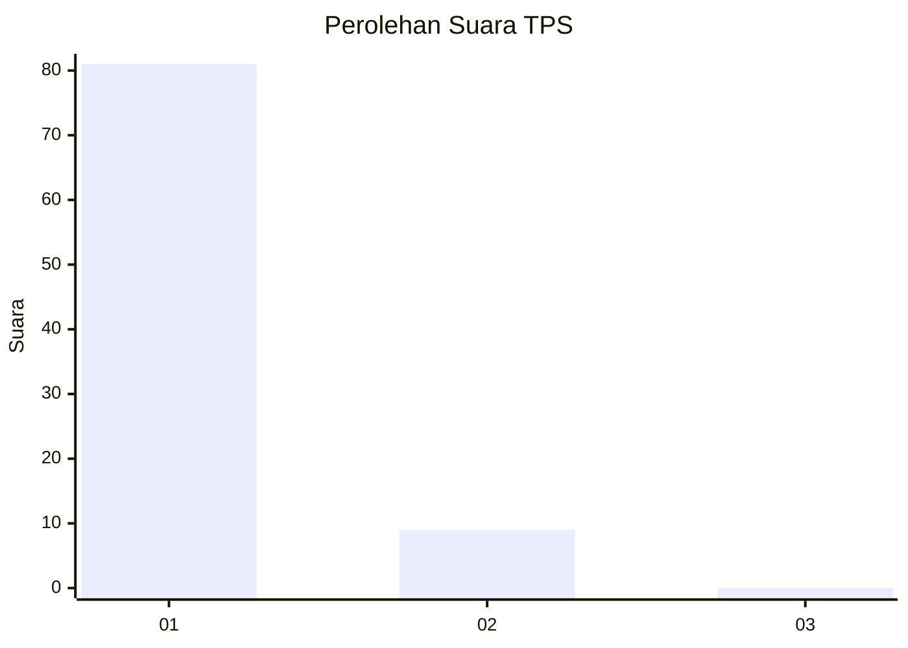
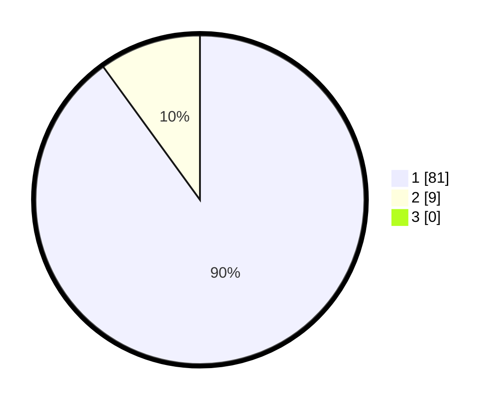

# Hasil

## Grafik

## Tabel

| No. | Nama Paslon    | Suara | Suara (raw) | Persentase |
|:--- |:-------------- | -----:| -----------:| ----------:|
| 1   | ANIES MUHAIMIN | 81    | [81][p-1]   | 90,00      |
| 2   | PRABOWO GIBRAN | 9     | [9][p-2]    | 10,00      |
| 3   | GANJAR MAHFUD  | 0     | [0][p-3]    | 0,00       |

[p-1]: https://github.com/gigit-pemilu/pemilu-2024-11-aceh/blob/main/pilpres/hitung-suara/sub/11-aceh/sub/08-aceh-utara/sub/25-geuredong-pase/sub/2002-darul-aman/sub/001-tps/sub/paslon-1.txt
[p-2]: https://github.com/gigit-pemilu/pemilu-2024-11-aceh/blob/main/pilpres/hitung-suara/sub/11-aceh/sub/08-aceh-utara/sub/25-geuredong-pase/sub/2002-darul-aman/sub/001-tps/sub/paslon-2.txt
[p-3]: https://github.com/gigit-pemilu/pemilu-2024-11-aceh/blob/main/pilpres/hitung-suara/sub/11-aceh/sub/08-aceh-utara/sub/25-geuredong-pase/sub/2002-darul-aman/sub/001-tps/sub/paslon-3.txt

## Foto C Plano

https://sirekap-obj-formc.kpu.go.id/bbf0/pemilu/ppwp/11/08/25/20/02/1108252002001-20240218-180243--ee821c99-6676-46e6-9faa-005357a26f89.jpg

https://sirekap-obj-formc.kpu.go.id/bbf0/pemilu/ppwp/11/08/25/20/02/1108252002001-20240218-180244--30f8ecc6-7d74-465f-8ce3-6540f9128789.jpg

https://sirekap-obj-formc.kpu.go.id/bbf0/pemilu/ppwp/11/08/25/20/02/1108252002001-20240218-180243--2f092424-0c8d-4d63-ba1b-e8cdb9172525.jpg

## Metadata

| Key        | Value               |
| ---------- | ------------------- |
| Time Stamp | 2024-02-21 12:00:00 |

## DATA PEMILIH TETAP

Jumlah pemilih dalam DPT: **91**.
 * L: **44**.
 * P: **47**.

## DATA PENGGUNA HAK PILIH

Jumlah pengguna hak pilih dalam DPT: **84**.
 * L: **39**.
 * P: **45**.

Jumlah pengguna hak pilih dalam DPTb: **6**.
 * L: **2**.
 * P: **4**.

Jumlah pengguna hak pilih dalam DPK: **0**.
 * L: **0**.
 * P: **0**.

Jumlah pengguna hak pilih: **90**.
 * L: **41**.
 * P: **49**.

## JUMLAH SUARA SAH DAN TIDAK SAH

JUMLAH SELURUH SUARA SAH: **90**.

JUMLAH SUARA TIDAK SAH: **0**.

JUMLAH SELURUH SUARA SAH DAN SUARA TIDAK SAH: **90**.

