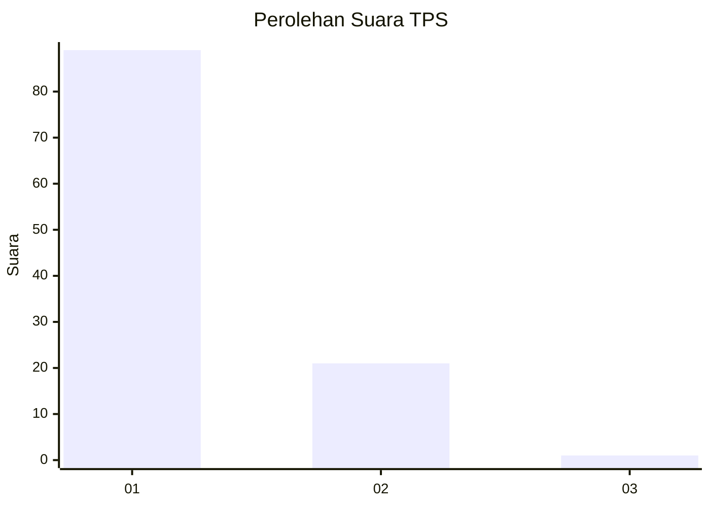
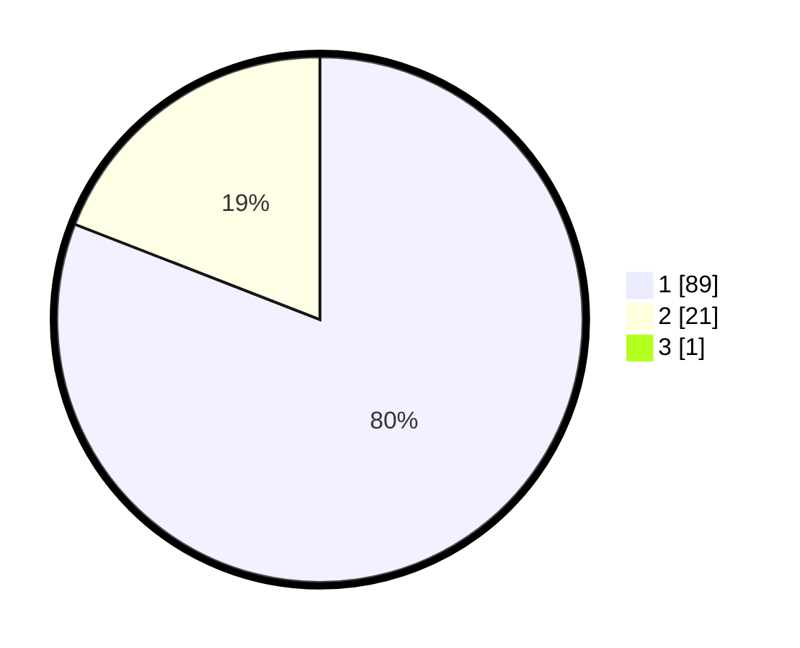

# Hasil

## Grafik

## Tabel

| No. | Nama Paslon    | Suara | Suara (raw) | Persentase |
|:--- |:-------------- | -----:| -----------:| ----------:|
| 1   | ANIES MUHAIMIN | 89    | [89][p-1]   | 80,18      |
| 2   | PRABOWO GIBRAN | 21    | [21][p-2]   | 18,92      |
| 3   | GANJAR MAHFUD  | 1     | [1][p-3]    | 0,90       |

[p-1]: https://github.com/gigit-pemilu/pemilu-2024-11-aceh/blob/main/pilpres/hitung-suara/sub/11-aceh/sub/08-aceh-utara/sub/25-geuredong-pase/sub/2004-darussalam/sub/001-tps/sub/paslon-1.txt
[p-2]: https://github.com/gigit-pemilu/pemilu-2024-11-aceh/blob/main/pilpres/hitung-suara/sub/11-aceh/sub/08-aceh-utara/sub/25-geuredong-pase/sub/2004-darussalam/sub/001-tps/sub/paslon-2.txt
[p-3]: https://github.com/gigit-pemilu/pemilu-2024-11-aceh/blob/main/pilpres/hitung-suara/sub/11-aceh/sub/08-aceh-utara/sub/25-geuredong-pase/sub/2004-darussalam/sub/001-tps/sub/paslon-3.txt

## Foto C Plano

https://sirekap-obj-formc.kpu.go.id/bb22/pemilu/ppwp/11/08/25/20/04/1108252004001-20240215-002335--cce7c9d1-2786-46ab-a227-a12a71393dbd.jpg

https://sirekap-obj-formc.kpu.go.id/bb22/pemilu/ppwp/11/08/25/20/04/1108252004001-20240218-212208--16295f55-cac1-4c21-b438-f936219b9ad0.jpg

https://sirekap-obj-formc.kpu.go.id/bb22/pemilu/ppwp/11/08/25/20/04/1108252004001-20240215-105159--b9effd3e-01e0-4d33-9ce5-1eac1b31b71d.jpg

## Metadata

| Key        | Value               |
| ---------- | ------------------- |
| Time Stamp | 2024-02-21 12:00:00 |

## DATA PEMILIH TETAP

Jumlah pemilih dalam DPT: **147**.
 * L: **73**.
 * P: **74**.

## DATA PENGGUNA HAK PILIH

Jumlah pengguna hak pilih dalam DPT: **113**.
 * L: **53**.
 * P: **60**.

Jumlah pengguna hak pilih dalam DPTb: **0**.
 * L: **0**.
 * P: **0**.

Jumlah pengguna hak pilih dalam DPK: **0**.
 * L: **0**.
 * P: **0**.

Jumlah pengguna hak pilih: **113**.
 * L: **53**.
 * P: **60**.

## JUMLAH SUARA SAH DAN TIDAK SAH

JUMLAH SELURUH SUARA SAH: **111**.

JUMLAH SUARA TIDAK SAH: **2**.

JUMLAH SELURUH SUARA SAH DAN SUARA TIDAK SAH: **113**.

