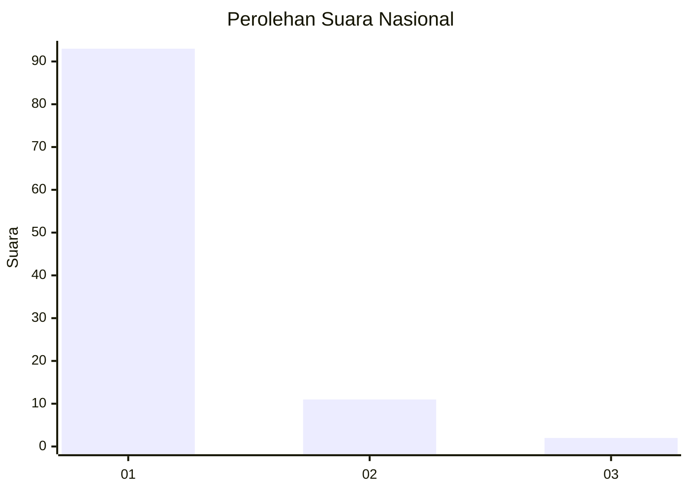
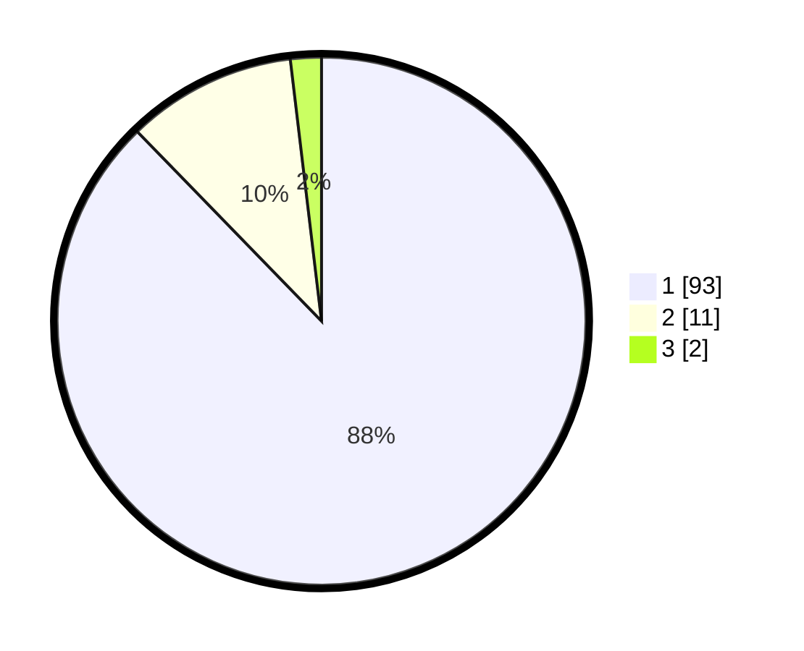

# Hasil

## Grafik

## Tabel

| No. | Nama Paslon    | Suara | Suara (raw) | Persentase |
|:--- |:-------------- | -----:| -----------:| ----------:|
| 1   | ANIES MUHAIMIN | 93    | [93][p-1]   | 87,74      |
| 2   | PRABOWO GIBRAN | 11    | [11][p-2]   | 10,38      |
| 3   | GANJAR MAHFUD  | 2     | [2][p-3]    | 1,89       |

[p-1]: https://github.com/gigit-pemilu/pemilu-2024/blob/main/pilpres/hitung-suara/sub/11-aceh/sub/08-aceh-utara/sub/25-geuredong-pase/sub/2004-darussalam/sub/002-tps/sub/paslon-1.txt
[p-2]: https://github.com/gigit-pemilu/pemilu-2024/blob/main/pilpres/hitung-suara/sub/11-aceh/sub/08-aceh-utara/sub/25-geuredong-pase/sub/2004-darussalam/sub/002-tps/sub/paslon-2.txt
[p-3]: https://github.com/gigit-pemilu/pemilu-2024/blob/main/pilpres/hitung-suara/sub/11-aceh/sub/08-aceh-utara/sub/25-geuredong-pase/sub/2004-darussalam/sub/002-tps/sub/paslon-3.txt

## Foto C Plano

https://sirekap-obj-formc.kpu.go.id/912e/pemilu/ppwp/11/08/25/20/04/1108252004002-20240218-181008--d60103ed-37af-417a-91b6-aa701dab9978.jpg

https://sirekap-obj-formc.kpu.go.id/912e/pemilu/ppwp/11/08/25/20/04/1108252004002-20240215-104918--7590dba5-4747-4a5a-85f5-476d95307bce.jpg

https://sirekap-obj-formc.kpu.go.id/912e/pemilu/ppwp/11/08/25/20/04/1108252004002-20240215-110208--c5c06c99-19db-422c-b2ff-be73ca6885ee.jpg

## Metadata

| Key        | Value               |
| ---------- | ------------------- |
| Time Stamp | 2024-02-19 06:16:00 |

## DATA PEMILIH TETAP

Jumlah pemilih dalam DPT: **155**.
 * L: **72**.
 * P: **83**.

## DATA PENGGUNA HAK PILIH

Jumlah pengguna hak pilih dalam DPT: **111**.
 * L: **48**.
 * P: **63**.

Jumlah pengguna hak pilih dalam DPTb: **0**.
 * L: **0**.
 * P: **0**.

Jumlah pengguna hak pilih dalam DPK: **1**.
 * L: **1**.
 * P: **0**.

Jumlah pengguna hak pilih: **112**.
 * L: **49**.
 * P: **63**.

## JUMLAH SUARA SAH DAN TIDAK SAH

JUMLAH SELURUH SUARA SAH: **106**.

JUMLAH SUARA TIDAK SAH: **6**.

JUMLAH SELURUH SUARA SAH DAN SUARA TIDAK SAH: **112**.

