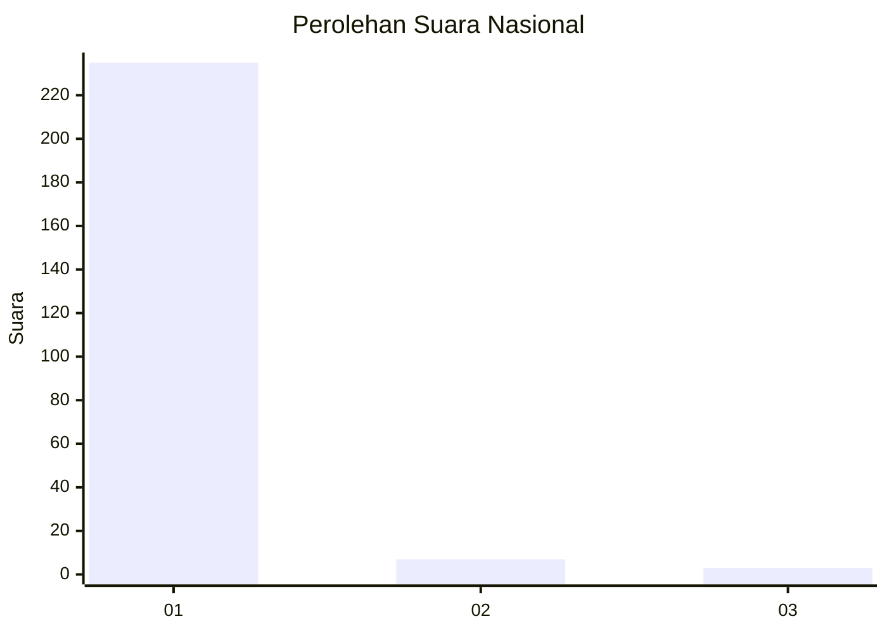
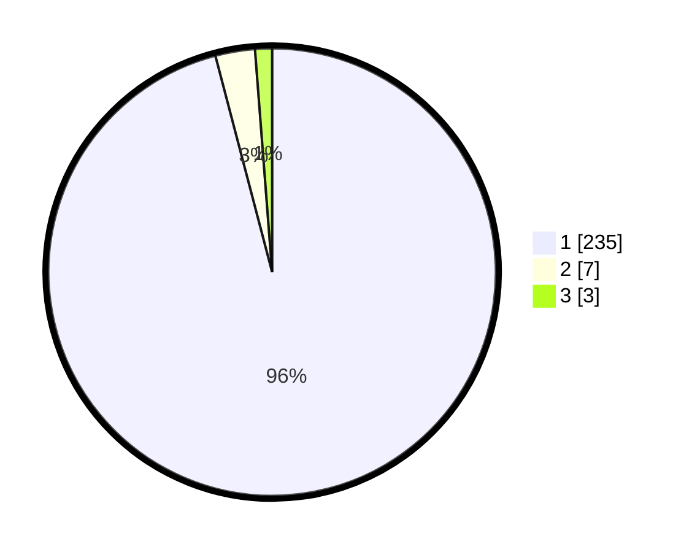

# Hasil

## Grafik

## Tabel

| No. | Nama Paslon    | Suara | Suara (raw) | Persentase |
|:--- |:-------------- | -----:| -----------:| ----------:|
| 1   | ANIES MUHAIMIN | 235   | [235][p-1]  | 95,92      |
| 2   | PRABOWO GIBRAN | 7     | [7][p-2]    | 2,86       |
| 3   | GANJAR MAHFUD  | 3     | [3][p-3]    | 1,22       |

[p-1]: https://github.com/gigit-pemilu/pemilu-2024/blob/main/pilpres/hitung-suara/sub/11-aceh/sub/08-aceh-utara/sub/26-banda-baro/sub/2001-paya-dua/sub/001-tps/sub/paslon-1.txt
[p-2]: https://github.com/gigit-pemilu/pemilu-2024/blob/main/pilpres/hitung-suara/sub/11-aceh/sub/08-aceh-utara/sub/26-banda-baro/sub/2001-paya-dua/sub/001-tps/sub/paslon-2.txt
[p-3]: https://github.com/gigit-pemilu/pemilu-2024/blob/main/pilpres/hitung-suara/sub/11-aceh/sub/08-aceh-utara/sub/26-banda-baro/sub/2001-paya-dua/sub/001-tps/sub/paslon-3.txt

## Foto C Plano

https://sirekap-obj-formc.kpu.go.id/e743/pemilu/ppwp/11/08/26/20/01/1108262001001-20240217-154541--36a0f0fd-cb4d-4071-bf32-2acce8a8dee1.jpg

https://sirekap-obj-formc.kpu.go.id/e743/pemilu/ppwp/11/08/26/20/01/1108262001001-20240217-163908--0414eee4-cf49-4139-a216-e95ed770f996.jpg

https://sirekap-obj-formc.kpu.go.id/e743/pemilu/ppwp/11/08/26/20/01/1108262001001-20240217-155153--5076486a-e1de-4ede-b1de-c4ff60394a4b.jpg

## Metadata

| Key        | Value               |
| ---------- | ------------------- |
| Time Stamp | 2024-02-24 22:31:28 |

## DATA PEMILIH TETAP

Jumlah pemilih dalam DPT: **245**.
 * L: **127**.
 * P: **118**.

## DATA PENGGUNA HAK PILIH

Jumlah pengguna hak pilih dalam DPT: **245**.
 * L: **127**.
 * P: **118**.

Jumlah pengguna hak pilih dalam DPTb: **0**.
 * L: **0**.
 * P: **0**.

Jumlah pengguna hak pilih dalam DPK: **245**.
 * L: **127**.
 * P: **118**.

Jumlah pengguna hak pilih: **245**.
 * L: **127**.
 * P: **118**.

## JUMLAH SUARA SAH DAN TIDAK SAH

JUMLAH SELURUH SUARA SAH: **245**.

JUMLAH SUARA TIDAK SAH: **0**.

JUMLAH SELURUH SUARA SAH DAN SUARA TIDAK SAH: **245**.

