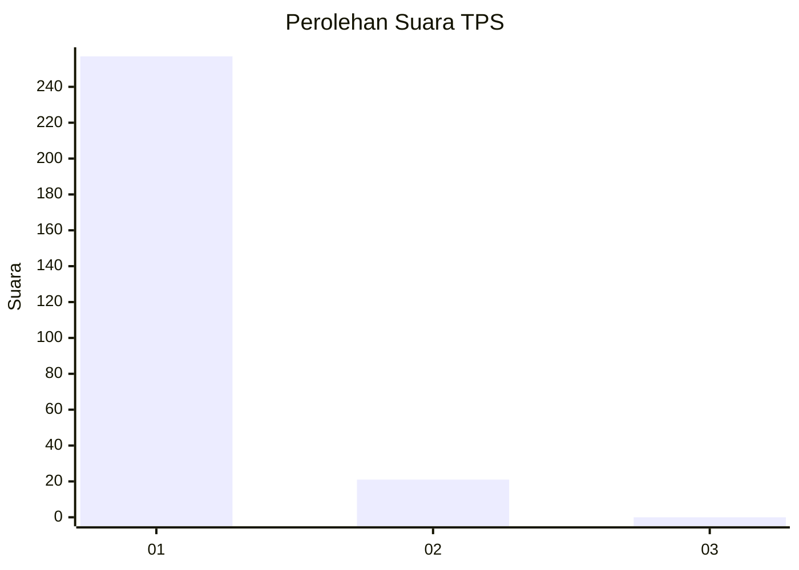
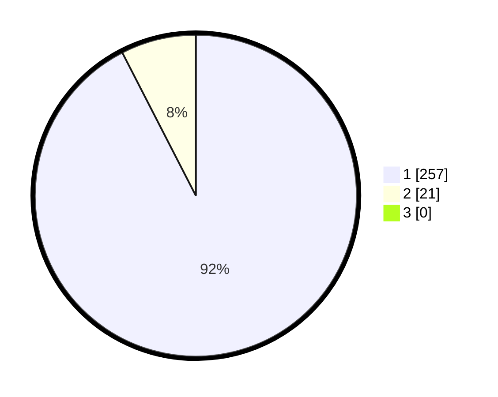

# Hasil

## Grafik

## Tabel

| No. | Nama Paslon    | Suara | Suara (raw) | Persentase |
|:--- |:-------------- | -----:| -----------:| ----------:|
| 1   | ANIES MUHAIMIN | 257   | [257][p-1]  | 92,45      |
| 2   | PRABOWO GIBRAN | 21    | [21][p-2]   | 7,55       |
| 3   | GANJAR MAHFUD  | 0     | [0][p-3]    | 0,00       |

[p-1]: https://github.com/gigit-pemilu/pemilu-2024-11-aceh/blob/main/pilpres/hitung-suara/sub/11-aceh/sub/08-aceh-utara/sub/26-banda-baro/sub/2005-jamuan/sub/002-tps/sub/paslon-1.txt
[p-2]: https://github.com/gigit-pemilu/pemilu-2024-11-aceh/blob/main/pilpres/hitung-suara/sub/11-aceh/sub/08-aceh-utara/sub/26-banda-baro/sub/2005-jamuan/sub/002-tps/sub/paslon-2.txt
[p-3]: https://github.com/gigit-pemilu/pemilu-2024-11-aceh/blob/main/pilpres/hitung-suara/sub/11-aceh/sub/08-aceh-utara/sub/26-banda-baro/sub/2005-jamuan/sub/002-tps/sub/paslon-3.txt

## Foto C Plano

https://sirekap-obj-formc.kpu.go.id/50c3/pemilu/ppwp/11/08/26/20/05/1108262005002-20240215-131634--69fca357-7550-43d4-8fbe-483a619649b4.jpg

https://sirekap-obj-formc.kpu.go.id/50c3/pemilu/ppwp/11/08/26/20/05/1108262005002-20240215-131946--05831df8-2abd-4732-abc9-77849341f564.jpg

https://sirekap-obj-formc.kpu.go.id/50c3/pemilu/ppwp/11/08/26/20/05/1108262005002-20240215-131202--2b444805-3cd6-4535-8c0f-1ca377316364.jpg

## Metadata

| Key        | Value               |
| ---------- | ------------------- |
| Time Stamp | 2024-02-16 23:00:00 |

