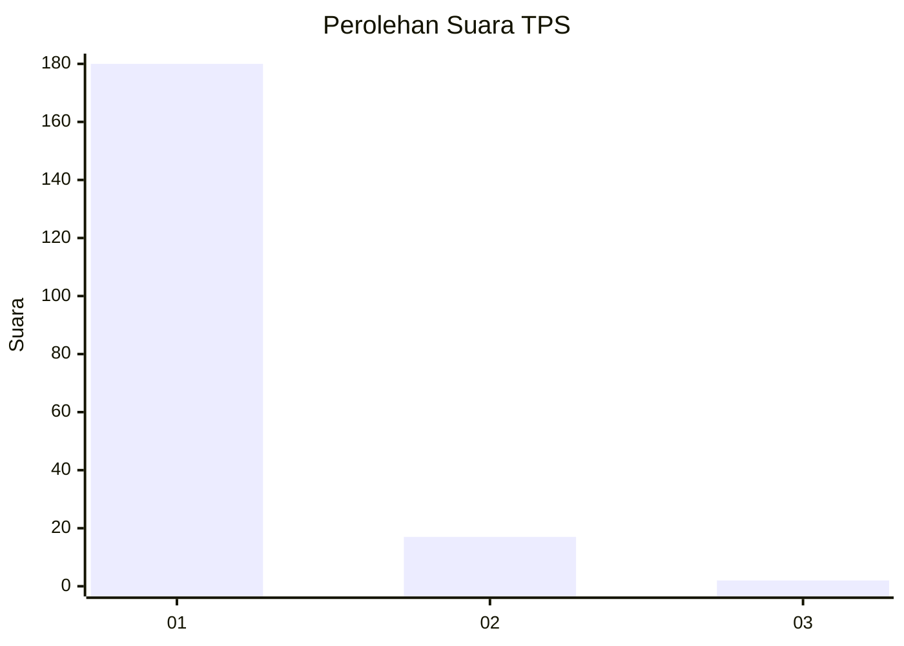
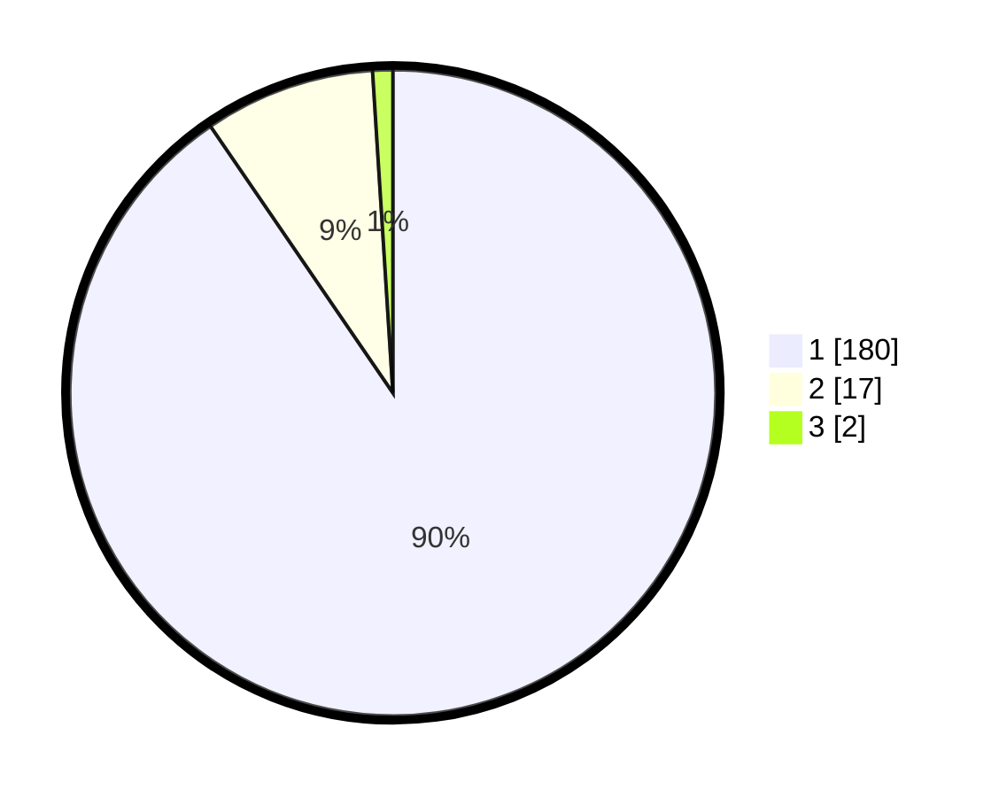

# Hasil

## Grafik

## Tabel

| No. | Nama Paslon    | Suara | Suara (raw) | Persentase |
|:--- |:-------------- | -----:| -----------:| ----------:|
| 1   | ANIES MUHAIMIN | 180   | [180][p-1]  | 90,45      |
| 2   | PRABOWO GIBRAN | 17    | [17][p-2]   | 8,54       |
| 3   | GANJAR MAHFUD  | 2     | [2][p-3]    | 1,01       |

[p-1]: https://github.com/gigit-pemilu/pemilu-2024-11-aceh/blob/main/pilpres/hitung-suara/sub/11-aceh/sub/08-aceh-utara/sub/26-banda-baro/sub/2005-jamuan/sub/003-tps/sub/paslon-1.txt
[p-2]: https://github.com/gigit-pemilu/pemilu-2024-11-aceh/blob/main/pilpres/hitung-suara/sub/11-aceh/sub/08-aceh-utara/sub/26-banda-baro/sub/2005-jamuan/sub/003-tps/sub/paslon-2.txt
[p-3]: https://github.com/gigit-pemilu/pemilu-2024-11-aceh/blob/main/pilpres/hitung-suara/sub/11-aceh/sub/08-aceh-utara/sub/26-banda-baro/sub/2005-jamuan/sub/003-tps/sub/paslon-3.txt

## Foto C Plano

https://sirekap-obj-formc.kpu.go.id/1ce8/pemilu/ppwp/11/08/26/20/05/1108262005003-20240215-105824--dd94786c-3f28-4dbb-8633-4353d61563d0.jpg

https://sirekap-obj-formc.kpu.go.id/1ce8/pemilu/ppwp/11/08/26/20/05/1108262005003-20240215-110007--a3c220a8-d77d-460d-a13a-7597a06fc801.jpg

https://sirekap-obj-formc.kpu.go.id/1ce8/pemilu/ppwp/11/08/26/20/05/1108262005003-20240215-110059--c5355c84-531b-4b70-a406-fda0373d49e2.jpg

## Metadata

| Key        | Value               |
| ---------- | ------------------- |
| Time Stamp | 2024-02-15 15:30:25 |

