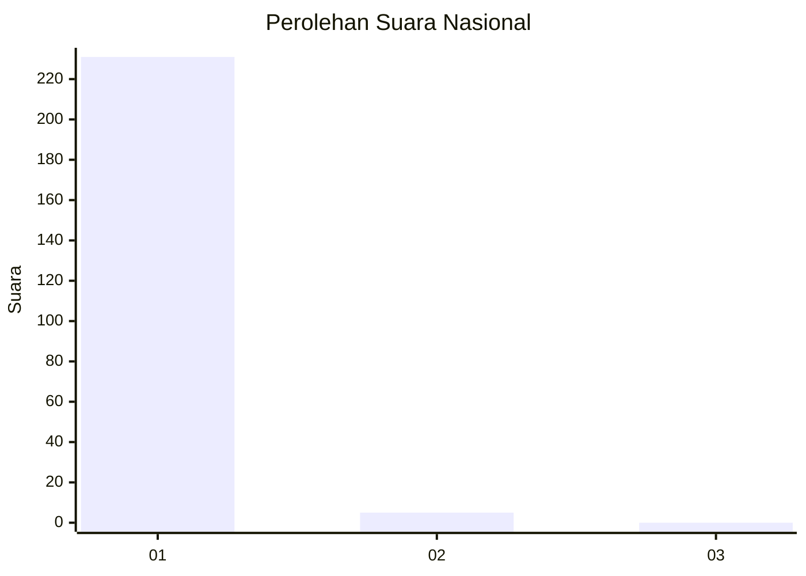
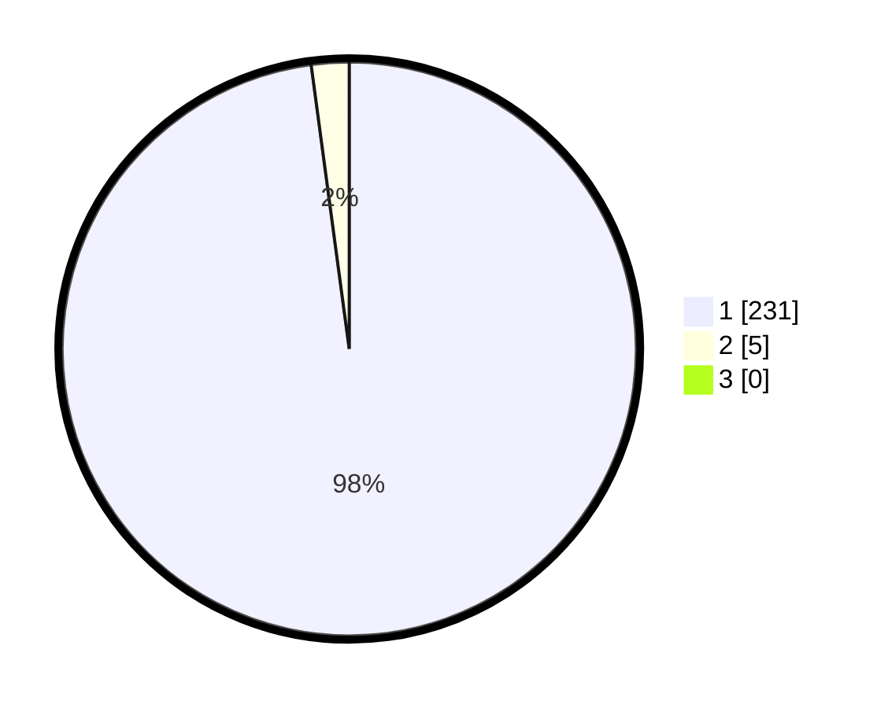

# Hasil

## Grafik

## Tabel

| No. | Nama Paslon    | Suara | Suara (raw) | Persentase |
|:--- |:-------------- | -----:| -----------:| ----------:|
| 1   | ANIES MUHAIMIN | 231   | [231][p-1]  | 97,88      |
| 2   | PRABOWO GIBRAN | 5     | [5][p-2]    | 2,12       |
| 3   | GANJAR MAHFUD  | 0     | [0][p-3]    | 0,00       |

[p-1]: https://github.com/gigit-pemilu/pemilu-2024/blob/main/pilpres/hitung-suara/sub/11-aceh/sub/08-aceh-utara/sub/26-banda-baro/sub/2005-jamuan/sub/004-tps/sub/paslon-1.txt
[p-2]: https://github.com/gigit-pemilu/pemilu-2024/blob/main/pilpres/hitung-suara/sub/11-aceh/sub/08-aceh-utara/sub/26-banda-baro/sub/2005-jamuan/sub/004-tps/sub/paslon-2.txt
[p-3]: https://github.com/gigit-pemilu/pemilu-2024/blob/main/pilpres/hitung-suara/sub/11-aceh/sub/08-aceh-utara/sub/26-banda-baro/sub/2005-jamuan/sub/004-tps/sub/paslon-3.txt

## Foto C Plano

https://sirekap-obj-formc.kpu.go.id/b735/pemilu/ppwp/11/08/26/20/05/1108262005004-20240215-105548--5e68e900-3f50-4358-bcff-38277ddbeebf.jpg

https://sirekap-obj-formc.kpu.go.id/b735/pemilu/ppwp/11/08/26/20/05/1108262005004-20240215-105729--7fac80be-a1c2-4b79-8fc0-26f58b62b399.jpg

https://sirekap-obj-formc.kpu.go.id/b735/pemilu/ppwp/11/08/26/20/05/1108262005004-20240215-105904--d2032b4b-3d3b-4e8d-a004-77e0635aa682.jpg

## Metadata

| Key        | Value               |
| ---------- | ------------------- |
| Time Stamp | 2024-02-17 00:28:35 |

