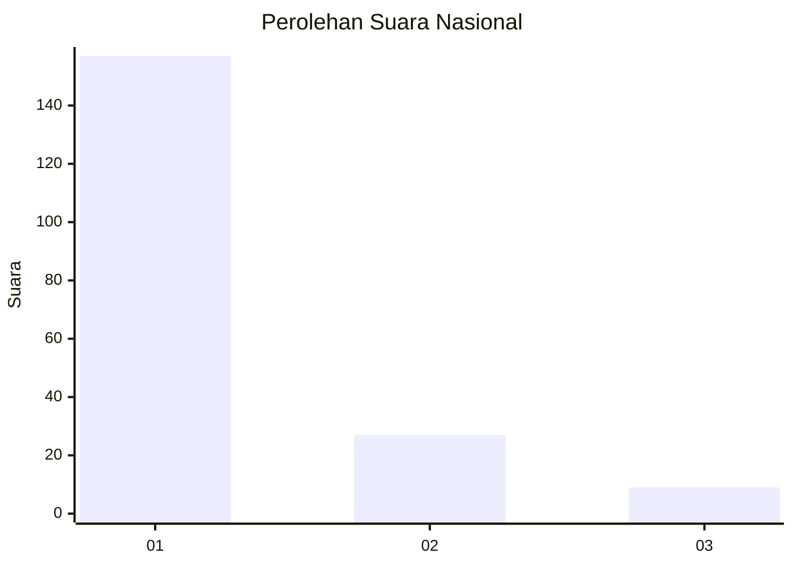
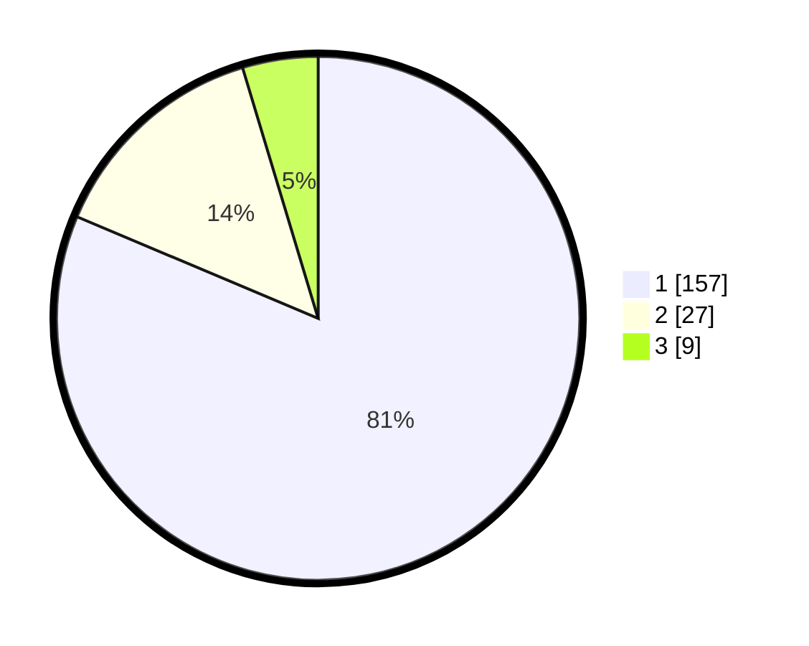

# Hasil

## Grafik

## Tabel

| No. | Nama Paslon    | Suara | Suara (raw) | Persentase |
|:--- |:-------------- | -----:| -----------:| ----------:|
| 1   | ANIES MUHAIMIN | 157   | [157][p-1]  | 81,35      |
| 2   | PRABOWO GIBRAN | 27    | [27][p-2]   | 13,99      |
| 3   | GANJAR MAHFUD  | 9     | [9][p-3]    | 4,66       |

[p-1]: https://github.com/gigit-pemilu/pemilu-2024/blob/main/pilpres/hitung-suara/sub/11-aceh/sub/08-aceh-utara/sub/26-banda-baro/sub/2006-alue-keurinyai/sub/001-tps/sub/paslon-1.txt
[p-2]: https://github.com/gigit-pemilu/pemilu-2024/blob/main/pilpres/hitung-suara/sub/11-aceh/sub/08-aceh-utara/sub/26-banda-baro/sub/2006-alue-keurinyai/sub/001-tps/sub/paslon-2.txt
[p-3]: https://github.com/gigit-pemilu/pemilu-2024/blob/main/pilpres/hitung-suara/sub/11-aceh/sub/08-aceh-utara/sub/26-banda-baro/sub/2006-alue-keurinyai/sub/001-tps/sub/paslon-3.txt

## Foto C Plano

https://sirekap-obj-formc.kpu.go.id/a9dc/pemilu/ppwp/11/08/26/20/06/1108262006001-20240215-111123--5a45f8fd-74fe-49ed-b729-a3a2d560070b.jpg

https://sirekap-obj-formc.kpu.go.id/a9dc/pemilu/ppwp/11/08/26/20/06/1108262006001-20240215-144211--bd189ad3-3901-4662-9206-bf571ae10989.jpg

https://sirekap-obj-formc.kpu.go.id/a9dc/pemilu/ppwp/11/08/26/20/06/1108262006001-20240215-144417--88ad252a-1b0f-4a73-872b-d5be28c44559.jpg

## Metadata

| Key        | Value               |
| ---------- | ------------------- |
| Time Stamp | 2024-02-17 14:45:18 |

