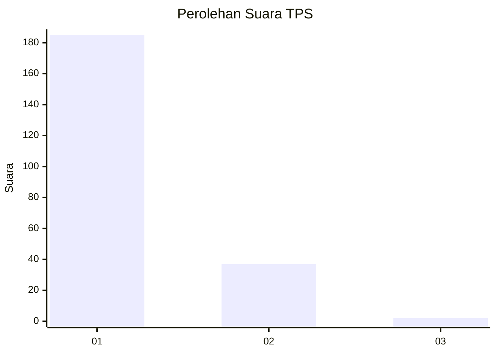
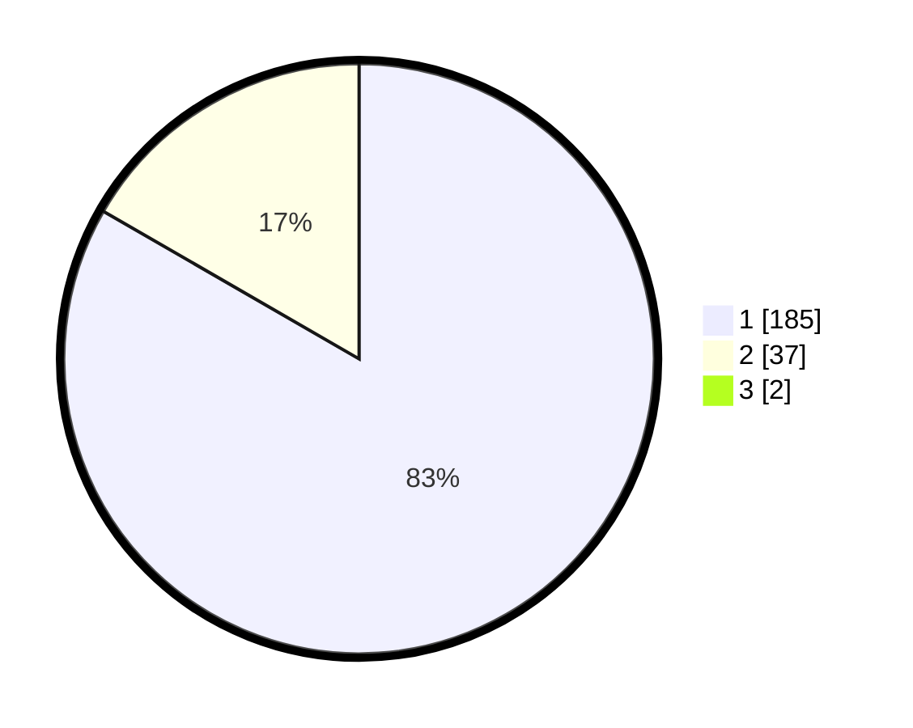

# Hasil

## Grafik

## Tabel

| No. | Nama Paslon    | Suara | Suara (raw) | Persentase |
|:--- |:-------------- | -----:| -----------:| ----------:|
| 1   | ANIES MUHAIMIN | 185   | [185][p-1]  | 82,59      |
| 2   | PRABOWO GIBRAN | 37    | [37][p-2]   | 16,52      |
| 3   | GANJAR MAHFUD  | 2     | [2][p-3]    | 0,89       |

[p-1]: https://github.com/gigit-pemilu/pemilu-2024-11-aceh/blob/main/pilpres/hitung-suara/sub/11-aceh/sub/08-aceh-utara/sub/26-banda-baro/sub/2007-sangkelan/sub/001-tps/sub/paslon-1.txt
[p-2]: https://github.com/gigit-pemilu/pemilu-2024-11-aceh/blob/main/pilpres/hitung-suara/sub/11-aceh/sub/08-aceh-utara/sub/26-banda-baro/sub/2007-sangkelan/sub/001-tps/sub/paslon-2.txt
[p-3]: https://github.com/gigit-pemilu/pemilu-2024-11-aceh/blob/main/pilpres/hitung-suara/sub/11-aceh/sub/08-aceh-utara/sub/26-banda-baro/sub/2007-sangkelan/sub/001-tps/sub/paslon-3.txt

## Foto C Plano

https://sirekap-obj-formc.kpu.go.id/2935/pemilu/ppwp/11/08/26/20/07/1108262007001-20240215-101758--e3b2316b-13c7-410c-b4e7-b1aae0e82878.jpg

https://sirekap-obj-formc.kpu.go.id/2935/pemilu/ppwp/11/08/26/20/07/1108262007001-20240215-101853--6684c25b-f8ec-49b3-badc-239379ff9810.jpg

https://sirekap-obj-formc.kpu.go.id/2935/pemilu/ppwp/11/08/26/20/07/1108262007001-20240215-101940--cc6bd70f-a242-44d4-8747-2671b4f71547.jpg

## Metadata

| Key        | Value               |
| ---------- | ------------------- |
| Time Stamp | 2024-02-15 19:30:26 |

