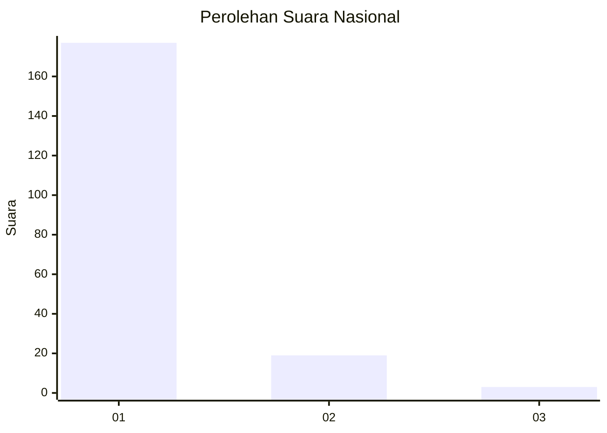
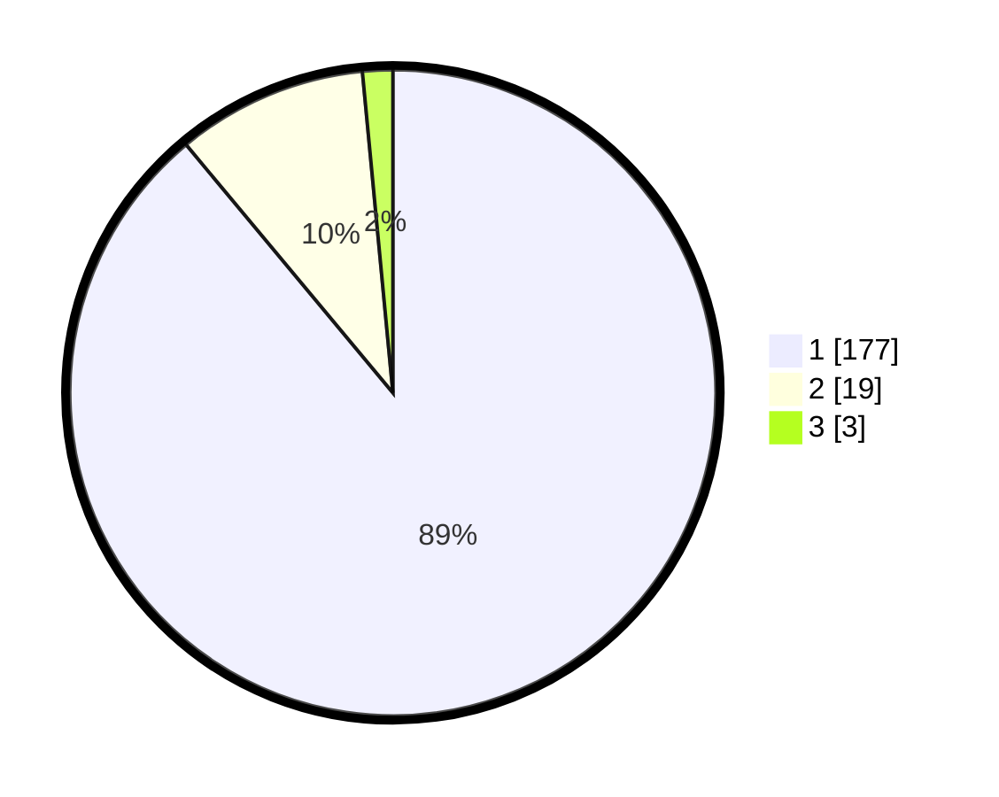

# Hasil

## Grafik

## Tabel

| No. | Nama Paslon    | Suara | Suara (raw) | Persentase |
|:--- |:-------------- | -----:| -----------:| ----------:|
| 1   | ANIES MUHAIMIN | 177   | [177][p-1]  | 88,94      |
| 2   | PRABOWO GIBRAN | 19    | [19][p-2]   | 9,55       |
| 3   | GANJAR MAHFUD  | 3     | [3][p-3]    | 1,51       |

[p-1]: https://github.com/gigit-pemilu/pemilu-2024/blob/main/pilpres/hitung-suara/sub/11-aceh/sub/08-aceh-utara/sub/26-banda-baro/sub/2007-sangkelan/sub/003-tps/sub/paslon-1.txt
[p-2]: https://github.com/gigit-pemilu/pemilu-2024/blob/main/pilpres/hitung-suara/sub/11-aceh/sub/08-aceh-utara/sub/26-banda-baro/sub/2007-sangkelan/sub/003-tps/sub/paslon-2.txt
[p-3]: https://github.com/gigit-pemilu/pemilu-2024/blob/main/pilpres/hitung-suara/sub/11-aceh/sub/08-aceh-utara/sub/26-banda-baro/sub/2007-sangkelan/sub/003-tps/sub/paslon-3.txt

## Foto C Plano

https://sirekap-obj-formc.kpu.go.id/48c0/pemilu/ppwp/11/08/26/20/07/1108262007003-20240215-142012--61a91317-2a95-4d2c-9b9a-b14d2374db62.jpg

https://sirekap-obj-formc.kpu.go.id/48c0/pemilu/ppwp/11/08/26/20/07/1108262007003-20240215-142159--8a3eb8c0-5441-41fb-88fb-90a2c708d4b6.jpg

https://sirekap-obj-formc.kpu.go.id/48c0/pemilu/ppwp/11/08/26/20/07/1108262007003-20240215-142304--a23e34a3-0765-430d-a341-7bfb1e3f4226.jpg

## Metadata

| Key        | Value               |
| ---------- | ------------------- |
| Time Stamp | 2024-02-15 15:30:25 |

