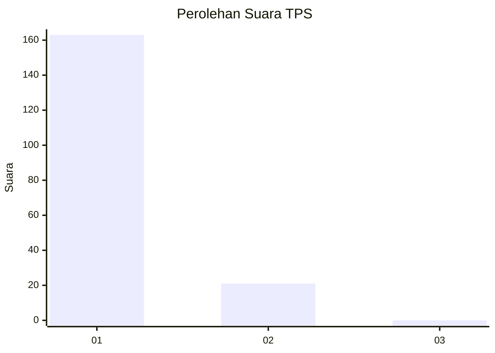
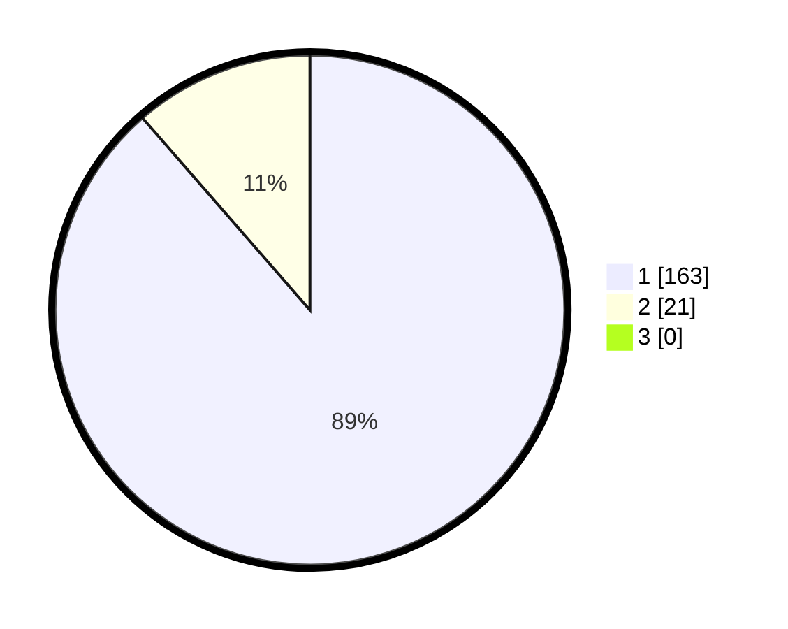

# Hasil

## Grafik

## Tabel

| No. | Nama Paslon    | Suara | Suara (raw) | Persentase |
|:--- |:-------------- | -----:| -----------:| ----------:|
| 1   | ANIES MUHAIMIN | 163   | [163][p-1]  | 88,59      |
| 2   | PRABOWO GIBRAN | 21    | [21][p-2]   | 11,41      |
| 3   | GANJAR MAHFUD  | 0     | [0][p-3]    | 0,00       |

[p-1]: https://github.com/gigit-pemilu/pemilu-2024-11-aceh/blob/main/pilpres/hitung-suara/sub/11-aceh/sub/08-aceh-utara/sub/26-banda-baro/sub/2008-blang-pala/sub/002-tps/sub/paslon-1.txt
[p-2]: https://github.com/gigit-pemilu/pemilu-2024-11-aceh/blob/main/pilpres/hitung-suara/sub/11-aceh/sub/08-aceh-utara/sub/26-banda-baro/sub/2008-blang-pala/sub/002-tps/sub/paslon-2.txt
[p-3]: https://github.com/gigit-pemilu/pemilu-2024-11-aceh/blob/main/pilpres/hitung-suara/sub/11-aceh/sub/08-aceh-utara/sub/26-banda-baro/sub/2008-blang-pala/sub/002-tps/sub/paslon-3.txt

## Foto C Plano

https://sirekap-obj-formc.kpu.go.id/50d9/pemilu/ppwp/11/08/26/20/08/1108262008002-20240215-101610--1d4929eb-f3da-4047-89b5-222bb5e1281a.jpg

https://sirekap-obj-formc.kpu.go.id/50d9/pemilu/ppwp/11/08/26/20/08/1108262008002-20240215-101637--55ad3563-5831-4c27-a361-c60ab0357eda.jpg

https://sirekap-obj-formc.kpu.go.id/50d9/pemilu/ppwp/11/08/26/20/08/1108262008002-20240215-101706--50e22557-c815-4319-af88-4ed046b2981c.jpg

## Metadata

| Key        | Value               |
| ---------- | ------------------- |
| Time Stamp | 2024-02-15 16:00:26 |

