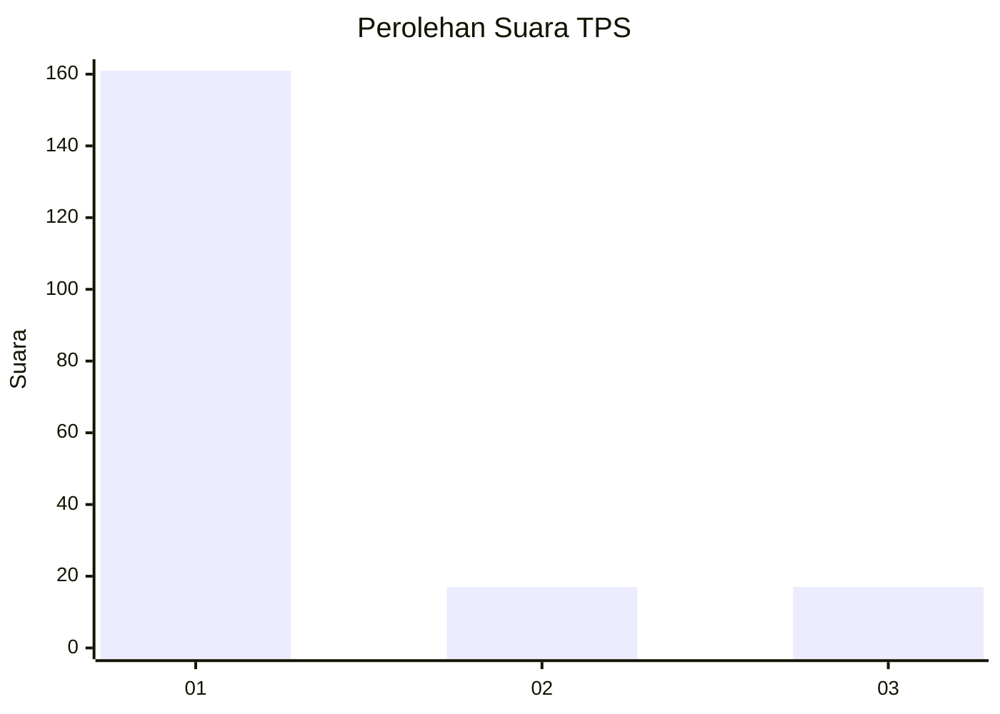
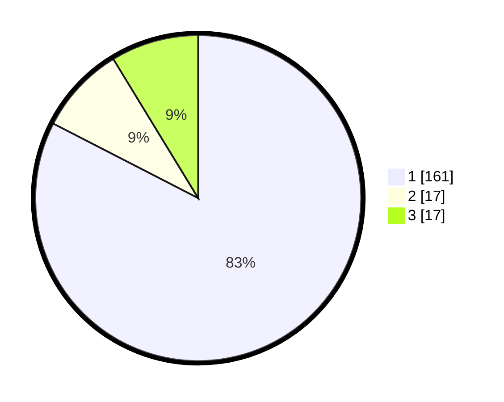

# Hasil

## Grafik

## Tabel

| No. | Nama Paslon    | Suara | Suara (raw) | Persentase |
|:--- |:-------------- | -----:| -----------:| ----------:|
| 1   | ANIES MUHAIMIN | 161   | [161][p-1]  | 82,56      |
| 2   | PRABOWO GIBRAN | 17    | [17][p-2]   | 8,72       |
| 3   | GANJAR MAHFUD  | 17    | [17][p-3]   | 8,72       |

[p-1]: https://github.com/gigit-pemilu/pemilu-2024-11-aceh/blob/main/pilpres/hitung-suara/sub/11-aceh/sub/08-aceh-utara/sub/26-banda-baro/sub/2008-blang-pala/sub/003-tps/sub/paslon-1.txt
[p-2]: https://github.com/gigit-pemilu/pemilu-2024-11-aceh/blob/main/pilpres/hitung-suara/sub/11-aceh/sub/08-aceh-utara/sub/26-banda-baro/sub/2008-blang-pala/sub/003-tps/sub/paslon-2.txt
[p-3]: https://github.com/gigit-pemilu/pemilu-2024-11-aceh/blob/main/pilpres/hitung-suara/sub/11-aceh/sub/08-aceh-utara/sub/26-banda-baro/sub/2008-blang-pala/sub/003-tps/sub/paslon-3.txt

## Foto C Plano

https://sirekap-obj-formc.kpu.go.id/35a0/pemilu/ppwp/11/08/26/20/08/1108262008003-20240215-100058--73efbf66-8226-4721-9c3e-80069b9bbe5b.jpg

https://sirekap-obj-formc.kpu.go.id/35a0/pemilu/ppwp/11/08/26/20/08/1108262008003-20240214-233040--ebb965ac-c83f-4f09-93e9-8977dd9273ab.jpg

https://sirekap-obj-formc.kpu.go.id/35a0/pemilu/ppwp/11/08/26/20/08/1108262008003-20240215-093349--5ba34a5d-868b-4760-9b66-4c3baf4c7788.jpg

## Metadata

| Key        | Value               |
| ---------- | ------------------- |
| Time Stamp | 2024-02-15 19:00:26 |

