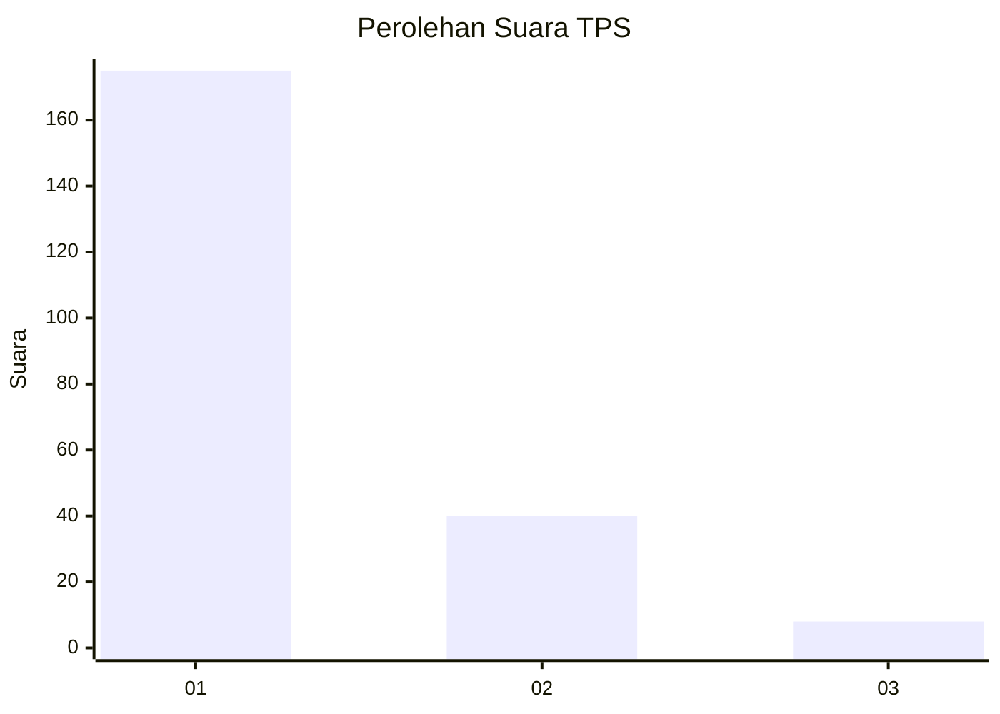
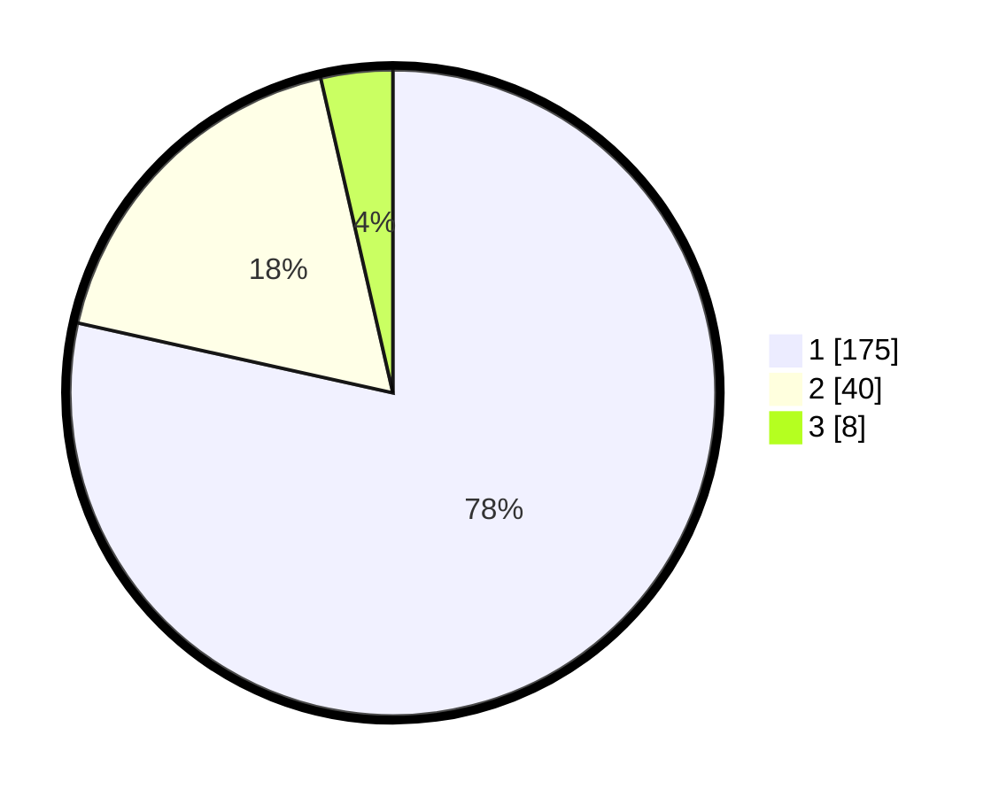

# Hasil

## Grafik

## Tabel

| No. | Nama Paslon    | Suara | Suara (raw) | Persentase |
|:--- |:-------------- | -----:| -----------:| ----------:|
| 1   | ANIES MUHAIMIN | 175   | [175][p-1]  | 78,48      |
| 2   | PRABOWO GIBRAN | 40    | [40][p-2]   | 17,94      |
| 3   | GANJAR MAHFUD  | 8     | [8][p-3]    | 3,59       |

[p-1]: https://github.com/gigit-pemilu/pemilu-2024-11-aceh/blob/main/pilpres/hitung-suara/sub/11-aceh/sub/09-simeulue/sub/01-simeulue-tengah/sub/2008-kampung-aie/sub/001-tps/sub/paslon-1.txt
[p-2]: https://github.com/gigit-pemilu/pemilu-2024-11-aceh/blob/main/pilpres/hitung-suara/sub/11-aceh/sub/09-simeulue/sub/01-simeulue-tengah/sub/2008-kampung-aie/sub/001-tps/sub/paslon-2.txt
[p-3]: https://github.com/gigit-pemilu/pemilu-2024-11-aceh/blob/main/pilpres/hitung-suara/sub/11-aceh/sub/09-simeulue/sub/01-simeulue-tengah/sub/2008-kampung-aie/sub/001-tps/sub/paslon-3.txt

## Foto C Plano

https://sirekap-obj-formc.kpu.go.id/e43d/pemilu/ppwp/11/09/01/20/08/1109012008001-20240214-204519--111f3dbc-daab-4e2b-9fe8-3aa3b0238504.jpg

https://sirekap-obj-formc.kpu.go.id/e43d/pemilu/ppwp/11/09/01/20/08/1109012008001-20240214-204743--2d726ded-2b40-47cc-a95e-4bbf3b1090c2.jpg

https://sirekap-obj-formc.kpu.go.id/e43d/pemilu/ppwp/11/09/01/20/08/1109012008001-20240214-204958--618c0a31-d015-4aca-881c-40ecf52ce08b.jpg

## Metadata

| Key        | Value               |
| ---------- | ------------------- |
| Time Stamp | 2024-02-15 12:00:28 |

## DATA PEMILIH TETAP

Jumlah pemilih dalam DPT: **276**.
 * L: **131**.
 * P: **145**.

## DATA PENGGUNA HAK PILIH

Jumlah pengguna hak pilih dalam DPT: **211**.
 * L: **103**.
 * P: **108**.

Jumlah pengguna hak pilih dalam DPTb: **14**.
 * L: **6**.
 * P: **8**.

Jumlah pengguna hak pilih dalam DPK: **0**.
 * L: **0**.
 * P: **0**.

Jumlah pengguna hak pilih: **225**.
 * L: **109**.
 * P: **116**.

## JUMLAH SUARA SAH DAN TIDAK SAH

JUMLAH SELURUH SUARA SAH: **223**.

JUMLAH SUARA TIDAK SAH: **2**.

JUMLAH SELURUH SUARA SAH DAN SUARA TIDAK SAH: **225**.

