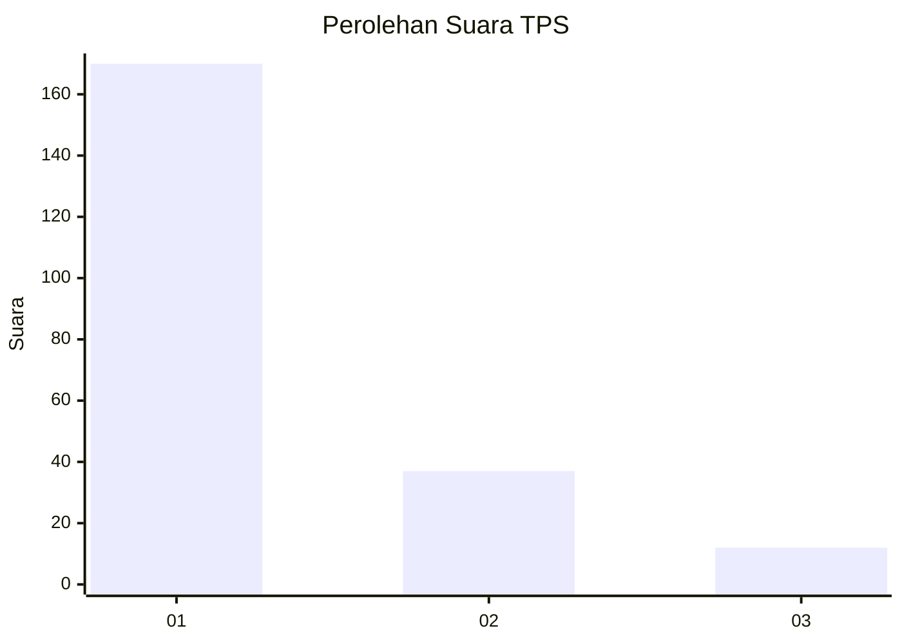
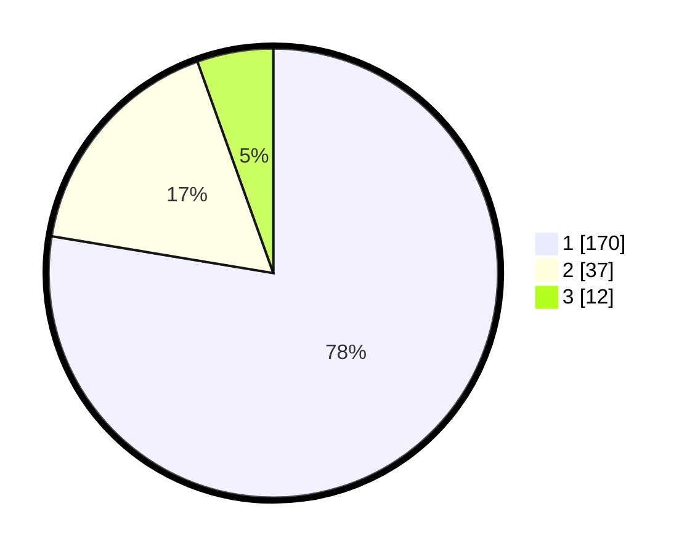

# Hasil

## Grafik

## Tabel

| No. | Nama Paslon    | Suara | Suara (raw) | Persentase |
|:--- |:-------------- | -----:| -----------:| ----------:|
| 1   | ANIES MUHAIMIN | 170   | [170][p-1]  | 77,63      |
| 2   | PRABOWO GIBRAN | 37    | [37][p-2]   | 16,89      |
| 3   | GANJAR MAHFUD  | 12    | [12][p-3]   | 5,48       |

[p-1]: https://github.com/gigit-pemilu/pemilu-2024-11-aceh/blob/main/pilpres/hitung-suara/sub/11-aceh/sub/09-simeulue/sub/01-simeulue-tengah/sub/2008-kampung-aie/sub/002-tps/sub/paslon-1.txt
[p-2]: https://github.com/gigit-pemilu/pemilu-2024-11-aceh/blob/main/pilpres/hitung-suara/sub/11-aceh/sub/09-simeulue/sub/01-simeulue-tengah/sub/2008-kampung-aie/sub/002-tps/sub/paslon-2.txt
[p-3]: https://github.com/gigit-pemilu/pemilu-2024-11-aceh/blob/main/pilpres/hitung-suara/sub/11-aceh/sub/09-simeulue/sub/01-simeulue-tengah/sub/2008-kampung-aie/sub/002-tps/sub/paslon-3.txt

## Foto C Plano

https://sirekap-obj-formc.kpu.go.id/7c98/pemilu/ppwp/11/09/01/20/08/1109012008002-20240215-164556--82bbbca3-d32f-4d93-aeed-bac479f1356b.jpg

https://sirekap-obj-formc.kpu.go.id/7c98/pemilu/ppwp/11/09/01/20/08/1109012008002-20240215-165135--814ae9b5-c2bd-4073-b038-78dd1e0f094f.jpg

https://sirekap-obj-formc.kpu.go.id/7c98/pemilu/ppwp/11/09/01/20/08/1109012008002-20240215-165747--dcda1bf1-3055-4392-b1d1-decb9235f543.jpg

## Metadata

| Key        | Value               |
| ---------- | ------------------- |
| Time Stamp | 2024-02-16 13:30:32 |

## DATA PEMILIH TETAP

Jumlah pemilih dalam DPT: **281**.
 * L: **136**.
 * P: **145**.

## DATA PENGGUNA HAK PILIH

Jumlah pengguna hak pilih dalam DPT: **222**.
 * L: **103**.
 * P: **119**.

Jumlah pengguna hak pilih dalam DPTb: **0**.
 * L: **0**.
 * P: **0**.

Jumlah pengguna hak pilih dalam DPK: **0**.
 * L: **0**.
 * P: **0**.

Jumlah pengguna hak pilih: **222**.
 * L: **103**.
 * P: **119**.

## JUMLAH SUARA SAH DAN TIDAK SAH

JUMLAH SELURUH SUARA SAH: **219**.

JUMLAH SUARA TIDAK SAH: **3**.

JUMLAH SELURUH SUARA SAH DAN SUARA TIDAK SAH: **222**.

