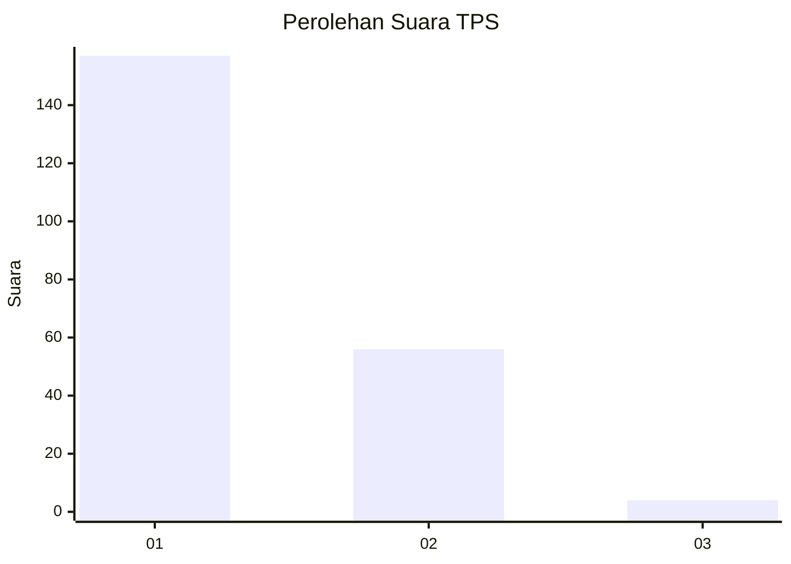
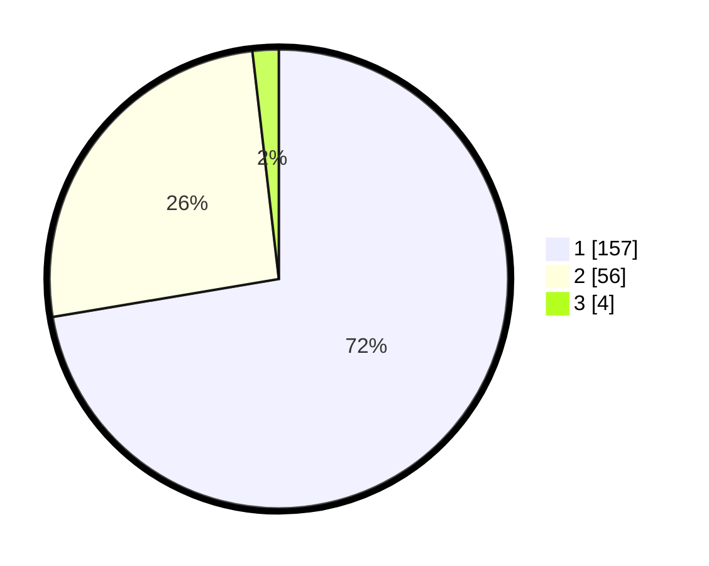

# Hasil

## Grafik

## Tabel

| No. | Nama Paslon    | Suara | Suara (raw) | Persentase |
|:--- |:-------------- | -----:| -----------:| ----------:|
| 1   | ANIES MUHAIMIN | 157   | [157][p-1]  | 72,35      |
| 2   | PRABOWO GIBRAN | 56    | [56][p-2]   | 25,81      |
| 3   | GANJAR MAHFUD  | 4     | [4][p-3]    | 1,84       |

[p-1]: https://github.com/gigit-pemilu/pemilu-2024-11-aceh/blob/main/pilpres/hitung-suara/sub/11-aceh/sub/09-simeulue/sub/01-simeulue-tengah/sub/2008-kampung-aie/sub/004-tps/sub/paslon-1.txt
[p-2]: https://github.com/gigit-pemilu/pemilu-2024-11-aceh/blob/main/pilpres/hitung-suara/sub/11-aceh/sub/09-simeulue/sub/01-simeulue-tengah/sub/2008-kampung-aie/sub/004-tps/sub/paslon-2.txt
[p-3]: https://github.com/gigit-pemilu/pemilu-2024-11-aceh/blob/main/pilpres/hitung-suara/sub/11-aceh/sub/09-simeulue/sub/01-simeulue-tengah/sub/2008-kampung-aie/sub/004-tps/sub/paslon-3.txt

## Foto C Plano

https://sirekap-obj-formc.kpu.go.id/2e37/pemilu/ppwp/11/09/01/20/08/1109012008004-20240219-220426--48973449-ecf5-4f46-b9c6-b20dc3a9a76d.jpg

https://sirekap-obj-formc.kpu.go.id/2e37/pemilu/ppwp/11/09/01/20/08/1109012008004-20240219-221029--963f938a-385a-4402-9f11-0b949549830b.jpg

https://sirekap-obj-formc.kpu.go.id/2e37/pemilu/ppwp/11/09/01/20/08/1109012008004-20240219-221208--e8508537-652d-49a5-9b2f-57c1ce315588.jpg

## Metadata

| Key        | Value               |
| ---------- | ------------------- |
| Time Stamp | 2024-02-20 11:00:00 |

## DATA PEMILIH TETAP

Jumlah pemilih dalam DPT: **283**.
 * L: **147**.
 * P: **136**.

## DATA PENGGUNA HAK PILIH

Jumlah pengguna hak pilih dalam DPT: **217**.
 * L: **115**.
 * P: **102**.

Jumlah pengguna hak pilih dalam DPTb: **0**.
 * L: **0**.
 * P: **0**.

Jumlah pengguna hak pilih dalam DPK: **0**.
 * L: **0**.
 * P: **0**.

Jumlah pengguna hak pilih: **217**.
 * L: **115**.
 * P: **102**.

## JUMLAH SUARA SAH DAN TIDAK SAH

JUMLAH SELURUH SUARA SAH: **217**.

JUMLAH SUARA TIDAK SAH: **0**.

JUMLAH SELURUH SUARA SAH DAN SUARA TIDAK SAH: **217**.

