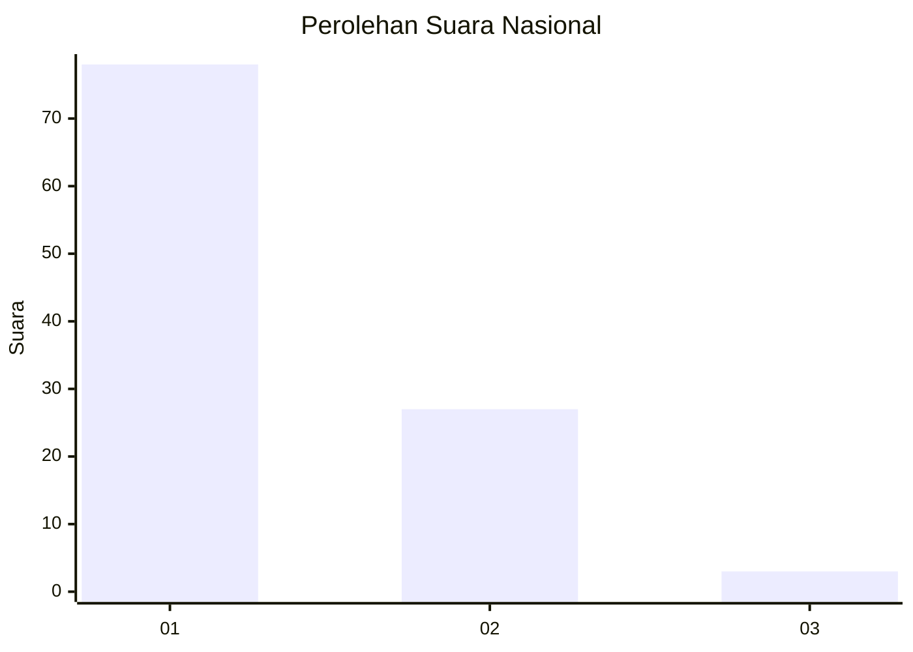
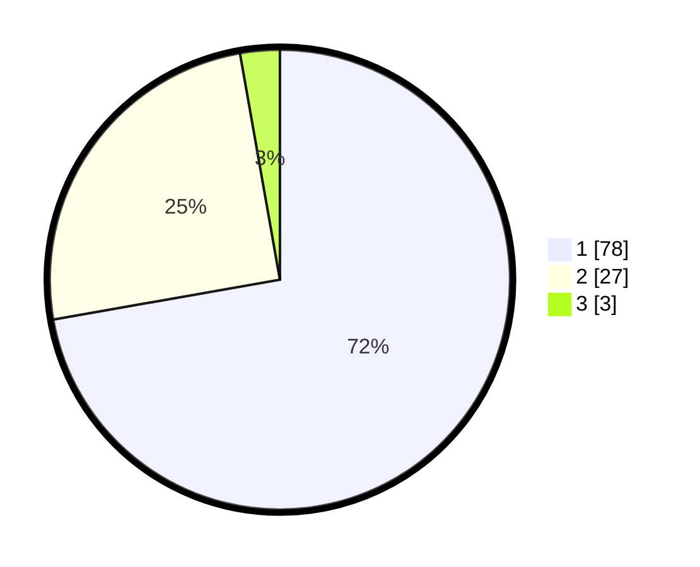

# Hasil

## Grafik

## Tabel

| No. | Nama Paslon    | Suara | Suara (raw) | Persentase |
|:--- |:-------------- | -----:| -----------:| ----------:|
| 1   | ANIES MUHAIMIN | 78    | [78][p-1]   | 72,22      |
| 2   | PRABOWO GIBRAN | 27    | [27][p-2]   | 25,00      |
| 3   | GANJAR MAHFUD  | 3     | [3][p-3]    | 2,78       |

[p-1]: https://github.com/gigit-pemilu/pemilu-2024/blob/main/pilpres/hitung-suara/sub/11-aceh/sub/09-simeulue/sub/01-simeulue-tengah/sub/2009-lauree/sub/001-tps/sub/paslon-1.txt
[p-2]: https://github.com/gigit-pemilu/pemilu-2024/blob/main/pilpres/hitung-suara/sub/11-aceh/sub/09-simeulue/sub/01-simeulue-tengah/sub/2009-lauree/sub/001-tps/sub/paslon-2.txt
[p-3]: https://github.com/gigit-pemilu/pemilu-2024/blob/main/pilpres/hitung-suara/sub/11-aceh/sub/09-simeulue/sub/01-simeulue-tengah/sub/2009-lauree/sub/001-tps/sub/paslon-3.txt

## Foto C Plano

https://sirekap-obj-formc.kpu.go.id/8a0b/pemilu/ppwp/11/09/01/20/09/1109012009001-20240217-213808--531c42ef-2373-4eef-987b-d2c4d0a4d834.jpg

https://sirekap-obj-formc.kpu.go.id/8a0b/pemilu/ppwp/11/09/01/20/09/1109012009001-20240217-213809--3052804b-8c01-48cf-b23a-e736cee4c6b2.jpg

https://sirekap-obj-formc.kpu.go.id/8a0b/pemilu/ppwp/11/09/01/20/09/1109012009001-20240217-213809--bfbb66a1-a99d-4f86-98f0-e57a07297fd7.jpg

## Metadata

| Key        | Value               |
| ---------- | ------------------- |
| Time Stamp | 2024-02-19 06:16:00 |

## DATA PEMILIH TETAP

Jumlah pemilih dalam DPT: **121**.
 * L: **60**.
 * P: **61**.

## DATA PENGGUNA HAK PILIH

Jumlah pengguna hak pilih dalam DPT: **104**.
 * L: **52**.
 * P: **52**.

Jumlah pengguna hak pilih dalam DPTb: **4**.
 * L: **1**.
 * P: **3**.

Jumlah pengguna hak pilih dalam DPK: **0**.
 * L: **0**.
 * P: **0**.

Jumlah pengguna hak pilih: **108**.
 * L: **53**.
 * P: **55**.

## JUMLAH SUARA SAH DAN TIDAK SAH

JUMLAH SELURUH SUARA SAH: **108**.

JUMLAH SUARA TIDAK SAH: **0**.

JUMLAH SELURUH SUARA SAH DAN SUARA TIDAK SAH: **108**.

