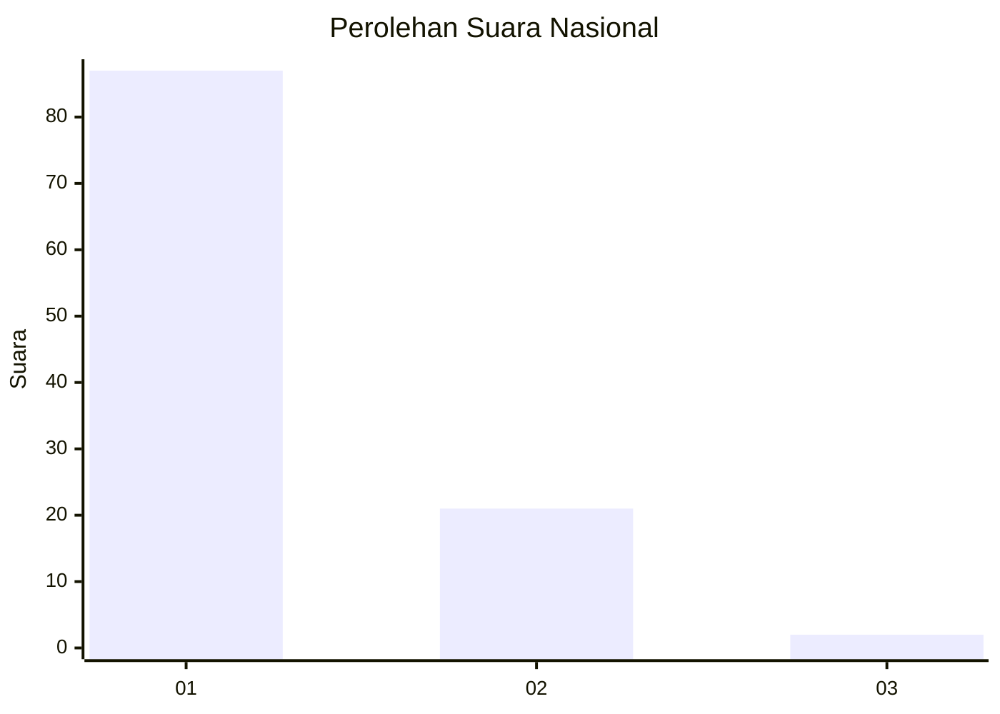
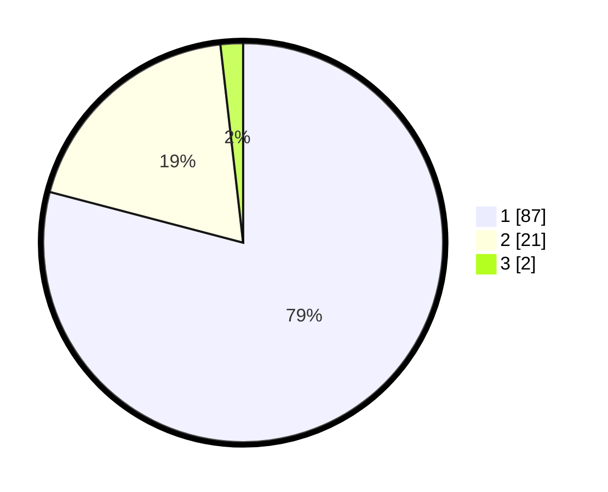

# Hasil

## Grafik

## Tabel

| No. | Nama Paslon    | Suara | Suara (raw) | Persentase |
|:--- |:-------------- | -----:| -----------:| ----------:|
| 1   | ANIES MUHAIMIN | 87    | [87][p-1]   | 79,09      |
| 2   | PRABOWO GIBRAN | 21    | [21][p-2]   | 19,09      |
| 3   | GANJAR MAHFUD  | 2     | [2][p-3]    | 1,82       |

[p-1]: https://github.com/gigit-pemilu/pemilu-2024/blob/main/pilpres/hitung-suara/sub/11-aceh/sub/09-simeulue/sub/01-simeulue-tengah/sub/2010-lamayang/sub/001-tps/sub/paslon-1.txt
[p-2]: https://github.com/gigit-pemilu/pemilu-2024/blob/main/pilpres/hitung-suara/sub/11-aceh/sub/09-simeulue/sub/01-simeulue-tengah/sub/2010-lamayang/sub/001-tps/sub/paslon-2.txt
[p-3]: https://github.com/gigit-pemilu/pemilu-2024/blob/main/pilpres/hitung-suara/sub/11-aceh/sub/09-simeulue/sub/01-simeulue-tengah/sub/2010-lamayang/sub/001-tps/sub/paslon-3.txt

## Foto C Plano

https://sirekap-obj-formc.kpu.go.id/658a/pemilu/ppwp/11/09/01/20/10/1109012010001-20240216-134421--9fdff5a8-0b18-4671-ae0d-8d96087451fd.jpg

https://sirekap-obj-formc.kpu.go.id/658a/pemilu/ppwp/11/09/01/20/10/1109012010001-20240216-134422--920493c9-e376-4017-a0ec-151953cec26b.jpg

https://sirekap-obj-formc.kpu.go.id/658a/pemilu/ppwp/11/09/01/20/10/1109012010001-20240216-134421--2c0791fe-f6df-4fce-8aea-9f357ca4b180.jpg

## Metadata

| Key        | Value               |
| ---------- | ------------------- |
| Time Stamp | 2024-02-16 16:25:10 |

## DATA PEMILIH TETAP

Jumlah pemilih dalam DPT: **120**.
 * L: **61**.
 * P: **59**.

## DATA PENGGUNA HAK PILIH

Jumlah pengguna hak pilih dalam DPT: **104**.
 * L: **50**.
 * P: **54**.

Jumlah pengguna hak pilih dalam DPTb: **4**.
 * L: **1**.
 * P: **3**.

Jumlah pengguna hak pilih dalam DPK: **3**.
 * L: **1**.
 * P: **2**.

Jumlah pengguna hak pilih: **111**.
 * L: **52**.
 * P: **59**.

## JUMLAH SUARA SAH DAN TIDAK SAH

JUMLAH SELURUH SUARA SAH: **111**.

JUMLAH SUARA TIDAK SAH: **0**.

JUMLAH SELURUH SUARA SAH DAN SUARA TIDAK SAH: **111**.

