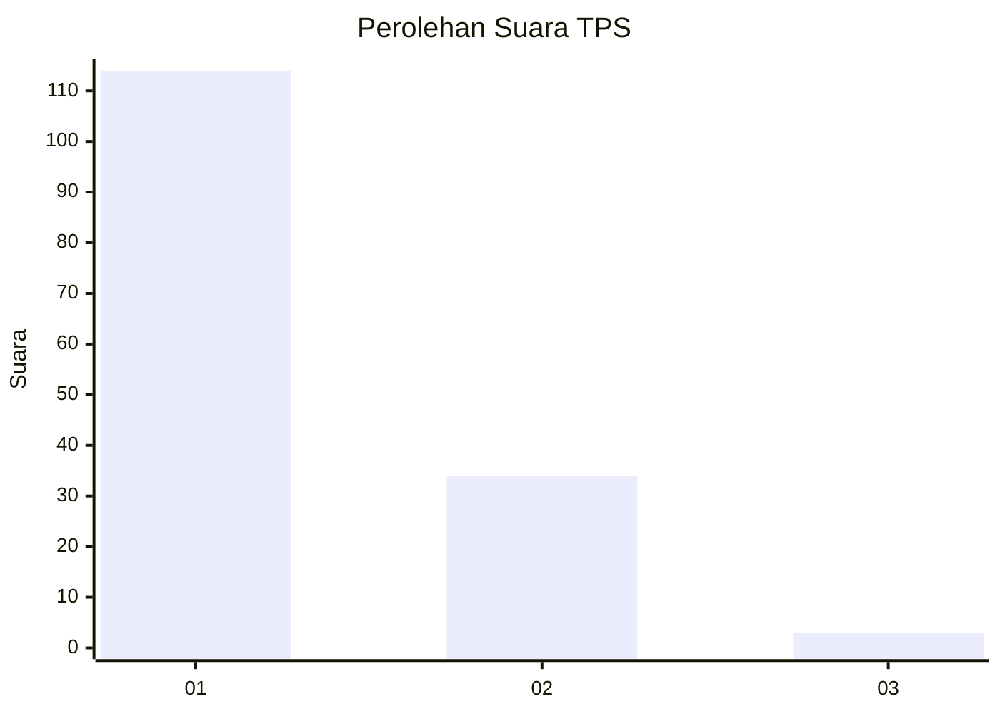
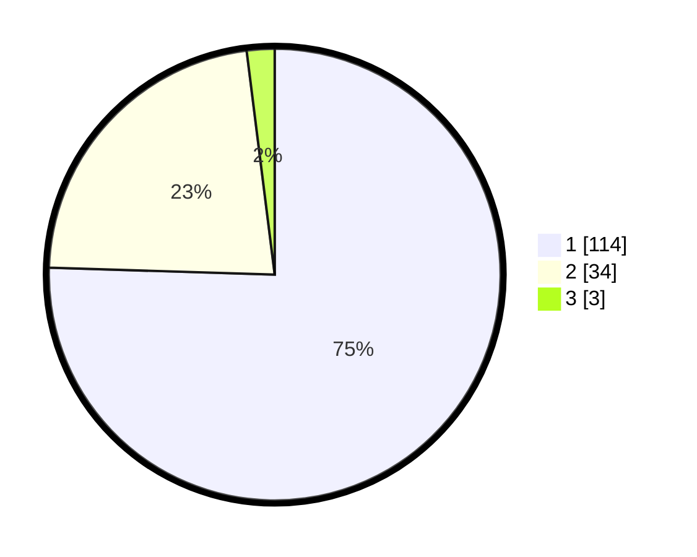

# Hasil

## Grafik

## Tabel

| No. | Nama Paslon    | Suara | Suara (raw) | Persentase |
|:--- |:-------------- | -----:| -----------:| ----------:|
| 1   | ANIES MUHAIMIN | 114   | [114][p-1]  | 75,50      |
| 2   | PRABOWO GIBRAN | 34    | [34][p-2]   | 22,52      |
| 3   | GANJAR MAHFUD  | 3     | [3][p-3]    | 1,99       |

[p-1]: https://github.com/gigit-pemilu/pemilu-2024-11-aceh/blob/main/pilpres/hitung-suara/sub/11-aceh/sub/09-simeulue/sub/02-salang/sub/2001-ujung-salang/sub/002-tps/sub/paslon-1.txt
[p-2]: https://github.com/gigit-pemilu/pemilu-2024-11-aceh/blob/main/pilpres/hitung-suara/sub/11-aceh/sub/09-simeulue/sub/02-salang/sub/2001-ujung-salang/sub/002-tps/sub/paslon-2.txt
[p-3]: https://github.com/gigit-pemilu/pemilu-2024-11-aceh/blob/main/pilpres/hitung-suara/sub/11-aceh/sub/09-simeulue/sub/02-salang/sub/2001-ujung-salang/sub/002-tps/sub/paslon-3.txt

## Foto C Plano

https://sirekap-obj-formc.kpu.go.id/41f8/pemilu/ppwp/11/09/02/20/01/1109022001002-20240216-131756--98660715-ef57-4f44-acf2-3f0d6889e2b2.jpg

https://sirekap-obj-formc.kpu.go.id/41f8/pemilu/ppwp/11/09/02/20/01/1109022001002-20240216-131758--cdab9436-de4a-480f-8633-594bda718fb4.jpg

https://sirekap-obj-formc.kpu.go.id/41f8/pemilu/ppwp/11/09/02/20/01/1109022001002-20240216-131757--fac9493c-1307-4a3e-8cd2-1a6bdd6d4d15.jpg

## Metadata

| Key        | Value               |
| ---------- | ------------------- |
| Time Stamp | 2024-02-17 12:00:00 |

## DATA PEMILIH TETAP

Jumlah pemilih dalam DPT: **187**.
 * L: **98**.
 * P: **89**.

## DATA PENGGUNA HAK PILIH

Jumlah pengguna hak pilih dalam DPT: **146**.
 * L: **72**.
 * P: **74**.

Jumlah pengguna hak pilih dalam DPTb: **2**.
 * L: **0**.
 * P: **2**.

Jumlah pengguna hak pilih dalam DPK: **3**.
 * L: **1**.
 * P: **2**.

Jumlah pengguna hak pilih: **151**.
 * L: **73**.
 * P: **78**.

## JUMLAH SUARA SAH DAN TIDAK SAH

JUMLAH SELURUH SUARA SAH: **151**.

JUMLAH SUARA TIDAK SAH: **0**.

JUMLAH SELURUH SUARA SAH DAN SUARA TIDAK SAH: **151**.

