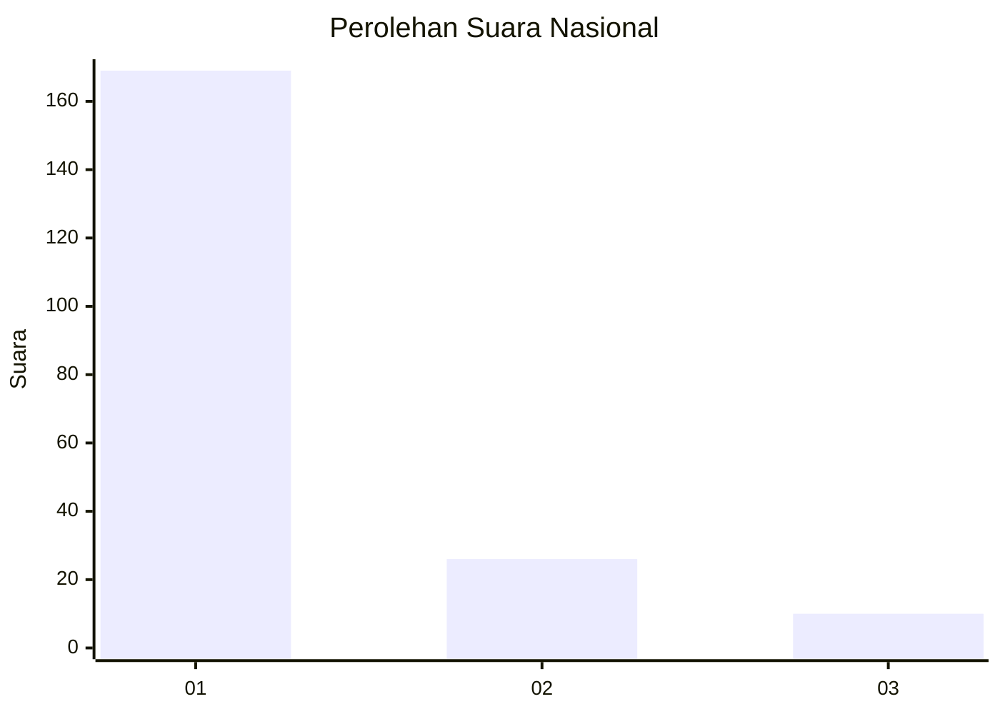
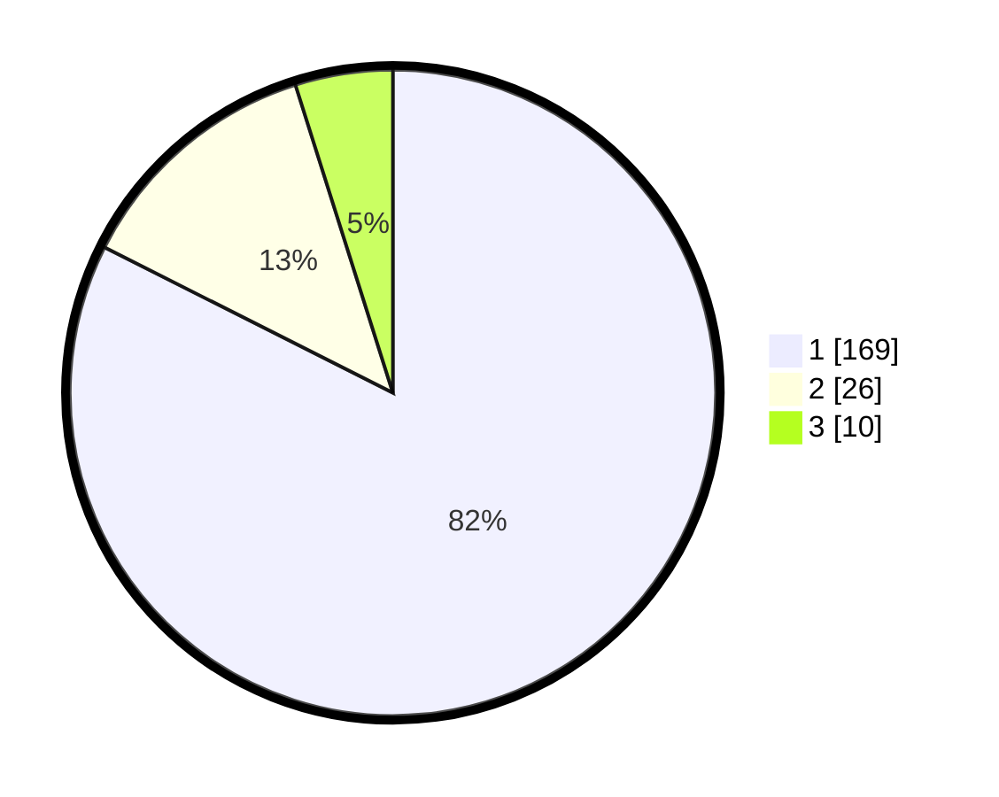

# Hasil

## Grafik

## Tabel

| No. | Nama Paslon    | Suara | Suara (raw) | Persentase |
|:--- |:-------------- | -----:| -----------:| ----------:|
| 1   | ANIES MUHAIMIN | 169   | [169][p-1]  | 82,44      |
| 2   | PRABOWO GIBRAN | 26    | [26][p-2]   | 12,68      |
| 3   | GANJAR MAHFUD  | 10    | [10][p-3]   | 4,88       |

[p-1]: https://github.com/gigit-pemilu/pemilu-2024/blob/main/pilpres/hitung-suara/sub/11-aceh/sub/09-simeulue/sub/03-teupah-barat/sub/2001-silengas/sub/001-tps/sub/paslon-1.txt
[p-2]: https://github.com/gigit-pemilu/pemilu-2024/blob/main/pilpres/hitung-suara/sub/11-aceh/sub/09-simeulue/sub/03-teupah-barat/sub/2001-silengas/sub/001-tps/sub/paslon-2.txt
[p-3]: https://github.com/gigit-pemilu/pemilu-2024/blob/main/pilpres/hitung-suara/sub/11-aceh/sub/09-simeulue/sub/03-teupah-barat/sub/2001-silengas/sub/001-tps/sub/paslon-3.txt

## Foto C Plano

https://sirekap-obj-formc.kpu.go.id/ca45/pemilu/ppwp/11/09/03/20/01/1109032001001-20240215-163045--2e7e2dac-98df-4c38-a53d-6137c3f540b7.jpg

https://sirekap-obj-formc.kpu.go.id/ca45/pemilu/ppwp/11/09/03/20/01/1109032001001-20240215-163922--037ae9e2-28d2-49eb-835b-51966f9e332f.jpg

https://sirekap-obj-formc.kpu.go.id/ca45/pemilu/ppwp/11/09/03/20/01/1109032001001-20240215-164156--c6986790-961c-4d25-842a-19c796a5ef0f.jpg

## Metadata

| Key        | Value               |
| ---------- | ------------------- |
| Time Stamp | 2024-02-16 23:30:00 |

## DATA PEMILIH TETAP

Jumlah pemilih dalam DPT: **275**.
 * L: **140**.
 * P: **135**.

## DATA PENGGUNA HAK PILIH

Jumlah pengguna hak pilih dalam DPT: **202**.
 * L: **99**.
 * P: **103**.

Jumlah pengguna hak pilih dalam DPTb: **2**.
 * L: **1**.
 * P: **1**.

Jumlah pengguna hak pilih dalam DPK: **2**.
 * L: **1**.
 * P: **1**.

Jumlah pengguna hak pilih: **206**.
 * L: **101**.
 * P: **105**.

## JUMLAH SUARA SAH DAN TIDAK SAH

JUMLAH SELURUH SUARA SAH: **205**.

JUMLAH SUARA TIDAK SAH: **1**.

JUMLAH SELURUH SUARA SAH DAN SUARA TIDAK SAH: **206**.

