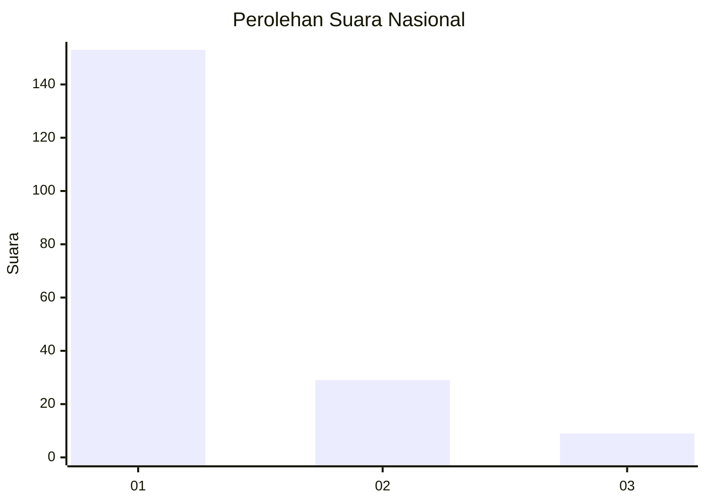
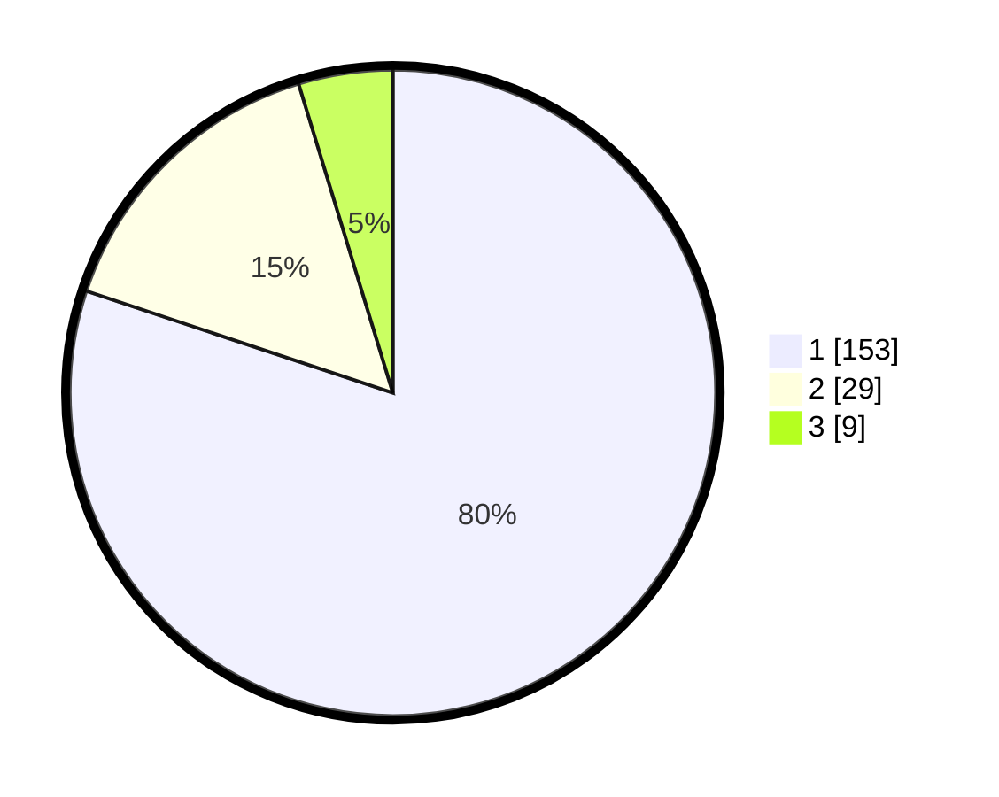

# Hasil

## Grafik

## Tabel

| No. | Nama Paslon    | Suara | Suara (raw) | Persentase |
|:--- |:-------------- | -----:| -----------:| ----------:|
| 1   | ANIES MUHAIMIN | 153   | [153][p-1]  | 80,10      |
| 2   | PRABOWO GIBRAN | 29    | [29][p-2]   | 15,18      |
| 3   | GANJAR MAHFUD  | 9     | [9][p-3]    | 4,71       |

[p-1]: https://github.com/gigit-pemilu/pemilu-2024/blob/main/pilpres/hitung-suara/sub/11-aceh/sub/09-simeulue/sub/03-teupah-barat/sub/2002-bunon/sub/001-tps/sub/paslon-1.txt
[p-2]: https://github.com/gigit-pemilu/pemilu-2024/blob/main/pilpres/hitung-suara/sub/11-aceh/sub/09-simeulue/sub/03-teupah-barat/sub/2002-bunon/sub/001-tps/sub/paslon-2.txt
[p-3]: https://github.com/gigit-pemilu/pemilu-2024/blob/main/pilpres/hitung-suara/sub/11-aceh/sub/09-simeulue/sub/03-teupah-barat/sub/2002-bunon/sub/001-tps/sub/paslon-3.txt

## Foto C Plano

https://sirekap-obj-formc.kpu.go.id/a07c/pemilu/ppwp/11/09/03/20/02/1109032002001-20240227-000952--7e53fb0d-990c-443c-8202-53146097e1cc.jpg

https://sirekap-obj-formc.kpu.go.id/a07c/pemilu/ppwp/11/09/03/20/02/1109032002001-20240227-000954--00262996-8fbd-4631-900a-0a7233387196.jpg

https://sirekap-obj-formc.kpu.go.id/a07c/pemilu/ppwp/11/09/03/20/02/1109032002001-20240227-000953--d6716be8-665b-47d7-9c2f-491eb513a20d.jpg

## Metadata

| Key        | Value               |
| ---------- | ------------------- |
| Time Stamp | 2024-02-27 22:00:00 |

## DATA PEMILIH TETAP

Jumlah pemilih dalam DPT: **233**.
 * L: **119**.
 * P: **114**.

## DATA PENGGUNA HAK PILIH

Jumlah pengguna hak pilih dalam DPT: **187**.
 * L: **98**.
 * P: **89**.

Jumlah pengguna hak pilih dalam DPTb: **2**.
 * L: **1**.
 * P: **1**.

Jumlah pengguna hak pilih dalam DPK: **4**.
 * L: **3**.
 * P: **1**.

Jumlah pengguna hak pilih: **193**.
 * L: **102**.
 * P: **91**.

## JUMLAH SUARA SAH DAN TIDAK SAH

JUMLAH SELURUH SUARA SAH: **191**.

JUMLAH SUARA TIDAK SAH: **2**.

JUMLAH SELURUH SUARA SAH DAN SUARA TIDAK SAH: **193**.

