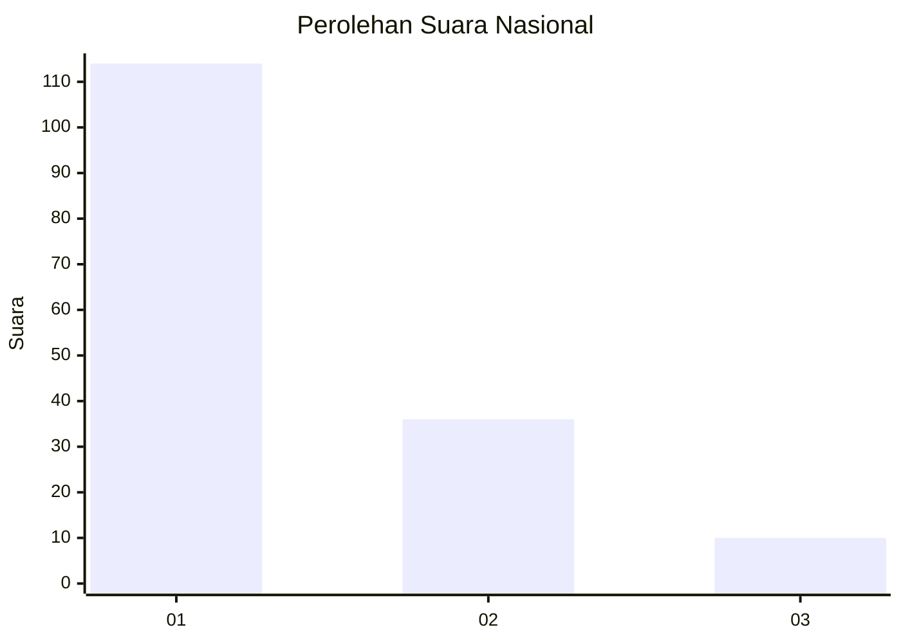
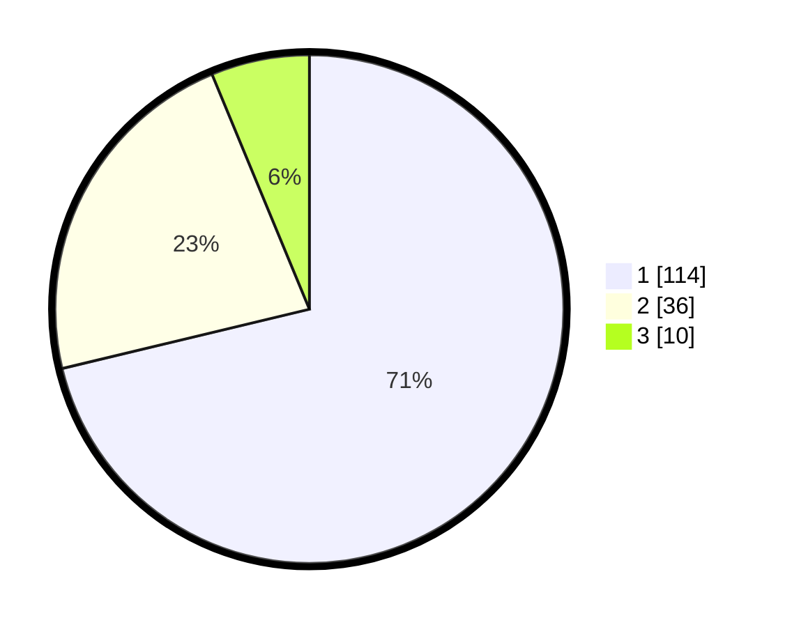

# Hasil

## Grafik

## Tabel

| No. | Nama Paslon    | Suara | Suara (raw) | Persentase |
|:--- |:-------------- | -----:| -----------:| ----------:|
| 1   | ANIES MUHAIMIN | 114   | [114][p-1]  | 71,25      |
| 2   | PRABOWO GIBRAN | 36    | [36][p-2]   | 22,50      |
| 3   | GANJAR MAHFUD  | 10    | [10][p-3]   | 6,25       |

[p-1]: https://github.com/gigit-pemilu/pemilu-2024/blob/main/pilpres/hitung-suara/sub/11-aceh/sub/09-simeulue/sub/03-teupah-barat/sub/2004-awe-seubal/sub/001-tps/sub/paslon-1.txt
[p-2]: https://github.com/gigit-pemilu/pemilu-2024/blob/main/pilpres/hitung-suara/sub/11-aceh/sub/09-simeulue/sub/03-teupah-barat/sub/2004-awe-seubal/sub/001-tps/sub/paslon-2.txt
[p-3]: https://github.com/gigit-pemilu/pemilu-2024/blob/main/pilpres/hitung-suara/sub/11-aceh/sub/09-simeulue/sub/03-teupah-barat/sub/2004-awe-seubal/sub/001-tps/sub/paslon-3.txt

## Foto C Plano

https://sirekap-obj-formc.kpu.go.id/382c/pemilu/ppwp/11/09/03/20/04/1109032004001-20240216-185613--d58e6069-7ecf-4b0a-b180-765b0b818316.jpg

https://sirekap-obj-formc.kpu.go.id/382c/pemilu/ppwp/11/09/03/20/04/1109032004001-20240216-185614--a10104e1-73b7-46af-b0ad-15e188bfd9cf.jpg

https://sirekap-obj-formc.kpu.go.id/382c/pemilu/ppwp/11/09/03/20/04/1109032004001-20240216-185614--d121d3be-c7ba-42fe-a869-6a277c192857.jpg

## Metadata

| Key        | Value               |
| ---------- | ------------------- |
| Time Stamp | 2024-02-17 12:00:00 |

## DATA PEMILIH TETAP

Jumlah pemilih dalam DPT: **183**.
 * L: **88**.
 * P: **95**.

## DATA PENGGUNA HAK PILIH

Jumlah pengguna hak pilih dalam DPT: **163**.
 * L: **76**.
 * P: **87**.

Jumlah pengguna hak pilih dalam DPTb: **3**.
 * L: **3**.
 * P: **0**.

Jumlah pengguna hak pilih dalam DPK: **2**.
 * L: **2**.
 * P: **0**.

Jumlah pengguna hak pilih: **168**.
 * L: **81**.
 * P: **87**.

## JUMLAH SUARA SAH DAN TIDAK SAH

JUMLAH SELURUH SUARA SAH: **160**.

JUMLAH SUARA TIDAK SAH: **8**.

JUMLAH SELURUH SUARA SAH DAN SUARA TIDAK SAH: **168**.

