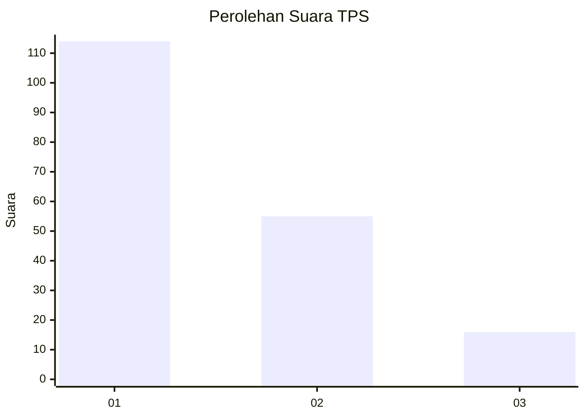
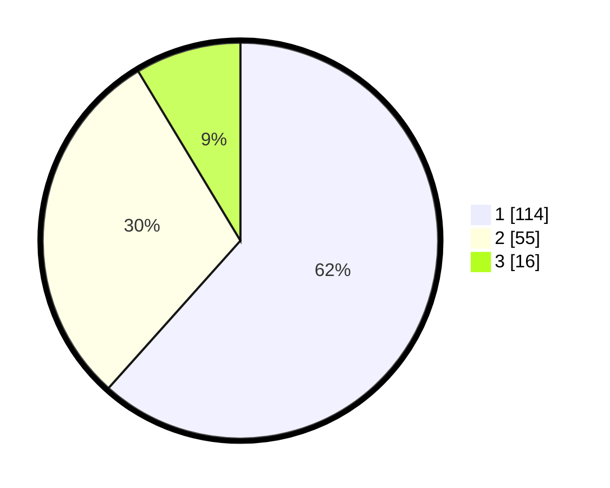

# Hasil

## Grafik

## Tabel

| No. | Nama Paslon    | Suara | Suara (raw) | Persentase |
|:--- |:-------------- | -----:| -----------:| ----------:|
| 1   | ANIES MUHAIMIN | 114   | [114][p-1]  | 61,62      |
| 2   | PRABOWO GIBRAN | 55    | [55][p-2]   | 29,73      |
| 3   | GANJAR MAHFUD  | 16    | [16][p-3]   | 8,65       |

[p-1]: https://github.com/gigit-pemilu/pemilu-2024-11-aceh/blob/main/pilpres/hitung-suara/sub/11-aceh/sub/09-simeulue/sub/03-teupah-barat/sub/2004-awe-seubal/sub/002-tps/sub/paslon-1.txt
[p-2]: https://github.com/gigit-pemilu/pemilu-2024-11-aceh/blob/main/pilpres/hitung-suara/sub/11-aceh/sub/09-simeulue/sub/03-teupah-barat/sub/2004-awe-seubal/sub/002-tps/sub/paslon-2.txt
[p-3]: https://github.com/gigit-pemilu/pemilu-2024-11-aceh/blob/main/pilpres/hitung-suara/sub/11-aceh/sub/09-simeulue/sub/03-teupah-barat/sub/2004-awe-seubal/sub/002-tps/sub/paslon-3.txt

## Foto C Plano

https://sirekap-obj-formc.kpu.go.id/b592/pemilu/ppwp/11/09/03/20/04/1109032004002-20240217-170714--2d7873a4-1770-4a9d-b0e4-d08daa8c377c.jpg

https://sirekap-obj-formc.kpu.go.id/b592/pemilu/ppwp/11/09/03/20/04/1109032004002-20240218-213540--9c3f9bf4-66b2-4c58-9f95-cf0289b0130b.jpg

https://sirekap-obj-formc.kpu.go.id/b592/pemilu/ppwp/11/09/03/20/04/1109032004002-20240218-213310--c4dd64a0-fe7a-4709-840c-cd5618489539.jpg

## Metadata

| Key        | Value               |
| ---------- | ------------------- |
| Time Stamp | 2024-02-19 06:16:00 |

