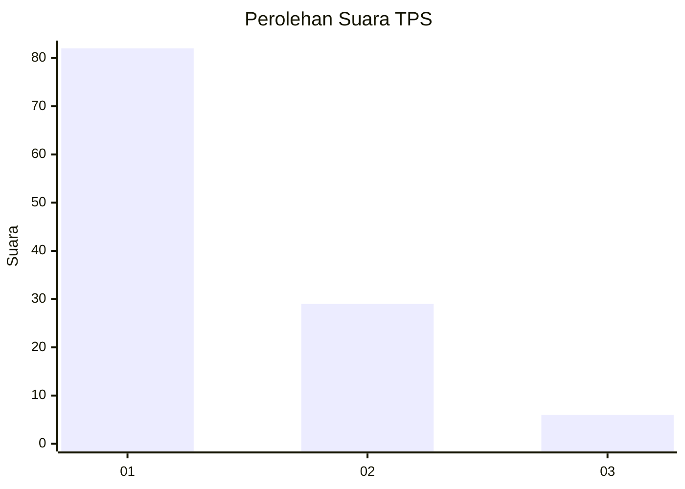
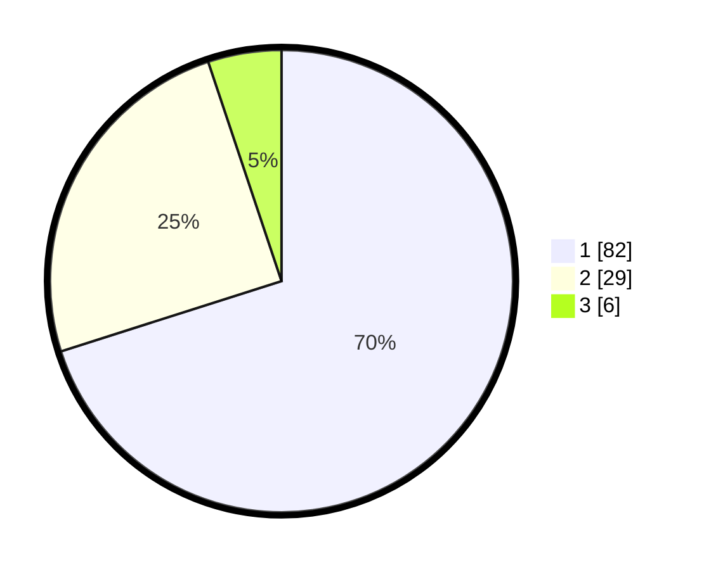

# Hasil

## Grafik

## Tabel

| No. | Nama Paslon    | Suara | Suara (raw) | Persentase |
|:--- |:-------------- | -----:| -----------:| ----------:|
| 1   | ANIES MUHAIMIN | 82    | [82][p-1]   | 70,09      |
| 2   | PRABOWO GIBRAN | 29    | [29][p-2]   | 24,79      |
| 3   | GANJAR MAHFUD  | 6     | [6][p-3]    | 5,13       |

[p-1]: https://github.com/gigit-pemilu/pemilu-2024-11-aceh/blob/main/pilpres/hitung-suara/sub/11-aceh/sub/09-simeulue/sub/03-teupah-barat/sub/2018-nancala/sub/001-tps/sub/paslon-1.txt
[p-2]: https://github.com/gigit-pemilu/pemilu-2024-11-aceh/blob/main/pilpres/hitung-suara/sub/11-aceh/sub/09-simeulue/sub/03-teupah-barat/sub/2018-nancala/sub/001-tps/sub/paslon-2.txt
[p-3]: https://github.com/gigit-pemilu/pemilu-2024-11-aceh/blob/main/pilpres/hitung-suara/sub/11-aceh/sub/09-simeulue/sub/03-teupah-barat/sub/2018-nancala/sub/001-tps/sub/paslon-3.txt

## Foto C Plano

https://sirekap-obj-formc.kpu.go.id/4f10/pemilu/ppwp/11/09/03/20/18/1109032018001-20240220-000920--d1f6c4b4-db0b-4644-80ae-dea4ed2d1494.jpg

https://sirekap-obj-formc.kpu.go.id/4f10/pemilu/ppwp/11/09/03/20/18/1109032018001-20240219-141903--e6593ac7-b619-4e95-8964-8e4715339602.jpg

https://sirekap-obj-formc.kpu.go.id/4f10/pemilu/ppwp/11/09/03/20/18/1109032018001-20240219-142307--3922d613-24c4-430f-bfea-379e8362789b.jpg

## Metadata

| Key        | Value               |
| ---------- | ------------------- |
| Time Stamp | 2024-02-20 01:00:00 |

## DATA PEMILIH TETAP

Jumlah pemilih dalam DPT: **132**.
 * L: **63**.
 * P: **69**.

## DATA PENGGUNA HAK PILIH

Jumlah pengguna hak pilih dalam DPT: **132**.
 * L: **63**.
 * P: **69**.

Jumlah pengguna hak pilih dalam DPTb: **5**.
 * L: **2**.
 * P: **3**.

Jumlah pengguna hak pilih dalam DPK: **0**.
 * L: **0**.
 * P: **0**.

Jumlah pengguna hak pilih: **119**.
 * L: **56**.
 * P: **63**.

## JUMLAH SUARA SAH DAN TIDAK SAH

JUMLAH SELURUH SUARA SAH: **117**.

JUMLAH SUARA TIDAK SAH: **2**.

JUMLAH SELURUH SUARA SAH DAN SUARA TIDAK SAH: **119**.

