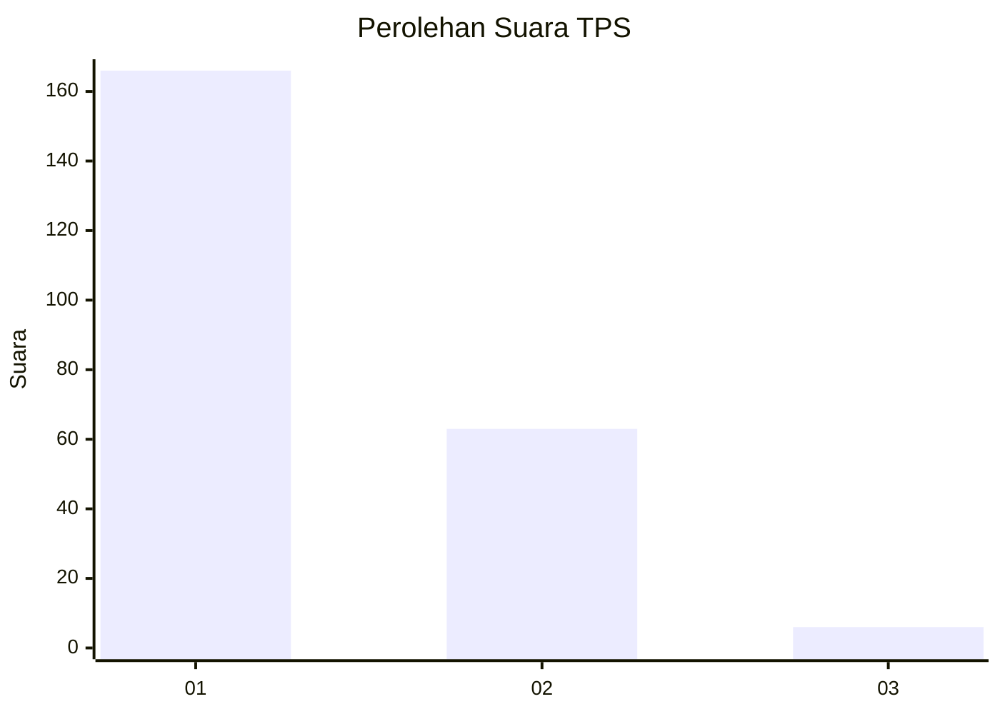
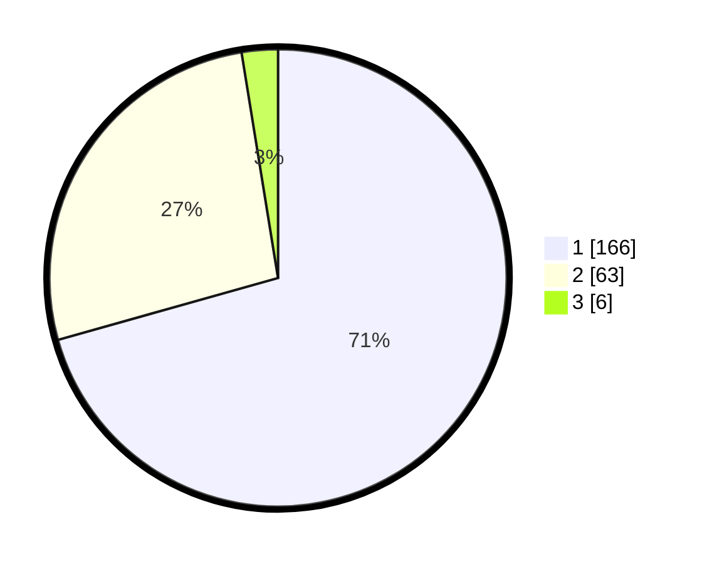

# Hasil

## Grafik

## Tabel

| No. | Nama Paslon    | Suara | Suara (raw) | Persentase |
|:--- |:-------------- | -----:| -----------:| ----------:|
| 1   | ANIES MUHAIMIN | 166   | [166][p-1]  | 70,64      |
| 2   | PRABOWO GIBRAN | 63    | [63][p-2]   | 26,81      |
| 3   | GANJAR MAHFUD  | 6     | [6][p-3]    | 2,55       |

[p-1]: https://github.com/gigit-pemilu/pemilu-2024-11-aceh/blob/main/pilpres/hitung-suara/sub/11-aceh/sub/09-simeulue/sub/04-simeulue-timur/sub/2009-suak-buluh/sub/004-tps/sub/paslon-1.txt
[p-2]: https://github.com/gigit-pemilu/pemilu-2024-11-aceh/blob/main/pilpres/hitung-suara/sub/11-aceh/sub/09-simeulue/sub/04-simeulue-timur/sub/2009-suak-buluh/sub/004-tps/sub/paslon-2.txt
[p-3]: https://github.com/gigit-pemilu/pemilu-2024-11-aceh/blob/main/pilpres/hitung-suara/sub/11-aceh/sub/09-simeulue/sub/04-simeulue-timur/sub/2009-suak-buluh/sub/004-tps/sub/paslon-3.txt

## Foto C Plano

https://sirekap-obj-formc.kpu.go.id/b94d/pemilu/ppwp/11/09/04/20/09/1109042009004-20240215-234207--51d19344-b49a-40e0-8282-dbf195afe551.jpg

https://sirekap-obj-formc.kpu.go.id/b94d/pemilu/ppwp/11/09/04/20/09/1109042009004-20240215-234317--5425a5f3-680b-4cb4-81bc-5b9add2245a0.jpg

https://sirekap-obj-formc.kpu.go.id/b94d/pemilu/ppwp/11/09/04/20/09/1109042009004-20240215-234449--d9a4dd84-6102-4248-918d-45a1810cbac0.jpg

## Metadata

| Key        | Value               |
| ---------- | ------------------- |
| Time Stamp | 2024-02-25 16:00:00 |

## DATA PEMILIH TETAP

Jumlah pemilih dalam DPT: **273**.
 * L: **126**.
 * P: **147**.

## DATA PENGGUNA HAK PILIH

Jumlah pengguna hak pilih dalam DPT: **220**.
 * L: **117**.
 * P: **103**.

Jumlah pengguna hak pilih dalam DPTb: **17**.
 * L: **14**.
 * P: **3**.

Jumlah pengguna hak pilih dalam DPK: **1**.
 * L: **0**.
 * P: **1**.

Jumlah pengguna hak pilih: **238**.
 * L: **131**.
 * P: **107**.

## JUMLAH SUARA SAH DAN TIDAK SAH

JUMLAH SELURUH SUARA SAH: **235**.

JUMLAH SUARA TIDAK SAH: **3**.

JUMLAH SELURUH SUARA SAH DAN SUARA TIDAK SAH: **238**.

