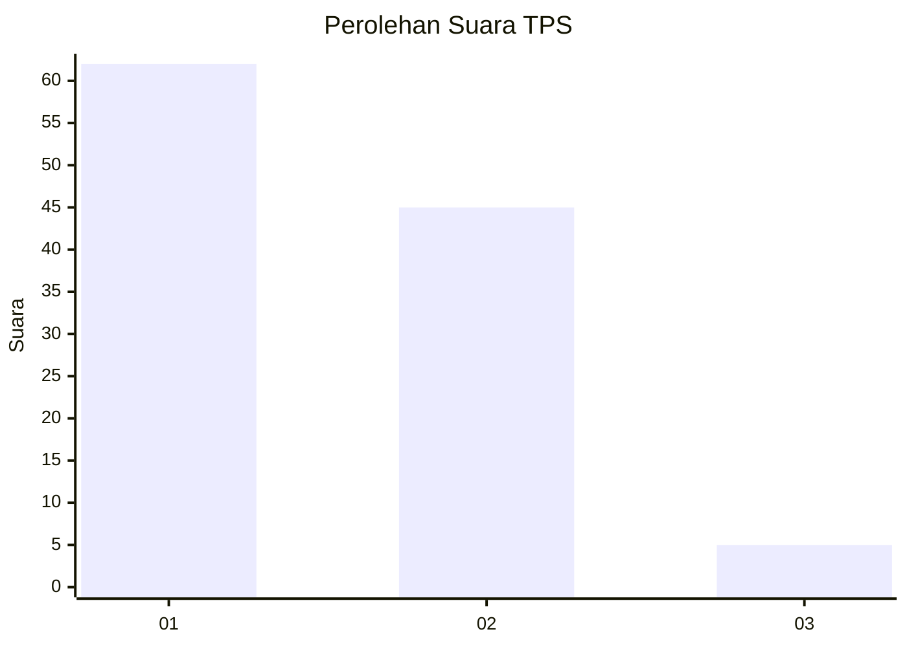
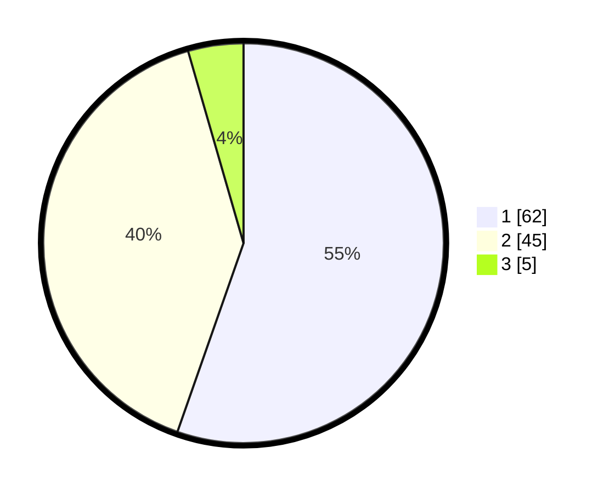

# Hasil

## Grafik

## Tabel

| No. | Nama Paslon    | Suara | Suara (raw) | Persentase |
|:--- |:-------------- | -----:| -----------:| ----------:|
| 1   | ANIES MUHAIMIN | 62    | [62][p-1]   | 55,36      |
| 2   | PRABOWO GIBRAN | 45    | [45][p-2]   | 40,18      |
| 3   | GANJAR MAHFUD  | 5     | [5][p-3]    | 4,46       |

[p-1]: https://github.com/gigit-pemilu/pemilu-2024-11-aceh/blob/main/pilpres/hitung-suara/sub/11-aceh/sub/09-simeulue/sub/04-simeulue-timur/sub/2009-suak-buluh/sub/901-tps/sub/paslon-1.txt
[p-2]: https://github.com/gigit-pemilu/pemilu-2024-11-aceh/blob/main/pilpres/hitung-suara/sub/11-aceh/sub/09-simeulue/sub/04-simeulue-timur/sub/2009-suak-buluh/sub/901-tps/sub/paslon-2.txt
[p-3]: https://github.com/gigit-pemilu/pemilu-2024-11-aceh/blob/main/pilpres/hitung-suara/sub/11-aceh/sub/09-simeulue/sub/04-simeulue-timur/sub/2009-suak-buluh/sub/901-tps/sub/paslon-3.txt

## Foto C Plano

https://sirekap-obj-formc.kpu.go.id/6381/pemilu/ppwp/11/09/04/20/09/1109042009901-20240215-002739--e779589a-6d8f-4192-a7c6-990e45df4571.jpg

https://sirekap-obj-formc.kpu.go.id/6381/pemilu/ppwp/11/09/04/20/09/1109042009901-20240215-002818--707eccb5-c709-479a-a6a5-972bf2e5fb2c.jpg

https://sirekap-obj-formc.kpu.go.id/6381/pemilu/ppwp/11/09/04/20/09/1109042009901-20240215-002918--d3258ebe-4f05-4ca0-934e-a92ac56b196e.jpg

## Metadata

| Key        | Value               |
| ---------- | ------------------- |
| Time Stamp | 2024-02-17 16:36:25 |

## DATA PEMILIH TETAP

Jumlah pemilih dalam DPT: **127**.
 * L: **124**.
 * P: **3**.

## DATA PENGGUNA HAK PILIH

Jumlah pengguna hak pilih dalam DPT: **56**.
 * L: **56**.
 * P: **0**.

Jumlah pengguna hak pilih dalam DPTb: **50**.
 * L: **48**.
 * P: **2**.

Jumlah pengguna hak pilih dalam DPK: **6**.
 * L: **6**.
 * P: **0**.

Jumlah pengguna hak pilih: **112**.
 * L: **110**.
 * P: **2**.

## JUMLAH SUARA SAH DAN TIDAK SAH

JUMLAH SELURUH SUARA SAH: **112**.

JUMLAH SUARA TIDAK SAH: **0**.

JUMLAH SELURUH SUARA SAH DAN SUARA TIDAK SAH: **112**.

