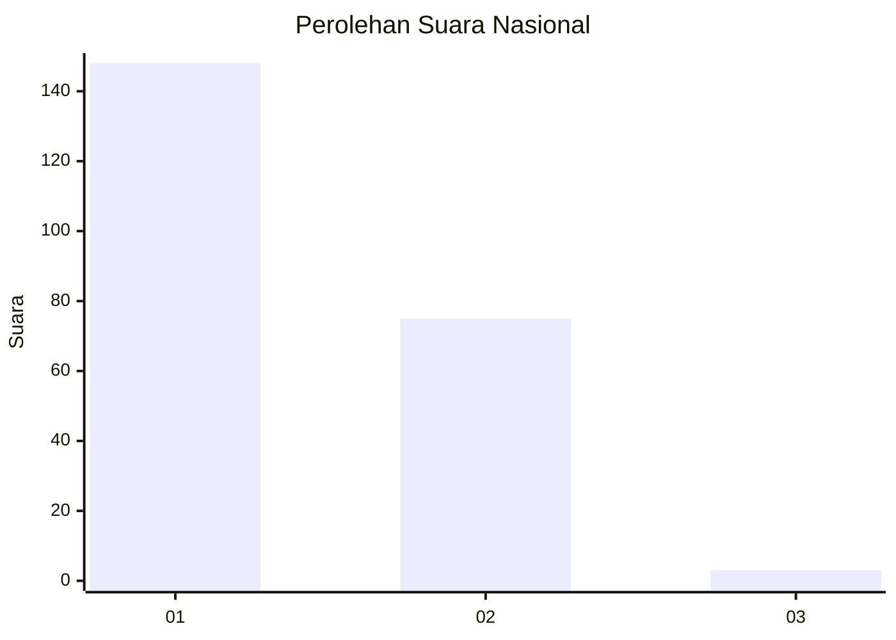
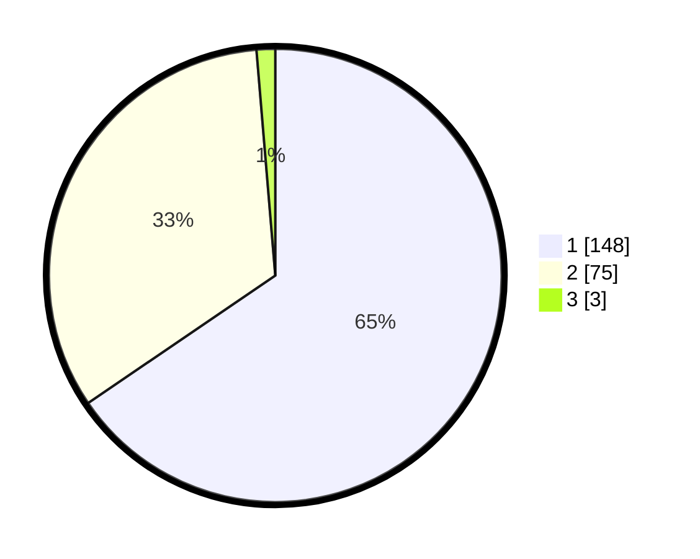

# Hasil

## Grafik

## Tabel

| No. | Nama Paslon    | Suara | Suara (raw) | Persentase |
|:--- |:-------------- | -----:| -----------:| ----------:|
| 1   | ANIES MUHAIMIN | 148   | [148][p-1]  | 65,49      |
| 2   | PRABOWO GIBRAN | 75    | [75][p-2]   | 33,19      |
| 3   | GANJAR MAHFUD  | 3     | [3][p-3]    | 1,33       |

[p-1]: https://github.com/gigit-pemilu/pemilu-2024/blob/main/pilpres/hitung-suara/sub/11-aceh/sub/09-simeulue/sub/04-simeulue-timur/sub/2014-suka-jaya/sub/001-tps/sub/paslon-1.txt
[p-2]: https://github.com/gigit-pemilu/pemilu-2024/blob/main/pilpres/hitung-suara/sub/11-aceh/sub/09-simeulue/sub/04-simeulue-timur/sub/2014-suka-jaya/sub/001-tps/sub/paslon-2.txt
[p-3]: https://github.com/gigit-pemilu/pemilu-2024/blob/main/pilpres/hitung-suara/sub/11-aceh/sub/09-simeulue/sub/04-simeulue-timur/sub/2014-suka-jaya/sub/001-tps/sub/paslon-3.txt

## Foto C Plano

https://sirekap-obj-formc.kpu.go.id/ff32/pemilu/ppwp/11/09/04/20/14/1109042014001-20240216-122014--fe91e922-bfed-4624-b719-8730566dd111.jpg

https://sirekap-obj-formc.kpu.go.id/ff32/pemilu/ppwp/11/09/04/20/14/1109042014001-20240216-121955--5e695170-fa9a-4c3e-b4b9-dbf85851a0f5.jpg

https://sirekap-obj-formc.kpu.go.id/ff32/pemilu/ppwp/11/09/04/20/14/1109042014001-20240216-122027--190ef401-fd0e-4f84-b513-0d06c384a920.jpg

## Metadata

| Key        | Value               |
| ---------- | ------------------- |
| Time Stamp | 2024-02-24 22:31:28 |

