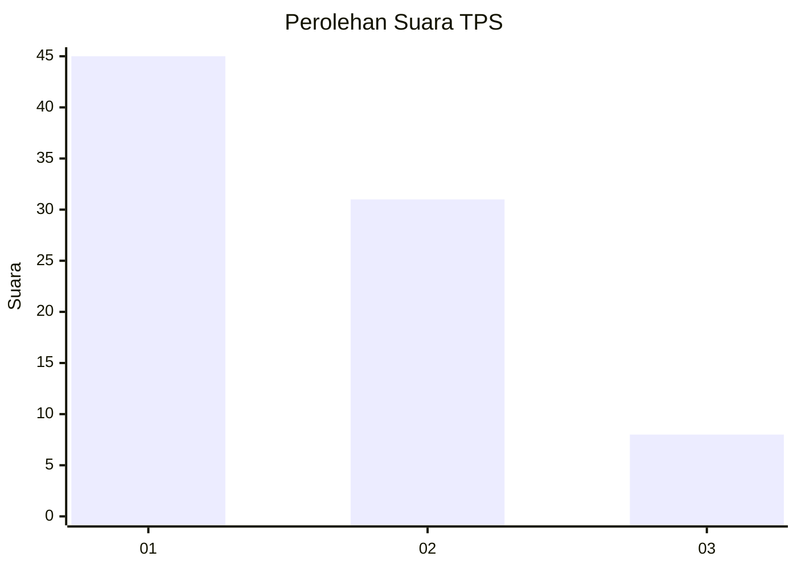
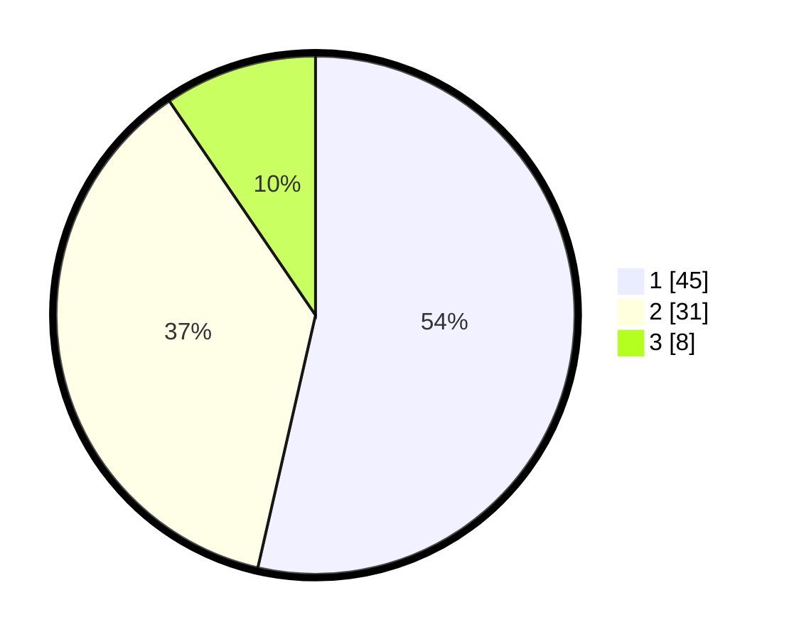

# Hasil

## Grafik

## Tabel

| No. | Nama Paslon    | Suara | Suara (raw) | Persentase |
|:--- |:-------------- | -----:| -----------:| ----------:|
| 1   | ANIES MUHAIMIN | 45    | [45][p-1]   | 53,57      |
| 2   | PRABOWO GIBRAN | 31    | [31][p-2]   | 36,90      |
| 3   | GANJAR MAHFUD  | 8     | [8][p-3]    | 9,52       |

[p-1]: https://github.com/gigit-pemilu/pemilu-2024-11-aceh/blob/main/pilpres/hitung-suara/sub/11-aceh/sub/09-simeulue/sub/04-simeulue-timur/sub/2014-suka-jaya/sub/007-tps/sub/paslon-1.txt
[p-2]: https://github.com/gigit-pemilu/pemilu-2024-11-aceh/blob/main/pilpres/hitung-suara/sub/11-aceh/sub/09-simeulue/sub/04-simeulue-timur/sub/2014-suka-jaya/sub/007-tps/sub/paslon-2.txt
[p-3]: https://github.com/gigit-pemilu/pemilu-2024-11-aceh/blob/main/pilpres/hitung-suara/sub/11-aceh/sub/09-simeulue/sub/04-simeulue-timur/sub/2014-suka-jaya/sub/007-tps/sub/paslon-3.txt

## Foto C Plano

https://sirekap-obj-formc.kpu.go.id/4c10/pemilu/ppwp/11/09/04/20/14/1109042014007-20240215-222343--f489c812-7dbe-4755-b639-aab44427ffc7.jpg

https://sirekap-obj-formc.kpu.go.id/4c10/pemilu/ppwp/11/09/04/20/14/1109042014007-20240215-222112--3ed407a0-5d03-4d57-ab49-97b2570bc375.jpg

https://sirekap-obj-formc.kpu.go.id/4c10/pemilu/ppwp/11/09/04/20/14/1109042014007-20240215-221703--af872e8d-465d-480f-a0e5-46ee517ecb75.jpg

## Metadata

| Key        | Value               |
| ---------- | ------------------- |
| Time Stamp | 2024-02-19 06:16:00 |

## DATA PEMILIH TETAP

Jumlah pemilih dalam DPT: **114**.
 * L: **51**.
 * P: **63**.

## DATA PENGGUNA HAK PILIH

Jumlah pengguna hak pilih dalam DPT: **79**.
 * L: **31**.
 * P: **48**.

Jumlah pengguna hak pilih dalam DPTb: **5**.
 * L: **3**.
 * P: **2**.

Jumlah pengguna hak pilih dalam DPK: **1**.
 * L: **1**.
 * P: **0**.

Jumlah pengguna hak pilih: **85**.
 * L: **35**.
 * P: **50**.

## JUMLAH SUARA SAH DAN TIDAK SAH

JUMLAH SELURUH SUARA SAH: **84**.

JUMLAH SUARA TIDAK SAH: **1**.

JUMLAH SELURUH SUARA SAH DAN SUARA TIDAK SAH: **85**.

