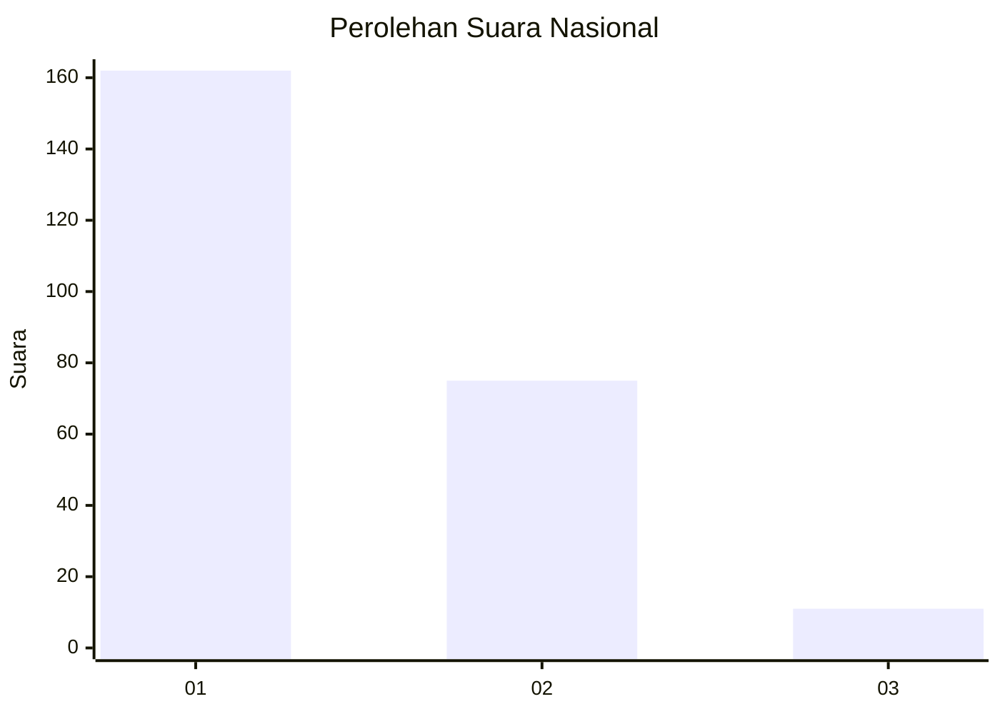
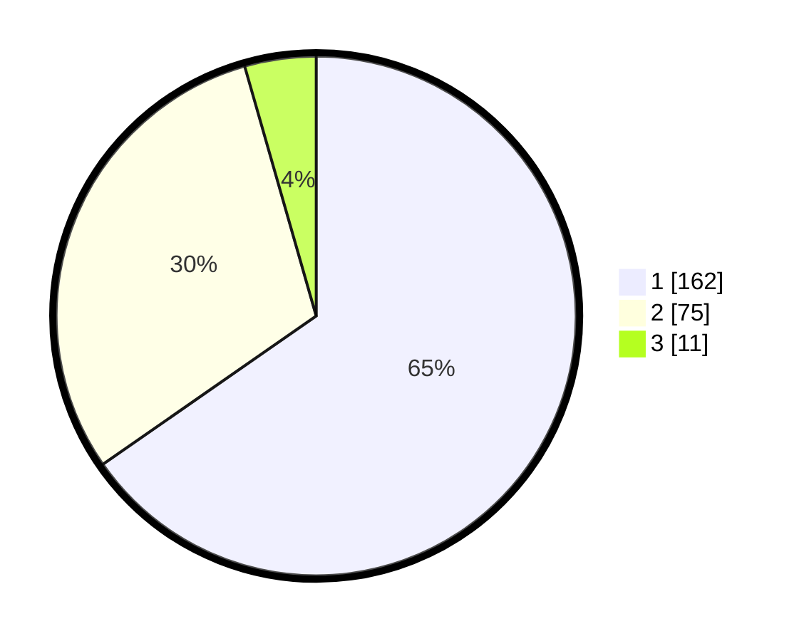

# Hasil

## Grafik

## Tabel

| No. | Nama Paslon    | Suara | Suara (raw) | Persentase |
|:--- |:-------------- | -----:| -----------:| ----------:|
| 1   | ANIES MUHAIMIN | 162   | [162][p-1]  | 65,32      |
| 2   | PRABOWO GIBRAN | 75    | [75][p-2]   | 30,24      |
| 3   | GANJAR MAHFUD  | 11    | [11][p-3]   | 4,44       |

[p-1]: https://github.com/gigit-pemilu/pemilu-2024/blob/main/pilpres/hitung-suara/sub/11-aceh/sub/09-simeulue/sub/04-simeulue-timur/sub/2016-suka-karya/sub/006-tps/sub/paslon-1.txt
[p-2]: https://github.com/gigit-pemilu/pemilu-2024/blob/main/pilpres/hitung-suara/sub/11-aceh/sub/09-simeulue/sub/04-simeulue-timur/sub/2016-suka-karya/sub/006-tps/sub/paslon-2.txt
[p-3]: https://github.com/gigit-pemilu/pemilu-2024/blob/main/pilpres/hitung-suara/sub/11-aceh/sub/09-simeulue/sub/04-simeulue-timur/sub/2016-suka-karya/sub/006-tps/sub/paslon-3.txt

## Foto C Plano

https://sirekap-obj-formc.kpu.go.id/2bcb/pemilu/ppwp/11/09/04/20/16/1109042016006-20240214-200353--5ec41f81-56c9-410d-a3f3-f601534c054a.jpg

https://sirekap-obj-formc.kpu.go.id/2bcb/pemilu/ppwp/11/09/04/20/16/1109042016006-20240214-200512--c54a1c3d-8638-4d7b-bed7-e2a7d52d5a65.jpg

https://sirekap-obj-formc.kpu.go.id/2bcb/pemilu/ppwp/11/09/04/20/16/1109042016006-20240214-200716--e0f1112b-93ff-4503-9fd1-9aca66292d5d.jpg

## Metadata

| Key        | Value               |
| ---------- | ------------------- |
| Time Stamp | 2024-02-14 21:46:01 |

