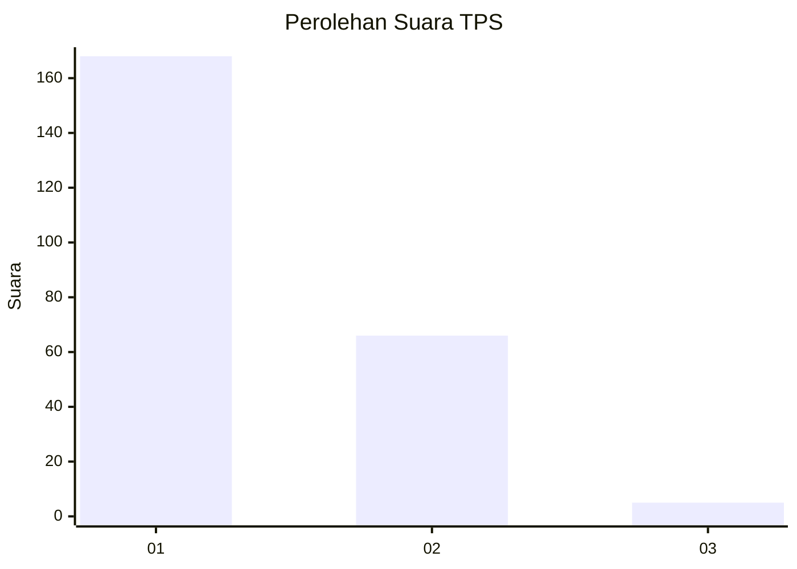
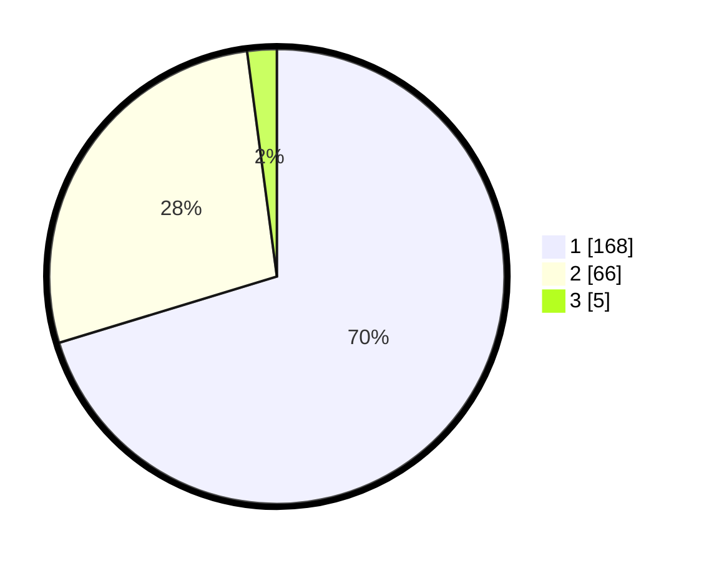

# Hasil

## Grafik

## Tabel

| No. | Nama Paslon    | Suara | Suara (raw) | Persentase |
|:--- |:-------------- | -----:| -----------:| ----------:|
| 1   | ANIES MUHAIMIN | 168   | [168][p-1]  | 70,29      |
| 2   | PRABOWO GIBRAN | 66    | [66][p-2]   | 27,62      |
| 3   | GANJAR MAHFUD  | 5     | [5][p-3]    | 2,09       |

[p-1]: https://github.com/gigit-pemilu/pemilu-2024-11-aceh/blob/main/pilpres/hitung-suara/sub/11-aceh/sub/09-simeulue/sub/04-simeulue-timur/sub/2016-suka-karya/sub/008-tps/sub/paslon-1.txt
[p-2]: https://github.com/gigit-pemilu/pemilu-2024-11-aceh/blob/main/pilpres/hitung-suara/sub/11-aceh/sub/09-simeulue/sub/04-simeulue-timur/sub/2016-suka-karya/sub/008-tps/sub/paslon-2.txt
[p-3]: https://github.com/gigit-pemilu/pemilu-2024-11-aceh/blob/main/pilpres/hitung-suara/sub/11-aceh/sub/09-simeulue/sub/04-simeulue-timur/sub/2016-suka-karya/sub/008-tps/sub/paslon-3.txt

## Foto C Plano

https://sirekap-obj-formc.kpu.go.id/b738/pemilu/ppwp/11/09/04/20/16/1109042016008-20240214-214124--caa9c27d-f2ad-4134-b595-64fc3e12554e.jpg

https://sirekap-obj-formc.kpu.go.id/b738/pemilu/ppwp/11/09/04/20/16/1109042016008-20240214-214239--e2dedff2-f5ef-4303-aedc-e8381d873b11.jpg

https://sirekap-obj-formc.kpu.go.id/b738/pemilu/ppwp/11/09/04/20/16/1109042016008-20240214-214349--63b47fef-86ed-4bc7-aa56-8d524f8ef9af.jpg

## Metadata

| Key        | Value               |
| ---------- | ------------------- |
| Time Stamp | 2024-02-19 20:00:00 |

