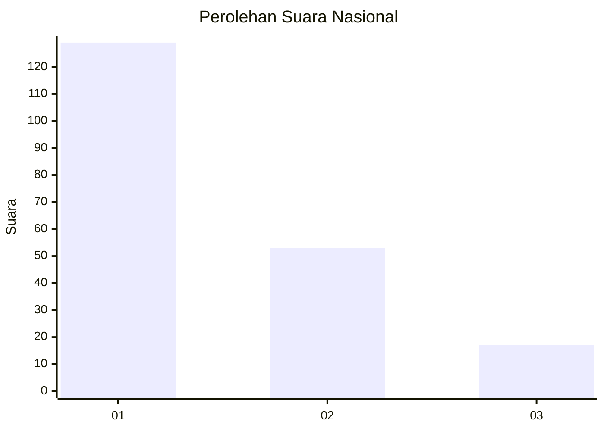
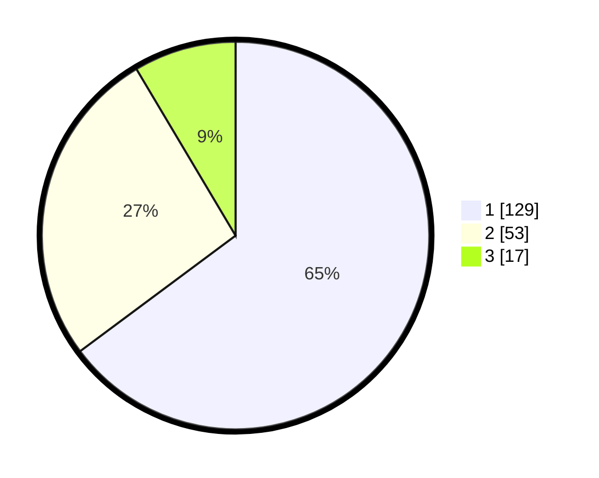

# Hasil

## Grafik

## Tabel

| No. | Nama Paslon    | Suara | Suara (raw) | Persentase |
|:--- |:-------------- | -----:| -----------:| ----------:|
| 1   | ANIES MUHAIMIN | 129   | [129][p-1]  | 64,82      |
| 2   | PRABOWO GIBRAN | 53    | [53][p-2]   | 26,63      |
| 3   | GANJAR MAHFUD  | 17    | [17][p-3]   | 8,54       |

[p-1]: https://github.com/gigit-pemilu/pemilu-2024/blob/main/pilpres/hitung-suara/sub/11-aceh/sub/09-simeulue/sub/04-simeulue-timur/sub/2021-ganting/sub/002-tps/sub/paslon-1.txt
[p-2]: https://github.com/gigit-pemilu/pemilu-2024/blob/main/pilpres/hitung-suara/sub/11-aceh/sub/09-simeulue/sub/04-simeulue-timur/sub/2021-ganting/sub/002-tps/sub/paslon-2.txt
[p-3]: https://github.com/gigit-pemilu/pemilu-2024/blob/main/pilpres/hitung-suara/sub/11-aceh/sub/09-simeulue/sub/04-simeulue-timur/sub/2021-ganting/sub/002-tps/sub/paslon-3.txt

## Foto C Plano

https://sirekap-obj-formc.kpu.go.id/5a16/pemilu/ppwp/11/09/04/20/21/1109042021002-20240217-194153--ea14ea27-cb63-4880-8d17-86934951e114.jpg

https://sirekap-obj-formc.kpu.go.id/5a16/pemilu/ppwp/11/09/04/20/21/1109042021002-20240217-194154--0691f081-ddf8-40fb-b9b4-1d42211a89b4.jpg

https://sirekap-obj-formc.kpu.go.id/5a16/pemilu/ppwp/11/09/04/20/21/1109042021002-20240217-194153--48d7ea3a-b424-4b15-a8e2-00387d50a95e.jpg

## Metadata

| Key        | Value               |
| ---------- | ------------------- |
| Time Stamp | 2024-02-24 22:31:28 |

## DATA PEMILIH TETAP

Jumlah pemilih dalam DPT: **218**.
 * L: **115**.
 * P: **103**.

## DATA PENGGUNA HAK PILIH

Jumlah pengguna hak pilih dalam DPT: **197**.
 * L: **104**.
 * P: **93**.

Jumlah pengguna hak pilih dalam DPTb: **3**.
 * L: **2**.
 * P: **1**.

Jumlah pengguna hak pilih dalam DPK: **0**.
 * L: **0**.
 * P: **0**.

Jumlah pengguna hak pilih: **200**.
 * L: **106**.
 * P: **94**.

## JUMLAH SUARA SAH DAN TIDAK SAH

JUMLAH SELURUH SUARA SAH: **129**.

JUMLAH SUARA TIDAK SAH: **53**.

JUMLAH SELURUH SUARA SAH DAN SUARA TIDAK SAH: **200**.

