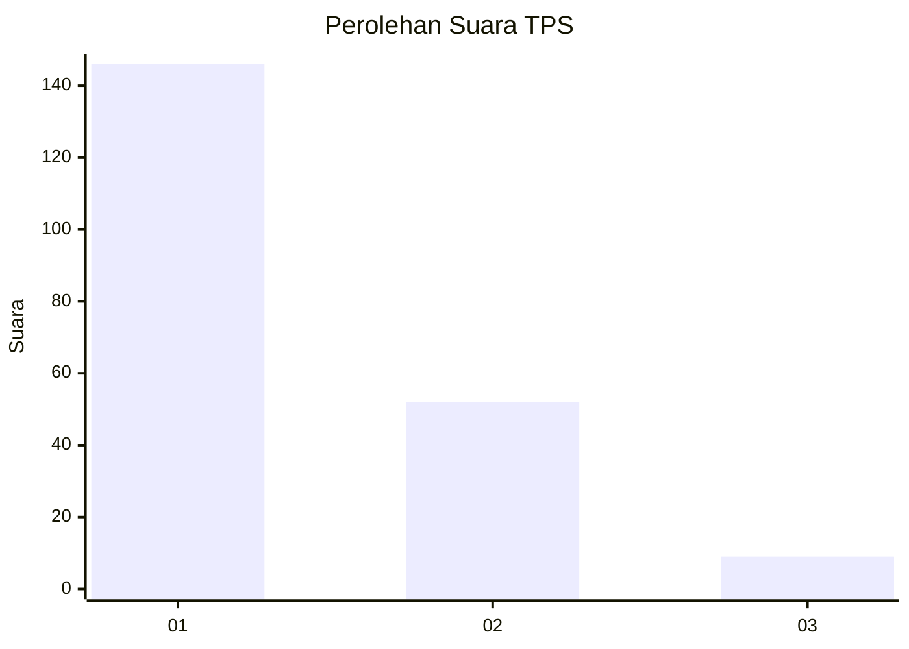
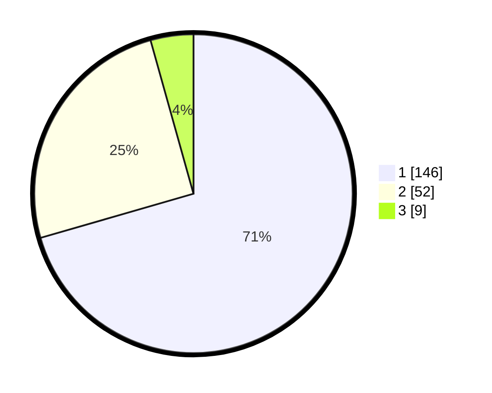

# Hasil

## Grafik

## Tabel

| No. | Nama Paslon    | Suara | Suara (raw) | Persentase |
|:--- |:-------------- | -----:| -----------:| ----------:|
| 1   | ANIES MUHAIMIN | 146   | [146][p-1]  | 70,53      |
| 2   | PRABOWO GIBRAN | 52    | [52][p-2]   | 25,12      |
| 3   | GANJAR MAHFUD  | 9     | [9][p-3]    | 4,35       |

[p-1]: https://github.com/gigit-pemilu/pemilu-2024-11-aceh/blob/main/pilpres/hitung-suara/sub/11-aceh/sub/09-simeulue/sub/04-simeulue-timur/sub/2028-linggi/sub/002-tps/sub/paslon-1.txt
[p-2]: https://github.com/gigit-pemilu/pemilu-2024-11-aceh/blob/main/pilpres/hitung-suara/sub/11-aceh/sub/09-simeulue/sub/04-simeulue-timur/sub/2028-linggi/sub/002-tps/sub/paslon-2.txt
[p-3]: https://github.com/gigit-pemilu/pemilu-2024-11-aceh/blob/main/pilpres/hitung-suara/sub/11-aceh/sub/09-simeulue/sub/04-simeulue-timur/sub/2028-linggi/sub/002-tps/sub/paslon-3.txt

## Foto C Plano

https://sirekap-obj-formc.kpu.go.id/eb82/pemilu/ppwp/11/09/04/20/28/1109042028002-20240214-224406--2bb61add-554e-49e0-911d-64e4185ca9a7.jpg

https://sirekap-obj-formc.kpu.go.id/eb82/pemilu/ppwp/11/09/04/20/28/1109042028002-20240214-222346--aea9e97e-103a-4c47-aa8b-e4e0eb344207.jpg

## Metadata

| Key        | Value               |
| ---------- | ------------------- |
| Time Stamp | 2024-02-15 07:00:44 |

