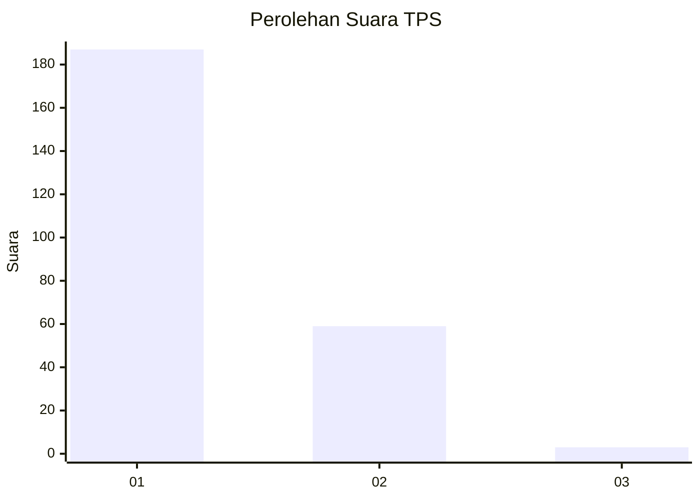
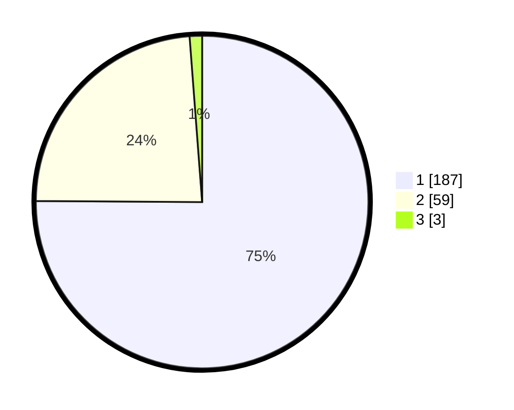

# Hasil

## Grafik

## Tabel

| No. | Nama Paslon    | Suara | Suara (raw) | Persentase |
|:--- |:-------------- | -----:| -----------:| ----------:|
| 1   | ANIES MUHAIMIN | 187   | [187][p-1]  | 75,10      |
| 2   | PRABOWO GIBRAN | 59    | [59][p-2]   | 23,69      |
| 3   | GANJAR MAHFUD  | 3     | [3][p-3]    | 1,20       |

[p-1]: https://github.com/gigit-pemilu/pemilu-2024-11-aceh/blob/main/pilpres/hitung-suara/sub/11-aceh/sub/09-simeulue/sub/05-teluk-dalam/sub/2003-gunung-putih/sub/001-tps/sub/paslon-1.txt
[p-2]: https://github.com/gigit-pemilu/pemilu-2024-11-aceh/blob/main/pilpres/hitung-suara/sub/11-aceh/sub/09-simeulue/sub/05-teluk-dalam/sub/2003-gunung-putih/sub/001-tps/sub/paslon-2.txt
[p-3]: https://github.com/gigit-pemilu/pemilu-2024-11-aceh/blob/main/pilpres/hitung-suara/sub/11-aceh/sub/09-simeulue/sub/05-teluk-dalam/sub/2003-gunung-putih/sub/001-tps/sub/paslon-3.txt

## Foto C Plano

https://sirekap-obj-formc.kpu.go.id/1a58/pemilu/ppwp/11/09/05/20/03/1109052003001-20240225-161534--8fa2f890-d7e2-4d97-a418-727717b45821.jpg

https://sirekap-obj-formc.kpu.go.id/1a58/pemilu/ppwp/11/09/05/20/03/1109052003001-20240214-225245--b9ef9d75-f99b-402a-8d29-07e399bc669f.jpg

https://sirekap-obj-formc.kpu.go.id/1a58/pemilu/ppwp/11/09/05/20/03/1109052003001-20240214-225505--2a955b2d-8161-445e-a014-c193e61219c3.jpg

## Metadata

| Key        | Value               |
| ---------- | ------------------- |
| Time Stamp | 2024-02-25 17:00:00 |

