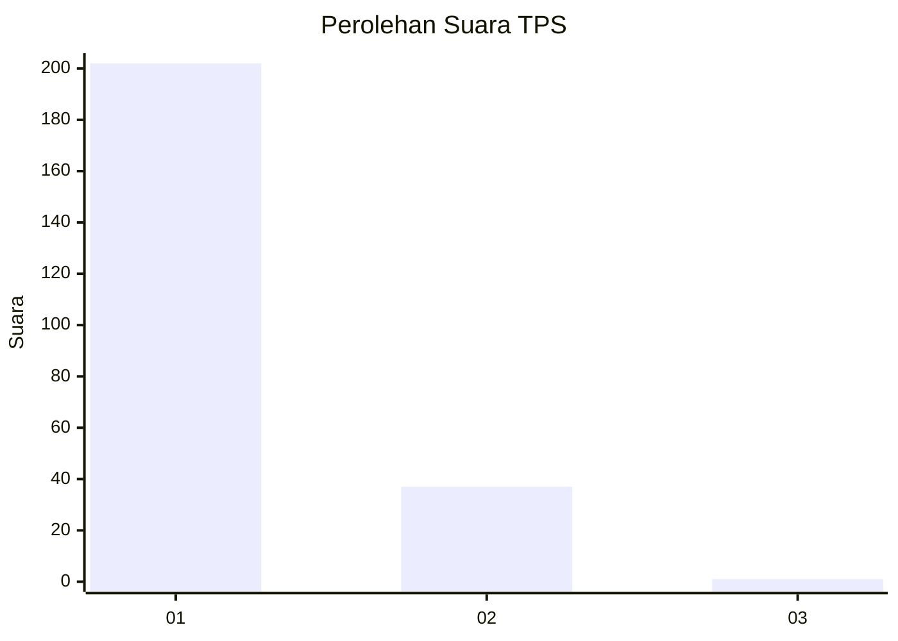
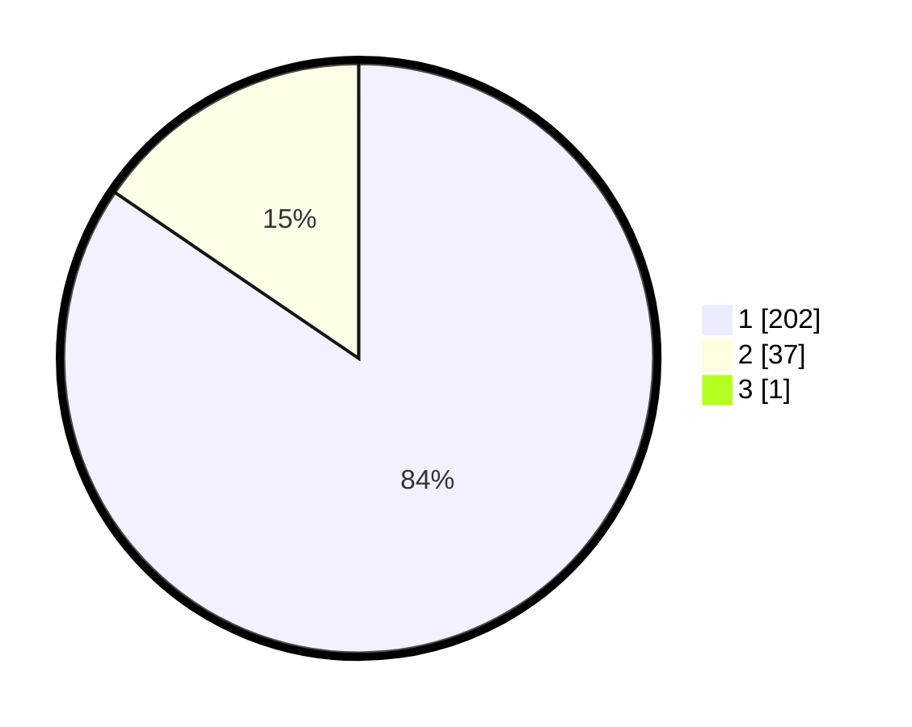

# Hasil

## Grafik

## Tabel

| No. | Nama Paslon    | Suara | Suara (raw) | Persentase |
|:--- |:-------------- | -----:| -----------:| ----------:|
| 1   | ANIES MUHAIMIN | 202   | [202][p-1]  | 84,17      |
| 2   | PRABOWO GIBRAN | 37    | [37][p-2]   | 15,42      |
| 3   | GANJAR MAHFUD  | 1     | [1][p-3]    | 0,42       |

[p-1]: https://github.com/gigit-pemilu/pemilu-2024-11-aceh/blob/main/pilpres/hitung-suara/sub/11-aceh/sub/09-simeulue/sub/05-teluk-dalam/sub/2004-lugu-sebahak/sub/001-tps/sub/paslon-1.txt
[p-2]: https://github.com/gigit-pemilu/pemilu-2024-11-aceh/blob/main/pilpres/hitung-suara/sub/11-aceh/sub/09-simeulue/sub/05-teluk-dalam/sub/2004-lugu-sebahak/sub/001-tps/sub/paslon-2.txt
[p-3]: https://github.com/gigit-pemilu/pemilu-2024-11-aceh/blob/main/pilpres/hitung-suara/sub/11-aceh/sub/09-simeulue/sub/05-teluk-dalam/sub/2004-lugu-sebahak/sub/001-tps/sub/paslon-3.txt

## Foto C Plano

https://sirekap-obj-formc.kpu.go.id/86a7/pemilu/ppwp/11/09/05/20/04/1109052004001-20240215-071828--115493a1-d1c2-4d9a-9bf8-4a376c986b0a.jpg

https://sirekap-obj-formc.kpu.go.id/86a7/pemilu/ppwp/11/09/05/20/04/1109052004001-20240215-171503--03f3b8d4-10eb-4a27-bdfb-af9fe03c141f.jpg

https://sirekap-obj-formc.kpu.go.id/86a7/pemilu/ppwp/11/09/05/20/04/1109052004001-20240215-172358--c07abc21-1082-416d-b72c-865dbadf0925.jpg

## Metadata

| Key        | Value               |
| ---------- | ------------------- |
| Time Stamp | 2024-02-15 20:30:46 |

## DATA PEMILIH TETAP

Jumlah pemilih dalam DPT: **289**.
 * L: **155**.
 * P: **134**.

## DATA PENGGUNA HAK PILIH

Jumlah pengguna hak pilih dalam DPT: **232**.
 * L: **125**.
 * P: **107**.

Jumlah pengguna hak pilih dalam DPTb: **5**.
 * L: **1**.
 * P: **4**.

Jumlah pengguna hak pilih dalam DPK: **3**.
 * L: **1**.
 * P: **2**.

Jumlah pengguna hak pilih: **240**.
 * L: **127**.
 * P: **113**.

## JUMLAH SUARA SAH DAN TIDAK SAH

JUMLAH SELURUH SUARA SAH: **240**.

JUMLAH SUARA TIDAK SAH: **0**.

JUMLAH SELURUH SUARA SAH DAN SUARA TIDAK SAH: **240**.

