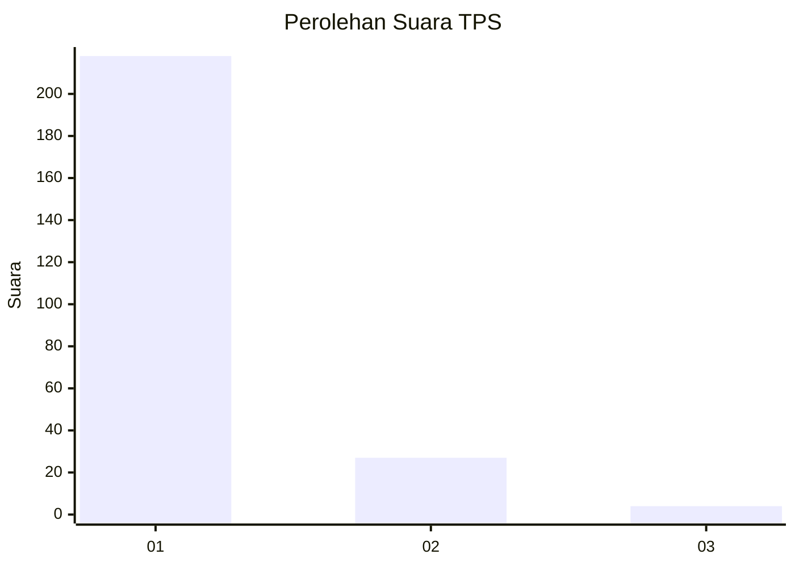
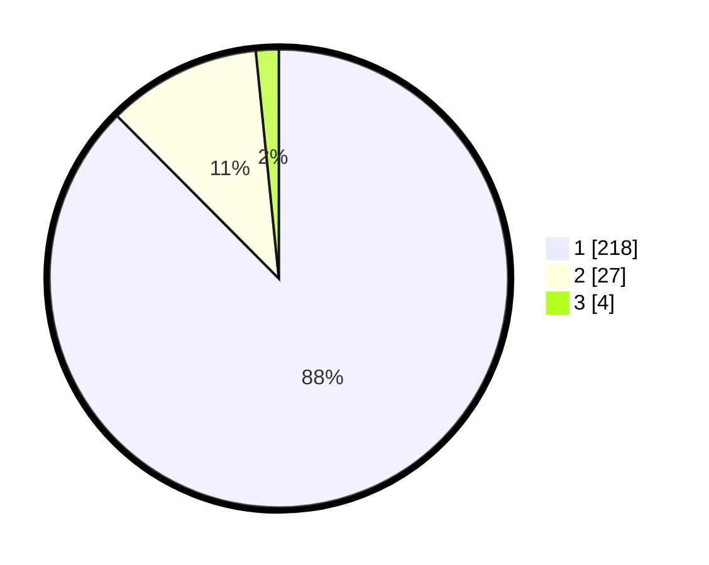

# Hasil

## Grafik

## Tabel

| No. | Nama Paslon    | Suara | Suara (raw) | Persentase |
|:--- |:-------------- | -----:| -----------:| ----------:|
| 1   | ANIES MUHAIMIN | 218   | [218][p-1]  | 87,55      |
| 2   | PRABOWO GIBRAN | 27    | [27][p-2]   | 10,84      |
| 3   | GANJAR MAHFUD  | 4     | [4][p-3]    | 1,61       |

[p-1]: https://github.com/gigit-pemilu/pemilu-2024-11-aceh/blob/main/pilpres/hitung-suara/sub/11-aceh/sub/09-simeulue/sub/06-simeulue-barat/sub/2003-sigulai/sub/002-tps/sub/paslon-1.txt
[p-2]: https://github.com/gigit-pemilu/pemilu-2024-11-aceh/blob/main/pilpres/hitung-suara/sub/11-aceh/sub/09-simeulue/sub/06-simeulue-barat/sub/2003-sigulai/sub/002-tps/sub/paslon-2.txt
[p-3]: https://github.com/gigit-pemilu/pemilu-2024-11-aceh/blob/main/pilpres/hitung-suara/sub/11-aceh/sub/09-simeulue/sub/06-simeulue-barat/sub/2003-sigulai/sub/002-tps/sub/paslon-3.txt

## Foto C Plano

https://sirekap-obj-formc.kpu.go.id/44a5/pemilu/ppwp/11/09/06/20/03/1109062003002-20240215-133658--d6b1abdd-0802-4fa0-adea-c1d5d76b470c.jpg

https://sirekap-obj-formc.kpu.go.id/44a5/pemilu/ppwp/11/09/06/20/03/1109062003002-20240215-134022--bd2bfb19-c485-46c2-99a9-fe2acf64812a.jpg

https://sirekap-obj-formc.kpu.go.id/44a5/pemilu/ppwp/11/09/06/20/03/1109062003002-20240215-134417--bb858ee5-a590-4f33-abca-bde299183693.jpg

## Metadata

| Key        | Value               |
| ---------- | ------------------- |
| Time Stamp | 2024-02-16 16:25:10 |

## DATA PEMILIH TETAP

Jumlah pemilih dalam DPT: **276**.
 * L: **138**.
 * P: **138**.

## DATA PENGGUNA HAK PILIH

Jumlah pengguna hak pilih dalam DPT: **231**.
 * L: **119**.
 * P: **112**.

Jumlah pengguna hak pilih dalam DPTb: **1**.
 * L: **0**.
 * P: **1**.

Jumlah pengguna hak pilih dalam DPK: **17**.
 * L: **8**.
 * P: **9**.

Jumlah pengguna hak pilih: **249**.
 * L: **127**.
 * P: **122**.

## JUMLAH SUARA SAH DAN TIDAK SAH

JUMLAH SELURUH SUARA SAH: **249**.

JUMLAH SUARA TIDAK SAH: **0**.

JUMLAH SELURUH SUARA SAH DAN SUARA TIDAK SAH: **249**.

