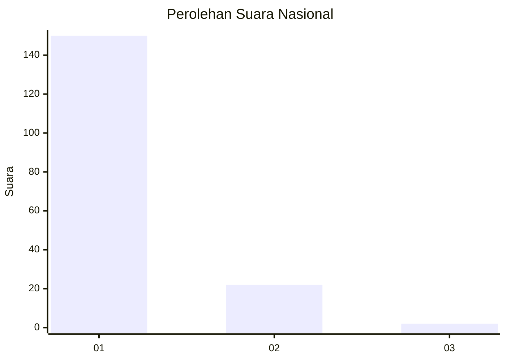
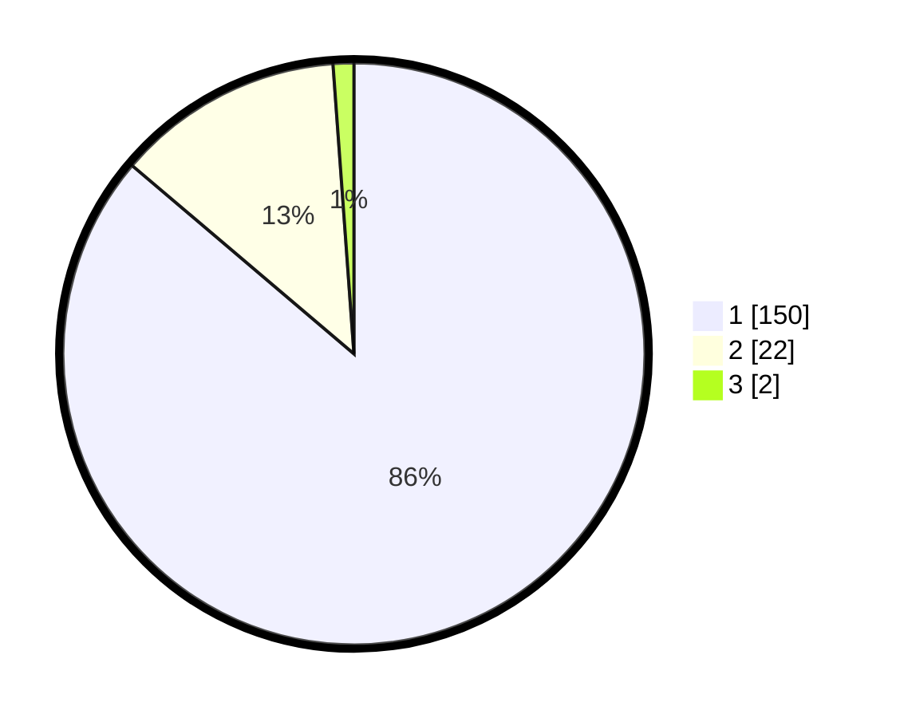

# Hasil

## Grafik

## Tabel

| No. | Nama Paslon    | Suara | Suara (raw) | Persentase |
|:--- |:-------------- | -----:| -----------:| ----------:|
| 1   | ANIES MUHAIMIN | 150   | [150][p-1]  | 86,21      |
| 2   | PRABOWO GIBRAN | 22    | [22][p-2]   | 12,64      |
| 3   | GANJAR MAHFUD  | 2     | [2][p-3]    | 1,15       |

[p-1]: https://github.com/gigit-pemilu/pemilu-2024/blob/main/pilpres/hitung-suara/sub/11-aceh/sub/09-simeulue/sub/06-simeulue-barat/sub/2004-sinar-bahagia/sub/001-tps/sub/paslon-1.txt
[p-2]: https://github.com/gigit-pemilu/pemilu-2024/blob/main/pilpres/hitung-suara/sub/11-aceh/sub/09-simeulue/sub/06-simeulue-barat/sub/2004-sinar-bahagia/sub/001-tps/sub/paslon-2.txt
[p-3]: https://github.com/gigit-pemilu/pemilu-2024/blob/main/pilpres/hitung-suara/sub/11-aceh/sub/09-simeulue/sub/06-simeulue-barat/sub/2004-sinar-bahagia/sub/001-tps/sub/paslon-3.txt

## Foto C Plano

https://sirekap-obj-formc.kpu.go.id/202b/pemilu/ppwp/11/09/06/20/04/1109062004001-20240215-173746--71e79807-c419-4a47-ace3-f4d1ec9d9526.jpg

https://sirekap-obj-formc.kpu.go.id/202b/pemilu/ppwp/11/09/06/20/04/1109062004001-20240214-205207--d6f2e1b7-cf9e-4b9e-8ead-d95114d05146.jpg

https://sirekap-obj-formc.kpu.go.id/202b/pemilu/ppwp/11/09/06/20/04/1109062004001-20240215-162115--5c4eb81b-ea09-482d-a105-05ae30c06b32.jpg

## Metadata

| Key        | Value               |
| ---------- | ------------------- |
| Time Stamp | 2024-02-17 00:28:35 |

