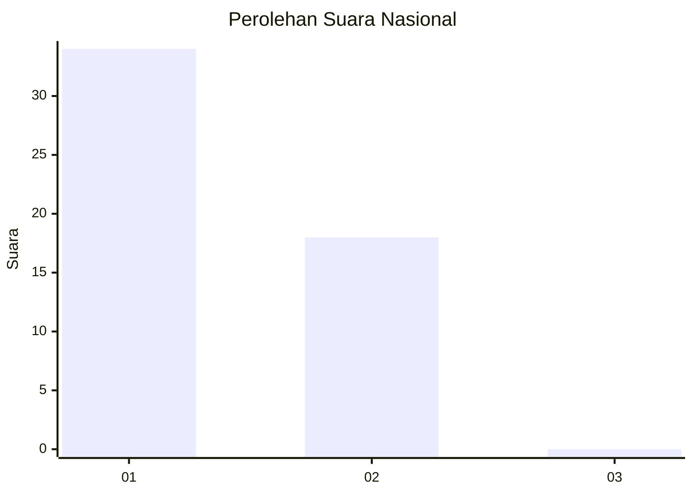
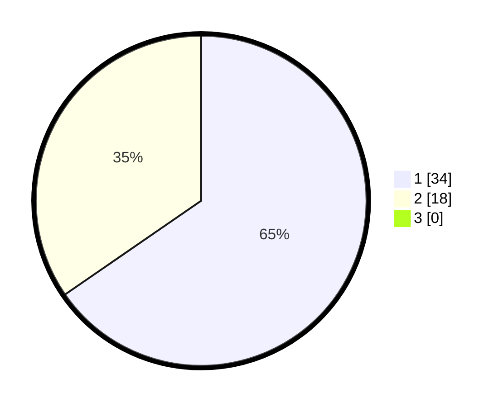

# Hasil

## Grafik

## Tabel

| No. | Nama Paslon    | Suara | Suara (raw) | Persentase |
|:--- |:-------------- | -----:| -----------:| ----------:|
| 1   | ANIES MUHAIMIN | 34    | [34][p-1]   | 65,38      |
| 2   | PRABOWO GIBRAN | 18    | [18][p-2]   | 34,62      |
| 3   | GANJAR MAHFUD  | 0     | [0][p-3]    | 0,00       |

[p-1]: https://github.com/gigit-pemilu/pemilu-2024/blob/main/pilpres/hitung-suara/sub/11-aceh/sub/09-simeulue/sub/06-simeulue-barat/sub/2010-miteum/sub/003-tps/sub/paslon-1.txt
[p-2]: https://github.com/gigit-pemilu/pemilu-2024/blob/main/pilpres/hitung-suara/sub/11-aceh/sub/09-simeulue/sub/06-simeulue-barat/sub/2010-miteum/sub/003-tps/sub/paslon-2.txt
[p-3]: https://github.com/gigit-pemilu/pemilu-2024/blob/main/pilpres/hitung-suara/sub/11-aceh/sub/09-simeulue/sub/06-simeulue-barat/sub/2010-miteum/sub/003-tps/sub/paslon-3.txt

## Foto C Plano

https://sirekap-obj-formc.kpu.go.id/b4cd/pemilu/ppwp/11/09/06/20/10/1109062010003-20240215-043021--d5b8f4b5-a575-4853-9dc5-59f168f6d8bd.jpg

https://sirekap-obj-formc.kpu.go.id/b4cd/pemilu/ppwp/11/09/06/20/10/1109062010003-20240215-153008--7994a1b7-7bb9-4dfc-acd0-3401d460e3aa.jpg

https://sirekap-obj-formc.kpu.go.id/b4cd/pemilu/ppwp/11/09/06/20/10/1109062010003-20240215-153159--83a97508-9722-4c00-a62d-641440e4b062.jpg

## Metadata

| Key        | Value               |
| ---------- | ------------------- |
| Time Stamp | 2024-02-24 22:31:28 |

## DATA PEMILIH TETAP

Jumlah pemilih dalam DPT: **54**.
 * L: **27**.
 * P: **27**.

## DATA PENGGUNA HAK PILIH

Jumlah pengguna hak pilih dalam DPT: **52**.
 * L: **27**.
 * P: **25**.

Jumlah pengguna hak pilih dalam DPTb: **0**.
 * L: **0**.
 * P: **0**.

Jumlah pengguna hak pilih dalam DPK: **0**.
 * L: **0**.
 * P: **0**.

Jumlah pengguna hak pilih: **52**.
 * L: **27**.
 * P: **25**.

## JUMLAH SUARA SAH DAN TIDAK SAH

JUMLAH SELURUH SUARA SAH: **52**.

JUMLAH SUARA TIDAK SAH: **0**.

JUMLAH SELURUH SUARA SAH DAN SUARA TIDAK SAH: **52**.

