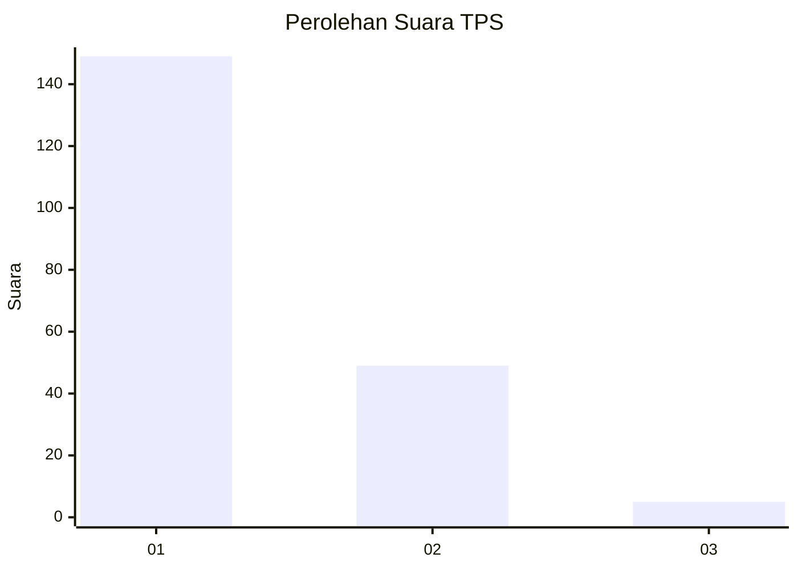
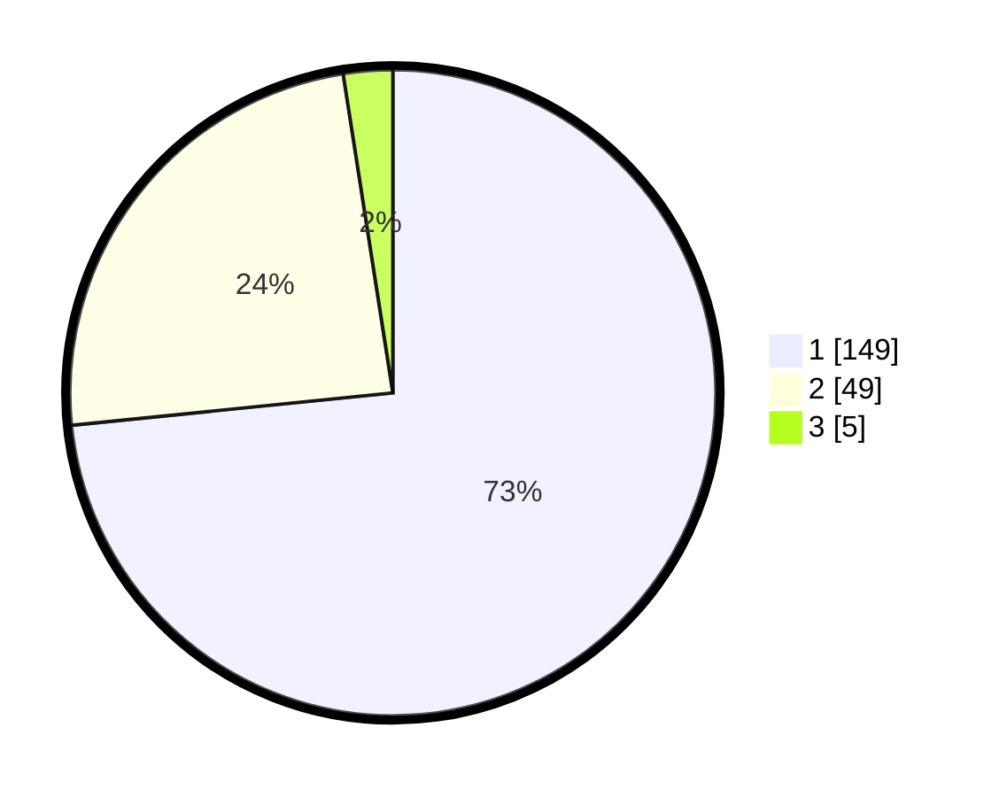

# Hasil

## Grafik

## Tabel

| No. | Nama Paslon    | Suara | Suara (raw) | Persentase |
|:--- |:-------------- | -----:| -----------:| ----------:|
| 1   | ANIES MUHAIMIN | 149   | [149][p-1]  | 73,40      |
| 2   | PRABOWO GIBRAN | 49    | [49][p-2]   | 24,14      |
| 3   | GANJAR MAHFUD  | 5     | [5][p-3]    | 2,46       |

[p-1]: https://github.com/gigit-pemilu/pemilu-2024-11-aceh/blob/main/pilpres/hitung-suara/sub/11-aceh/sub/09-simeulue/sub/07-teupah-selatan/sub/2001-seneubuk/sub/001-tps/sub/paslon-1.txt
[p-2]: https://github.com/gigit-pemilu/pemilu-2024-11-aceh/blob/main/pilpres/hitung-suara/sub/11-aceh/sub/09-simeulue/sub/07-teupah-selatan/sub/2001-seneubuk/sub/001-tps/sub/paslon-2.txt
[p-3]: https://github.com/gigit-pemilu/pemilu-2024-11-aceh/blob/main/pilpres/hitung-suara/sub/11-aceh/sub/09-simeulue/sub/07-teupah-selatan/sub/2001-seneubuk/sub/001-tps/sub/paslon-3.txt

## Foto C Plano

https://sirekap-obj-formc.kpu.go.id/3cc4/pemilu/ppwp/11/09/07/20/01/1109072001001-20240215-100952--8de8650a-a905-4d96-a274-d47b43b21b93.jpg

https://sirekap-obj-formc.kpu.go.id/3cc4/pemilu/ppwp/11/09/07/20/01/1109072001001-20240215-100739--e405833b-6249-4be2-9466-39f74a9bc013.jpg

https://sirekap-obj-formc.kpu.go.id/3cc4/pemilu/ppwp/11/09/07/20/01/1109072001001-20240215-100701--19264393-cab8-4f5d-9c07-62a2b80f0aa9.jpg

## Metadata

| Key        | Value               |
| ---------- | ------------------- |
| Time Stamp | 2024-02-17 00:28:35 |

## DATA PEMILIH TETAP

Jumlah pemilih dalam DPT: **232**.
 * L: **111**.
 * P: **121**.

## DATA PENGGUNA HAK PILIH

Jumlah pengguna hak pilih dalam DPT: **205**.
 * L: **98**.
 * P: **107**.

Jumlah pengguna hak pilih dalam DPTb: **0**.
 * L: **0**.
 * P: **0**.

Jumlah pengguna hak pilih dalam DPK: **1**.
 * L: **0**.
 * P: **1**.

Jumlah pengguna hak pilih: **206**.
 * L: **98**.
 * P: **108**.

## JUMLAH SUARA SAH DAN TIDAK SAH

JUMLAH SELURUH SUARA SAH: **203**.

JUMLAH SUARA TIDAK SAH: **3**.

JUMLAH SELURUH SUARA SAH DAN SUARA TIDAK SAH: **206**.

