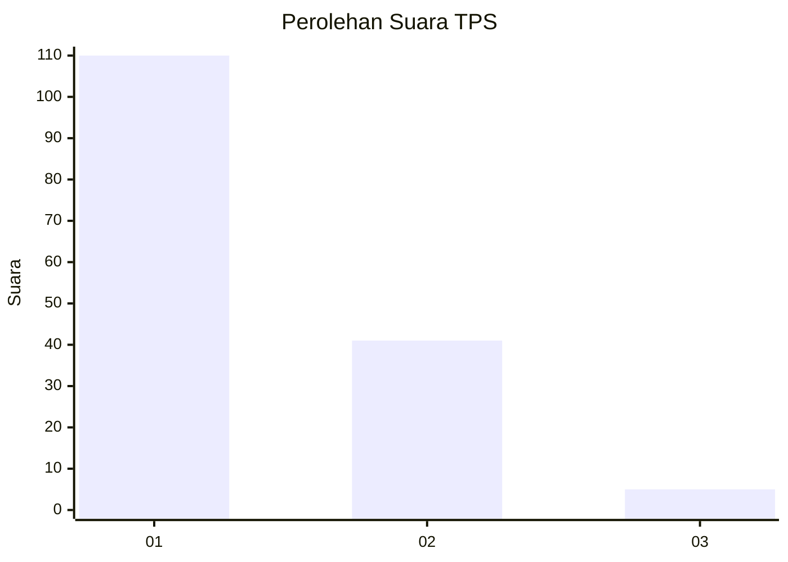
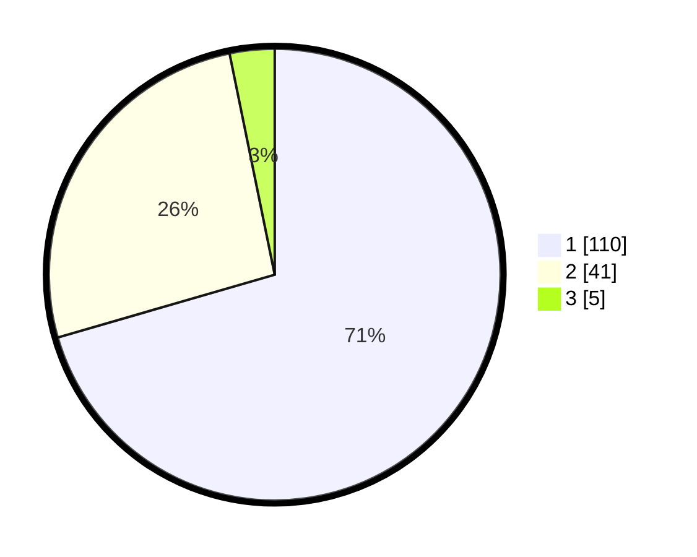

# Hasil

## Grafik

## Tabel

| No. | Nama Paslon    | Suara | Suara (raw) | Persentase |
|:--- |:-------------- | -----:| -----------:| ----------:|
| 1   | ANIES MUHAIMIN | 110   | [110][p-1]  | 70,51      |
| 2   | PRABOWO GIBRAN | 41    | [41][p-2]   | 26,28      |
| 3   | GANJAR MAHFUD  | 5     | [5][p-3]    | 3,21       |

[p-1]: https://github.com/gigit-pemilu/pemilu-2024-11-aceh/blob/main/pilpres/hitung-suara/sub/11-aceh/sub/09-simeulue/sub/07-teupah-selatan/sub/2002-suak-lamatan/sub/001-tps/sub/paslon-1.txt
[p-2]: https://github.com/gigit-pemilu/pemilu-2024-11-aceh/blob/main/pilpres/hitung-suara/sub/11-aceh/sub/09-simeulue/sub/07-teupah-selatan/sub/2002-suak-lamatan/sub/001-tps/sub/paslon-2.txt
[p-3]: https://github.com/gigit-pemilu/pemilu-2024-11-aceh/blob/main/pilpres/hitung-suara/sub/11-aceh/sub/09-simeulue/sub/07-teupah-selatan/sub/2002-suak-lamatan/sub/001-tps/sub/paslon-3.txt

## Foto C Plano

https://sirekap-obj-formc.kpu.go.id/3f17/pemilu/ppwp/11/09/07/20/02/1109072002001-20240215-123143--fcdf9cb4-093b-4547-83e8-4ed7690ad413.jpg

https://sirekap-obj-formc.kpu.go.id/3f17/pemilu/ppwp/11/09/07/20/02/1109072002001-20240215-123253--5c4f8014-04a0-48d2-8ebd-53a3242280df.jpg

https://sirekap-obj-formc.kpu.go.id/3f17/pemilu/ppwp/11/09/07/20/02/1109072002001-20240215-123436--240b4ac3-089c-419e-8b01-a761405ef63a.jpg

## Metadata

| Key        | Value               |
| ---------- | ------------------- |
| Time Stamp | 2024-02-17 00:28:35 |

## DATA PEMILIH TETAP

Jumlah pemilih dalam DPT: **186**.
 * L: **91**.
 * P: **95**.

## DATA PENGGUNA HAK PILIH

Jumlah pengguna hak pilih dalam DPT: **158**.
 * L: **79**.
 * P: **79**.

Jumlah pengguna hak pilih dalam DPTb: **0**.
 * L: **0**.
 * P: **0**.

Jumlah pengguna hak pilih dalam DPK: **2**.
 * L: **1**.
 * P: **1**.

Jumlah pengguna hak pilih: **160**.
 * L: **80**.
 * P: **80**.

## JUMLAH SUARA SAH DAN TIDAK SAH

JUMLAH SELURUH SUARA SAH: **156**.

JUMLAH SUARA TIDAK SAH: **4**.

JUMLAH SELURUH SUARA SAH DAN SUARA TIDAK SAH: **160**.

