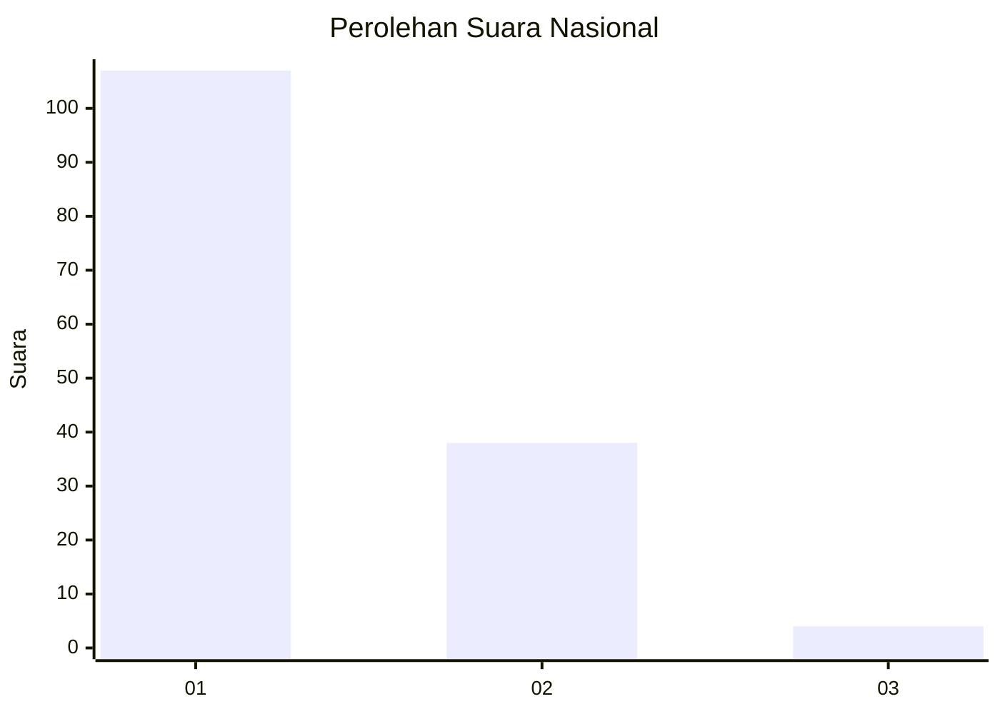
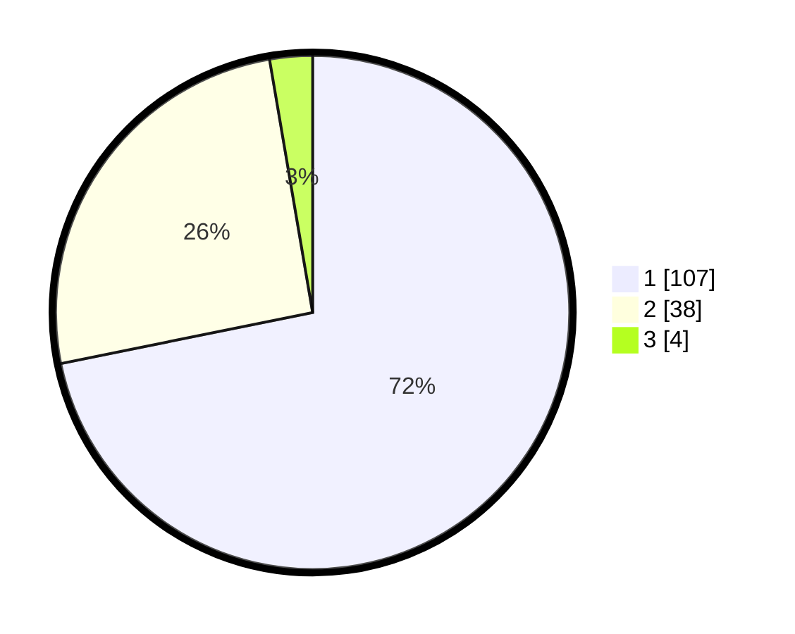

# Hasil

## Grafik

## Tabel

| No. | Nama Paslon    | Suara | Suara (raw) | Persentase |
|:--- |:-------------- | -----:| -----------:| ----------:|
| 1   | ANIES MUHAIMIN | 107   | [107][p-1]  | 71,81      |
| 2   | PRABOWO GIBRAN | 38    | [38][p-2]   | 25,50      |
| 3   | GANJAR MAHFUD  | 4     | [4][p-3]    | 2,68       |

[p-1]: https://github.com/gigit-pemilu/pemilu-2024/blob/main/pilpres/hitung-suara/sub/11-aceh/sub/09-simeulue/sub/07-teupah-selatan/sub/2002-suak-lamatan/sub/002-tps/sub/paslon-1.txt
[p-2]: https://github.com/gigit-pemilu/pemilu-2024/blob/main/pilpres/hitung-suara/sub/11-aceh/sub/09-simeulue/sub/07-teupah-selatan/sub/2002-suak-lamatan/sub/002-tps/sub/paslon-2.txt
[p-3]: https://github.com/gigit-pemilu/pemilu-2024/blob/main/pilpres/hitung-suara/sub/11-aceh/sub/09-simeulue/sub/07-teupah-selatan/sub/2002-suak-lamatan/sub/002-tps/sub/paslon-3.txt

## Foto C Plano

https://sirekap-obj-formc.kpu.go.id/b3d7/pemilu/ppwp/11/09/07/20/02/1109072002002-20240214-193553--4659d72b-c667-4a0c-a4c3-c7ae5439aec1.jpg

https://sirekap-obj-formc.kpu.go.id/b3d7/pemilu/ppwp/11/09/07/20/02/1109072002002-20240214-193617--429ec8b3-a1ac-4aa6-be3d-65ff18d18afb.jpg

https://sirekap-obj-formc.kpu.go.id/b3d7/pemilu/ppwp/11/09/07/20/02/1109072002002-20240214-184811--2b7d986f-af43-437b-9709-7fe796b968a8.jpg

## Metadata

| Key        | Value               |
| ---------- | ------------------- |
| Time Stamp | 2024-02-15 12:00:28 |

## DATA PEMILIH TETAP

Jumlah pemilih dalam DPT: **175**.
 * L: **90**.
 * P: **85**.

## DATA PENGGUNA HAK PILIH

Jumlah pengguna hak pilih dalam DPT: **152**.
 * L: **76**.
 * P: **76**.

Jumlah pengguna hak pilih dalam DPTb: **0**.
 * L: **0**.
 * P: **0**.

Jumlah pengguna hak pilih dalam DPK: **1**.
 * L: **0**.
 * P: **1**.

Jumlah pengguna hak pilih: **153**.
 * L: **76**.
 * P: **77**.

## JUMLAH SUARA SAH DAN TIDAK SAH

JUMLAH SELURUH SUARA SAH: **149**.

JUMLAH SUARA TIDAK SAH: **4**.

JUMLAH SELURUH SUARA SAH DAN SUARA TIDAK SAH: **153**.

