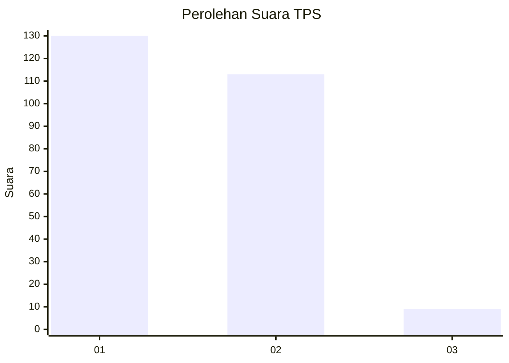
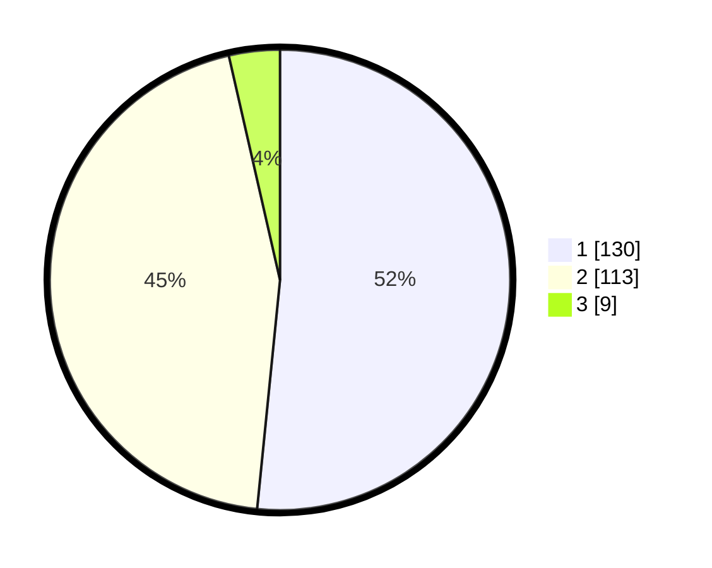

# Hasil

## Grafik

## Tabel

| No. | Nama Paslon    | Suara | Suara (raw) | Persentase |
|:--- |:-------------- | -----:| -----------:| ----------:|
| 1   | ANIES MUHAIMIN | 130   | [130][p-1]  | 51,59      |
| 2   | PRABOWO GIBRAN | 113   | [113][p-2]  | 44,84      |
| 3   | GANJAR MAHFUD  | 9     | [9][p-3]    | 3,57       |

[p-1]: https://github.com/gigit-pemilu/pemilu-2024-11-aceh/blob/main/pilpres/hitung-suara/sub/11-aceh/sub/09-simeulue/sub/07-teupah-selatan/sub/2003-alus-alus/sub/001-tps/sub/paslon-1.txt
[p-2]: https://github.com/gigit-pemilu/pemilu-2024-11-aceh/blob/main/pilpres/hitung-suara/sub/11-aceh/sub/09-simeulue/sub/07-teupah-selatan/sub/2003-alus-alus/sub/001-tps/sub/paslon-2.txt
[p-3]: https://github.com/gigit-pemilu/pemilu-2024-11-aceh/blob/main/pilpres/hitung-suara/sub/11-aceh/sub/09-simeulue/sub/07-teupah-selatan/sub/2003-alus-alus/sub/001-tps/sub/paslon-3.txt

## Foto C Plano

https://sirekap-obj-formc.kpu.go.id/922e/pemilu/ppwp/11/09/07/20/03/1109072003001-20240217-225414--ddd7e6b6-b7e5-4cbf-8d34-a2a40bc85366.jpg

https://sirekap-obj-formc.kpu.go.id/922e/pemilu/ppwp/11/09/07/20/03/1109072003001-20240217-225415--38db8d39-7f56-42ae-a884-39e66c4fa889.jpg

https://sirekap-obj-formc.kpu.go.id/922e/pemilu/ppwp/11/09/07/20/03/1109072003001-20240217-225414--d9e98d76-b1af-4e4b-8059-9abef7015d29.jpg

## Metadata

| Key        | Value               |
| ---------- | ------------------- |
| Time Stamp | 2024-02-19 06:16:00 |

## DATA PEMILIH TETAP

Jumlah pemilih dalam DPT: **299**.
 * L: **152**.
 * P: **147**.

## DATA PENGGUNA HAK PILIH

Jumlah pengguna hak pilih dalam DPT: **250**.
 * L: **128**.
 * P: **122**.

Jumlah pengguna hak pilih dalam DPTb: **6**.
 * L: **5**.
 * P: **1**.

Jumlah pengguna hak pilih dalam DPK: **0**.
 * L: **0**.
 * P: **1**.

Jumlah pengguna hak pilih: **157**.
 * L: **133**.
 * P: **124**.

## JUMLAH SUARA SAH DAN TIDAK SAH

JUMLAH SELURUH SUARA SAH: **252**.

JUMLAH SUARA TIDAK SAH: **5**.

JUMLAH SELURUH SUARA SAH DAN SUARA TIDAK SAH: **257**.

