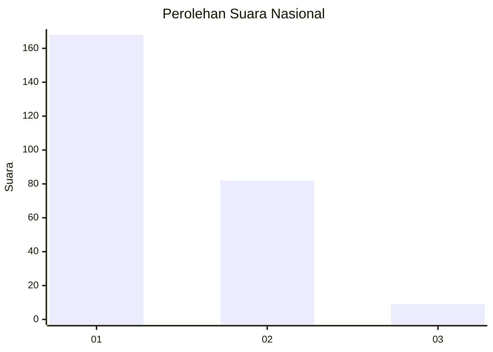
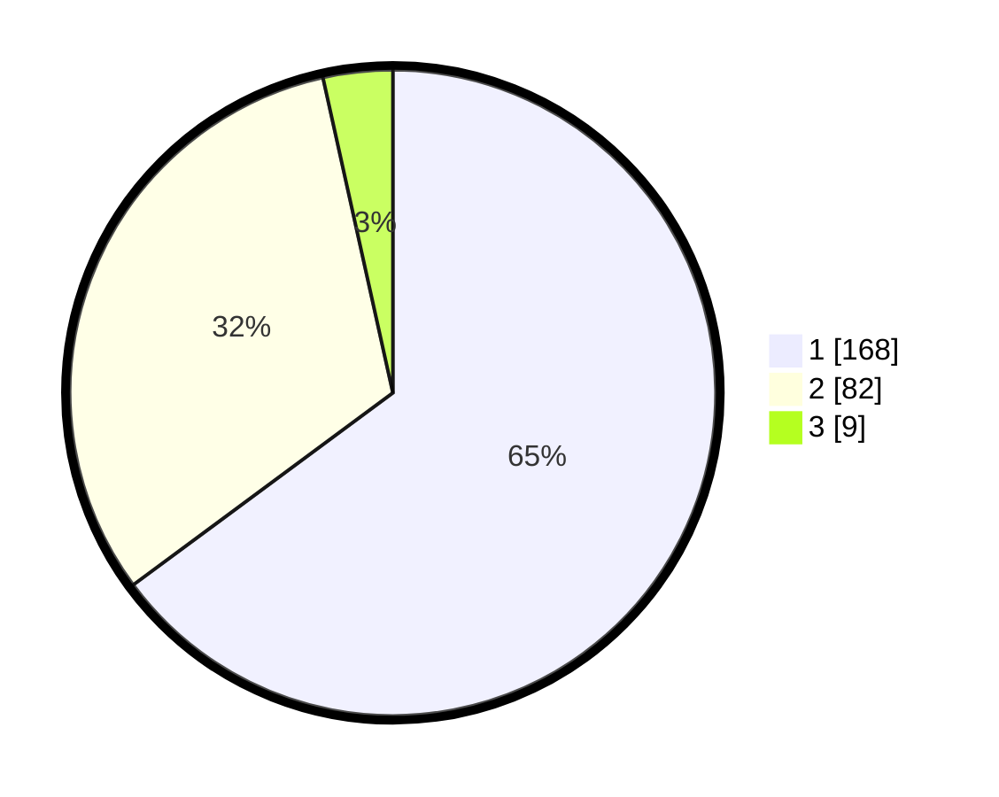

# Hasil

## Grafik

## Tabel

| No. | Nama Paslon    | Suara | Suara (raw) | Persentase |
|:--- |:-------------- | -----:| -----------:| ----------:|
| 1   | ANIES MUHAIMIN | 168   | [168][p-1]  | 64,86      |
| 2   | PRABOWO GIBRAN | 82    | [82][p-2]   | 31,66      |
| 3   | GANJAR MAHFUD  | 9     | [9][p-3]    | 3,47       |

[p-1]: https://github.com/gigit-pemilu/pemilu-2024/blob/main/pilpres/hitung-suara/sub/11-aceh/sub/09-simeulue/sub/07-teupah-selatan/sub/2003-alus-alus/sub/002-tps/sub/paslon-1.txt
[p-2]: https://github.com/gigit-pemilu/pemilu-2024/blob/main/pilpres/hitung-suara/sub/11-aceh/sub/09-simeulue/sub/07-teupah-selatan/sub/2003-alus-alus/sub/002-tps/sub/paslon-2.txt
[p-3]: https://github.com/gigit-pemilu/pemilu-2024/blob/main/pilpres/hitung-suara/sub/11-aceh/sub/09-simeulue/sub/07-teupah-selatan/sub/2003-alus-alus/sub/002-tps/sub/paslon-3.txt

## Foto C Plano

https://sirekap-obj-formc.kpu.go.id/a14a/pemilu/ppwp/11/09/07/20/03/1109072003002-20240216-142724--8c6fd078-494b-46ad-961d-d7192cad728b.jpg

https://sirekap-obj-formc.kpu.go.id/a14a/pemilu/ppwp/11/09/07/20/03/1109072003002-20240216-142725--c15e360c-b96a-4a9a-9f20-0befc8ccb1ce.jpg

https://sirekap-obj-formc.kpu.go.id/a14a/pemilu/ppwp/11/09/07/20/03/1109072003002-20240216-142724--ef5f348e-a496-4a78-9267-e32c8c4463d6.jpg

## Metadata

| Key        | Value               |
| ---------- | ------------------- |
| Time Stamp | 2024-02-16 16:25:10 |

## DATA PEMILIH TETAP

Jumlah pemilih dalam DPT: **286**.
 * L: **140**.
 * P: **146**.

## DATA PENGGUNA HAK PILIH

Jumlah pengguna hak pilih dalam DPT: **256**.
 * L: **125**.
 * P: **131**.

Jumlah pengguna hak pilih dalam DPTb: **6**.
 * L: **1**.
 * P: **5**.

Jumlah pengguna hak pilih dalam DPK: **2**.
 * L: **2**.
 * P: **0**.

Jumlah pengguna hak pilih: **264**.
 * L: **128**.
 * P: **136**.

## JUMLAH SUARA SAH DAN TIDAK SAH

JUMLAH SELURUH SUARA SAH: **259**.

JUMLAH SUARA TIDAK SAH: **5**.

JUMLAH SELURUH SUARA SAH DAN SUARA TIDAK SAH: **264**.

