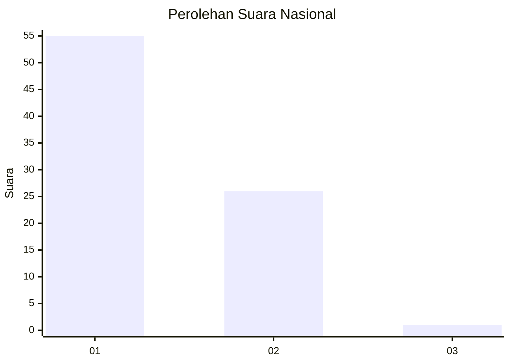
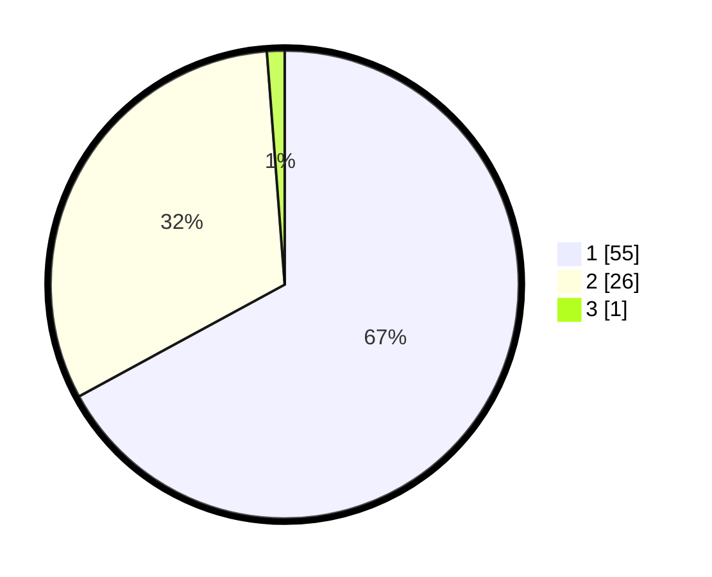

# Hasil

## Grafik

## Tabel

| No. | Nama Paslon    | Suara | Suara (raw) | Persentase |
|:--- |:-------------- | -----:| -----------:| ----------:|
| 1   | ANIES MUHAIMIN | 55    | [55][p-1]   | 67,07      |
| 2   | PRABOWO GIBRAN | 26    | [26][p-2]   | 31,71      |
| 3   | GANJAR MAHFUD  | 1     | [1][p-3]    | 1,22       |

[p-1]: https://github.com/gigit-pemilu/pemilu-2024/blob/main/pilpres/hitung-suara/sub/11-aceh/sub/09-simeulue/sub/07-teupah-selatan/sub/2006-kebun-baru/sub/002-tps/sub/paslon-1.txt
[p-2]: https://github.com/gigit-pemilu/pemilu-2024/blob/main/pilpres/hitung-suara/sub/11-aceh/sub/09-simeulue/sub/07-teupah-selatan/sub/2006-kebun-baru/sub/002-tps/sub/paslon-2.txt
[p-3]: https://github.com/gigit-pemilu/pemilu-2024/blob/main/pilpres/hitung-suara/sub/11-aceh/sub/09-simeulue/sub/07-teupah-selatan/sub/2006-kebun-baru/sub/002-tps/sub/paslon-3.txt

## Foto C Plano

https://sirekap-obj-formc.kpu.go.id/c6d6/pemilu/ppwp/11/09/07/20/06/1109072006002-20240215-050409--0db0edc7-dc30-4152-96c1-e6365e495714.jpg

https://sirekap-obj-formc.kpu.go.id/c6d6/pemilu/ppwp/11/09/07/20/06/1109072006002-20240215-050522--47b1a098-3bce-4d51-bf80-c7ce658d8ed2.jpg

https://sirekap-obj-formc.kpu.go.id/c6d6/pemilu/ppwp/11/09/07/20/06/1109072006002-20240215-050658--30349000-11f6-40af-92fd-6f0da3861acf.jpg

## Metadata

| Key        | Value               |
| ---------- | ------------------- |
| Time Stamp | 2024-02-17 01:00:00 |

## DATA PEMILIH TETAP

Jumlah pemilih dalam DPT: **98**.
 * L: **49**.
 * P: **49**.

## DATA PENGGUNA HAK PILIH

Jumlah pengguna hak pilih dalam DPT: **83**.
 * L: **42**.
 * P: **41**.

Jumlah pengguna hak pilih dalam DPTb: **1**.
 * L: **1**.
 * P: **0**.

Jumlah pengguna hak pilih dalam DPK: **0**.
 * L: **0**.
 * P: **0**.

Jumlah pengguna hak pilih: **84**.
 * L: **43**.
 * P: **41**.

## JUMLAH SUARA SAH DAN TIDAK SAH

JUMLAH SELURUH SUARA SAH: **82**.

JUMLAH SUARA TIDAK SAH: **2**.

JUMLAH SELURUH SUARA SAH DAN SUARA TIDAK SAH: **84**.

