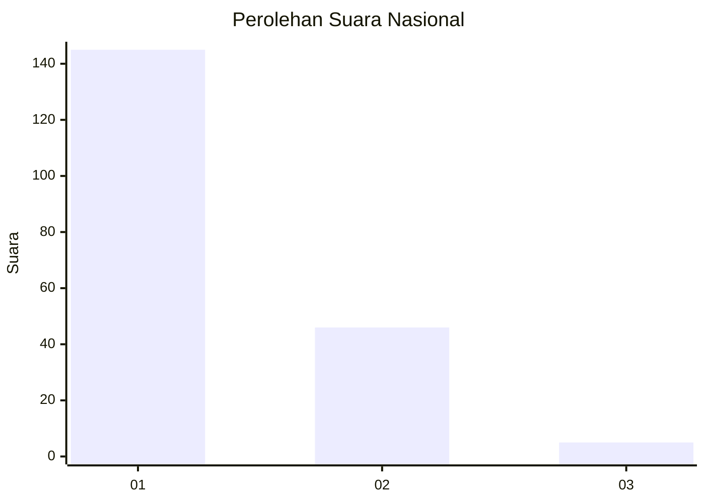
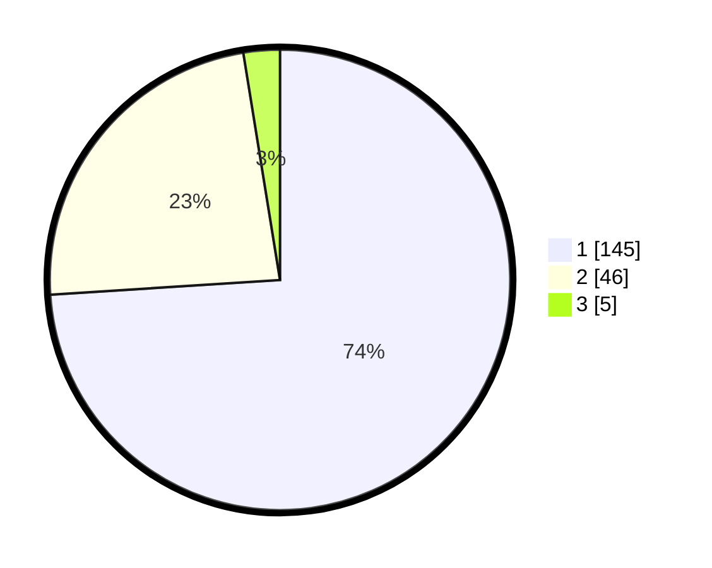

# Hasil

## Grafik

## Tabel

| No. | Nama Paslon    | Suara | Suara (raw) | Persentase |
|:--- |:-------------- | -----:| -----------:| ----------:|
| 1   | ANIES MUHAIMIN | 145   | [145][p-1]  | 73,98      |
| 2   | PRABOWO GIBRAN | 46    | [46][p-2]   | 23,47      |
| 3   | GANJAR MAHFUD  | 5     | [5][p-3]    | 2,55       |

[p-1]: https://github.com/gigit-pemilu/pemilu-2024/blob/main/pilpres/hitung-suara/sub/11-aceh/sub/09-simeulue/sub/07-teupah-selatan/sub/2010-labuhan-jaya/sub/002-tps/sub/paslon-1.txt
[p-2]: https://github.com/gigit-pemilu/pemilu-2024/blob/main/pilpres/hitung-suara/sub/11-aceh/sub/09-simeulue/sub/07-teupah-selatan/sub/2010-labuhan-jaya/sub/002-tps/sub/paslon-2.txt
[p-3]: https://github.com/gigit-pemilu/pemilu-2024/blob/main/pilpres/hitung-suara/sub/11-aceh/sub/09-simeulue/sub/07-teupah-selatan/sub/2010-labuhan-jaya/sub/002-tps/sub/paslon-3.txt

## Foto C Plano

https://sirekap-obj-formc.kpu.go.id/3e2a/pemilu/ppwp/11/09/07/20/10/1109072010002-20240215-161513--4608173d-0d06-4479-86c3-1a9d77439444.jpg

https://sirekap-obj-formc.kpu.go.id/3e2a/pemilu/ppwp/11/09/07/20/10/1109072010002-20240214-205416--fd0c308a-406c-484b-a9af-4ec82a20d2bd.jpg

## Metadata

| Key        | Value               |
| ---------- | ------------------- |
| Time Stamp | 2024-02-15 21:01:18 |

