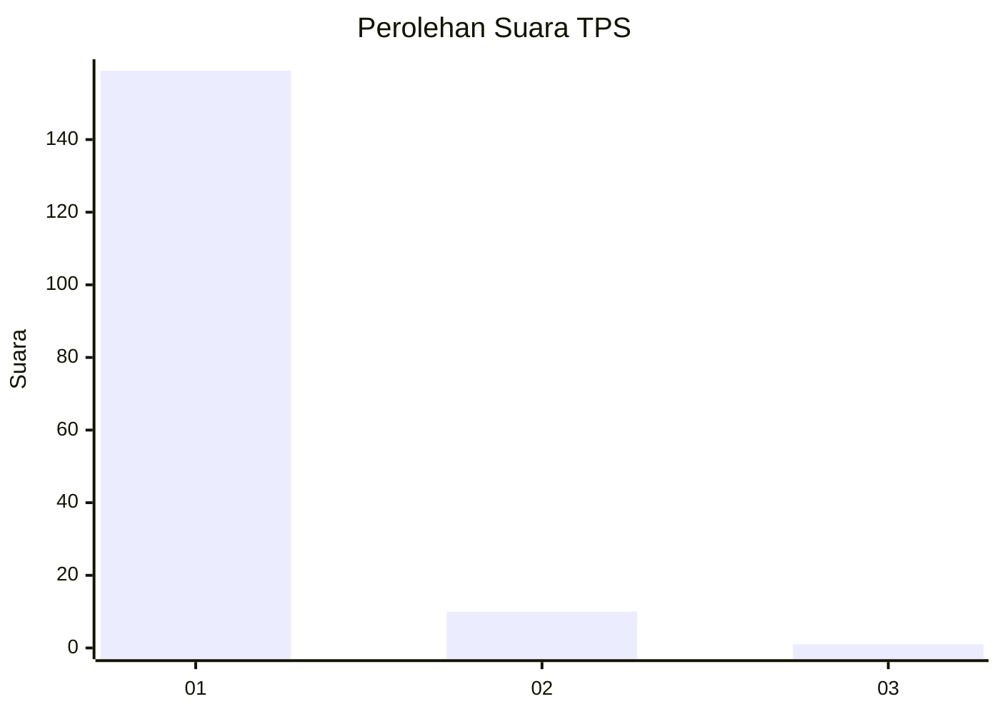
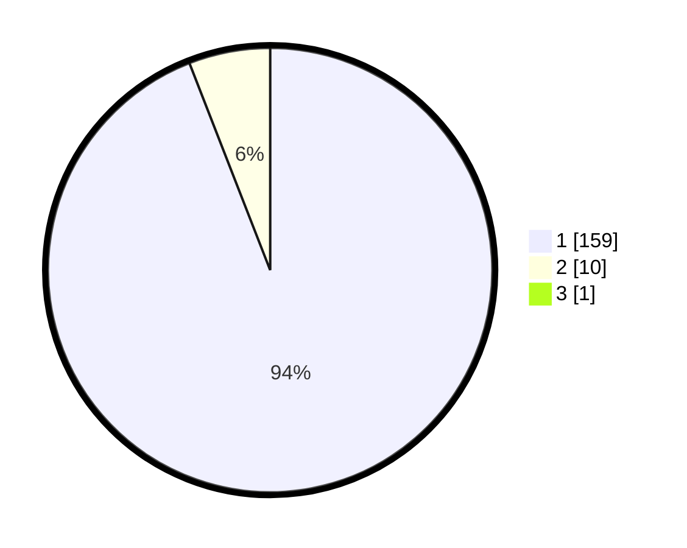

# Hasil

## Grafik

## Tabel

| No. | Nama Paslon    | Suara | Suara (raw) | Persentase |
|:--- |:-------------- | -----:| -----------:| ----------:|
| 1   | ANIES MUHAIMIN | 159   | [159][p-1]  | 93,53      |
| 2   | PRABOWO GIBRAN | 10    | [10][p-2]   | 5,88       |
| 3   | GANJAR MAHFUD  | 1     | [1][p-3]    | 0,59       |

[p-1]: https://github.com/gigit-pemilu/pemilu-2024-11-aceh/blob/main/pilpres/hitung-suara/sub/11-aceh/sub/09-simeulue/sub/08-alafan/sub/2002-lamerem/sub/001-tps/sub/paslon-1.txt
[p-2]: https://github.com/gigit-pemilu/pemilu-2024-11-aceh/blob/main/pilpres/hitung-suara/sub/11-aceh/sub/09-simeulue/sub/08-alafan/sub/2002-lamerem/sub/001-tps/sub/paslon-2.txt
[p-3]: https://github.com/gigit-pemilu/pemilu-2024-11-aceh/blob/main/pilpres/hitung-suara/sub/11-aceh/sub/09-simeulue/sub/08-alafan/sub/2002-lamerem/sub/001-tps/sub/paslon-3.txt

## Foto C Plano

https://sirekap-obj-formc.kpu.go.id/f689/pemilu/ppwp/11/09/08/20/02/1109082002001-20240215-164946--62843fcd-90b4-49f5-8792-3c58a53edf0d.jpg

https://sirekap-obj-formc.kpu.go.id/f689/pemilu/ppwp/11/09/08/20/02/1109082002001-20240215-165124--eea1d945-8e40-45ca-aa0b-4005fdfdd356.jpg

## Metadata

| Key        | Value               |
| ---------- | ------------------- |
| Time Stamp | 2024-02-24 23:00:00 |

