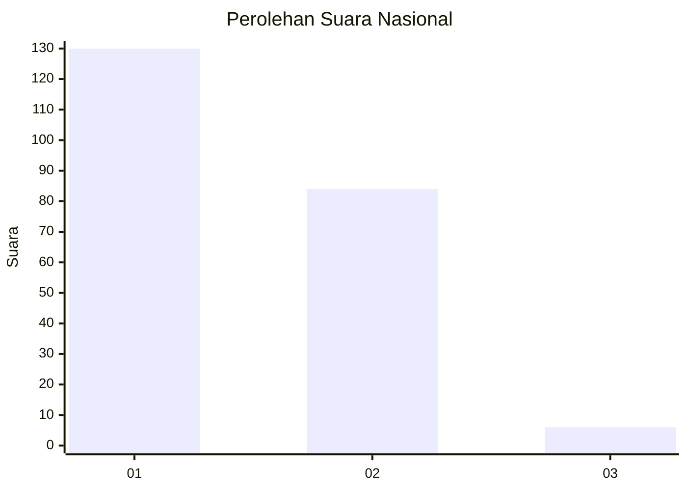
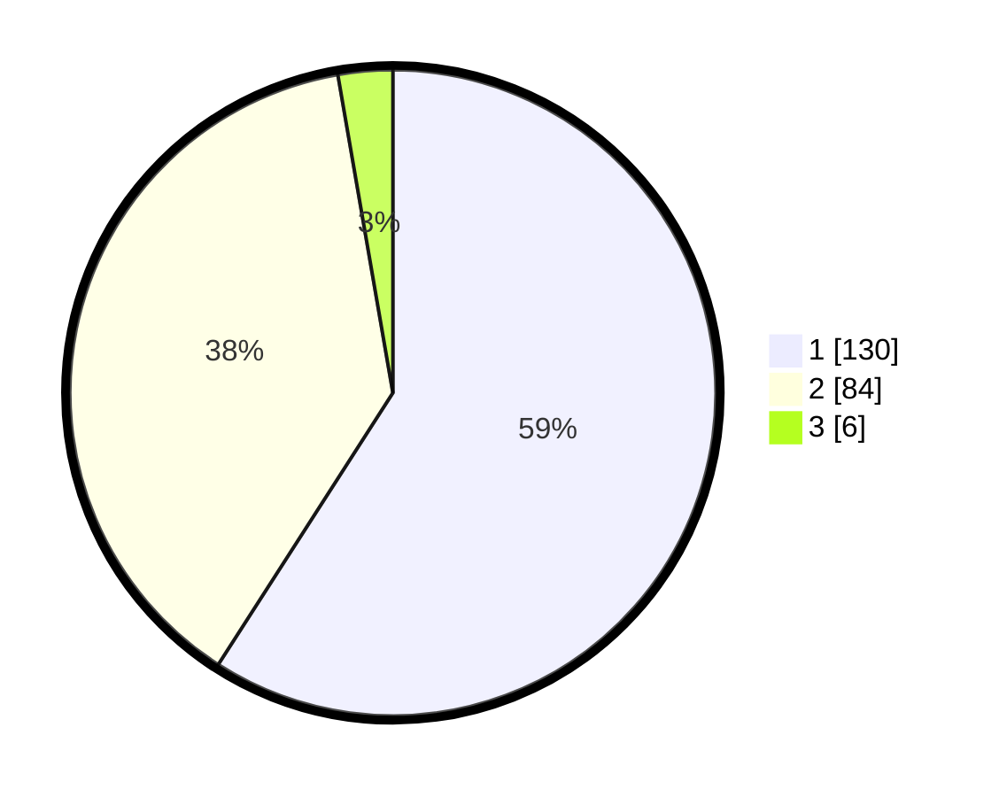

# Hasil

## Grafik

## Tabel

| No. | Nama Paslon    | Suara | Suara (raw) | Persentase |
|:--- |:-------------- | -----:| -----------:| ----------:|
| 1   | ANIES MUHAIMIN | 130   | [130][p-1]  | 59,09      |
| 2   | PRABOWO GIBRAN | 84    | [84][p-2]   | 38,18      |
| 3   | GANJAR MAHFUD  | 6     | [6][p-3]    | 2,73       |

[p-1]: https://github.com/gigit-pemilu/pemilu-2024/blob/main/pilpres/hitung-suara/sub/11-aceh/sub/09-simeulue/sub/09-teupah-tengah/sub/2002-lasikin/sub/003-tps/sub/paslon-1.txt
[p-2]: https://github.com/gigit-pemilu/pemilu-2024/blob/main/pilpres/hitung-suara/sub/11-aceh/sub/09-simeulue/sub/09-teupah-tengah/sub/2002-lasikin/sub/003-tps/sub/paslon-2.txt
[p-3]: https://github.com/gigit-pemilu/pemilu-2024/blob/main/pilpres/hitung-suara/sub/11-aceh/sub/09-simeulue/sub/09-teupah-tengah/sub/2002-lasikin/sub/003-tps/sub/paslon-3.txt

## Foto C Plano

https://sirekap-obj-formc.kpu.go.id/d441/pemilu/ppwp/11/09/09/20/02/1109092002003-20240216-160408--5a49a20c-95c8-4aab-a935-e5d184b88cd9.jpg

https://sirekap-obj-formc.kpu.go.id/d441/pemilu/ppwp/11/09/09/20/02/1109092002003-20240216-160409--fe0c7eb7-9de6-44aa-8e57-0fd800128357.jpg

https://sirekap-obj-formc.kpu.go.id/d441/pemilu/ppwp/11/09/09/20/02/1109092002003-20240216-164123--2356d145-69e4-4115-b27c-4e6849b166ff.jpg

## Metadata

| Key        | Value               |
| ---------- | ------------------- |
| Time Stamp | 2024-02-16 22:30:00 |

## DATA PEMILIH TETAP

Jumlah pemilih dalam DPT: **264**.
 * L: **133**.
 * P: **131**.

## DATA PENGGUNA HAK PILIH

Jumlah pengguna hak pilih dalam DPT: **220**.
 * L: **114**.
 * P: **106**.

Jumlah pengguna hak pilih dalam DPTb: **1**.
 * L: **1**.
 * P: **0**.

Jumlah pengguna hak pilih dalam DPK: **0**.
 * L: **0**.
 * P: **0**.

Jumlah pengguna hak pilih: **221**.
 * L: **115**.
 * P: **106**.

## JUMLAH SUARA SAH DAN TIDAK SAH

JUMLAH SELURUH SUARA SAH: **220**.

JUMLAH SUARA TIDAK SAH: **1**.

JUMLAH SELURUH SUARA SAH DAN SUARA TIDAK SAH: **221**.

