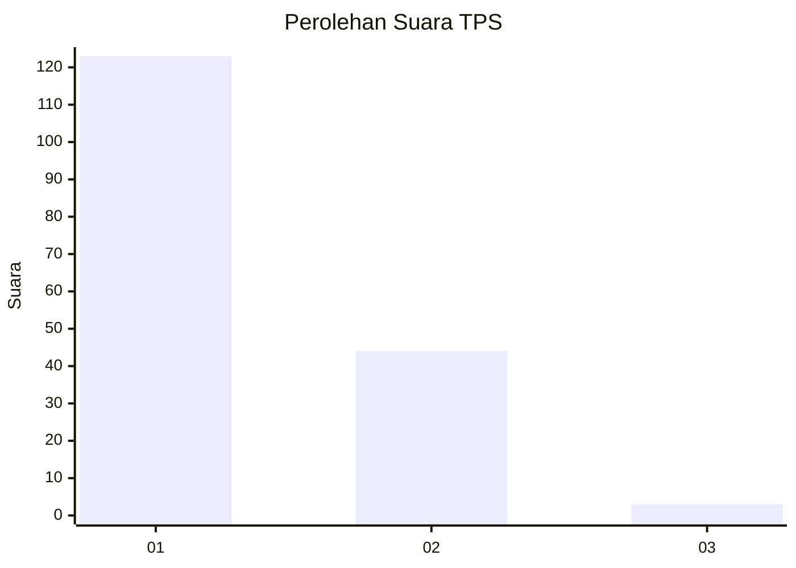
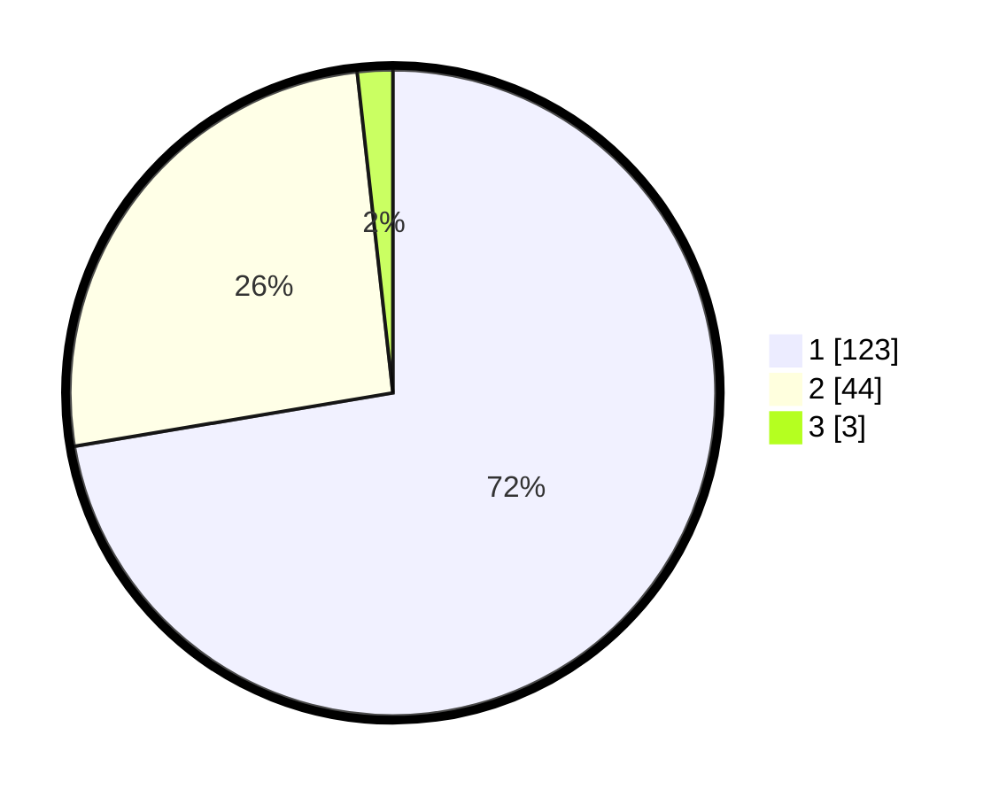

# Hasil

## Grafik

## Tabel

| No. | Nama Paslon    | Suara | Suara (raw) | Persentase |
|:--- |:-------------- | -----:| -----------:| ----------:|
| 1   | ANIES MUHAIMIN | 123   | [123][p-1]  | 72,35      |
| 2   | PRABOWO GIBRAN | 44    | [44][p-2]   | 25,88      |
| 3   | GANJAR MAHFUD  | 3     | [3][p-3]    | 1,76       |

[p-1]: https://github.com/gigit-pemilu/pemilu-2024-11-aceh/blob/main/pilpres/hitung-suara/sub/11-aceh/sub/09-simeulue/sub/10-simeulue-cut/sub/2002-amarabu/sub/001-tps/sub/paslon-1.txt
[p-2]: https://github.com/gigit-pemilu/pemilu-2024-11-aceh/blob/main/pilpres/hitung-suara/sub/11-aceh/sub/09-simeulue/sub/10-simeulue-cut/sub/2002-amarabu/sub/001-tps/sub/paslon-2.txt
[p-3]: https://github.com/gigit-pemilu/pemilu-2024-11-aceh/blob/main/pilpres/hitung-suara/sub/11-aceh/sub/09-simeulue/sub/10-simeulue-cut/sub/2002-amarabu/sub/001-tps/sub/paslon-3.txt

## Foto C Plano

https://sirekap-obj-formc.kpu.go.id/90eb/pemilu/ppwp/11/09/10/20/02/1109102002001-20240216-143435--24f0a4de-2efa-45fc-b6b9-0efa08a70788.jpg

https://sirekap-obj-formc.kpu.go.id/90eb/pemilu/ppwp/11/09/10/20/02/1109102002001-20240216-143437--5dc095a2-b167-4fb0-ad46-957e86f4cdeb.jpg

https://sirekap-obj-formc.kpu.go.id/90eb/pemilu/ppwp/11/09/10/20/02/1109102002001-20240216-143436--58a005ee-0a4c-4beb-bd4b-a1872924e7cd.jpg

## Metadata

| Key        | Value               |
| ---------- | ------------------- |
| Time Stamp | 2024-02-17 13:37:34 |

## DATA PEMILIH TETAP

Jumlah pemilih dalam DPT: **197**.
 * L: **98**.
 * P: **99**.

## DATA PENGGUNA HAK PILIH

Jumlah pengguna hak pilih dalam DPT: **167**.
 * L: **83**.
 * P: **84**.

Jumlah pengguna hak pilih dalam DPTb: **1**.
 * L: **1**.
 * P: **0**.

Jumlah pengguna hak pilih dalam DPK: **3**.
 * L: **2**.
 * P: **1**.

Jumlah pengguna hak pilih: **171**.
 * L: **86**.
 * P: **85**.

## JUMLAH SUARA SAH DAN TIDAK SAH

JUMLAH SELURUH SUARA SAH: **170**.

JUMLAH SUARA TIDAK SAH: **1**.

JUMLAH SELURUH SUARA SAH DAN SUARA TIDAK SAH: **171**.

