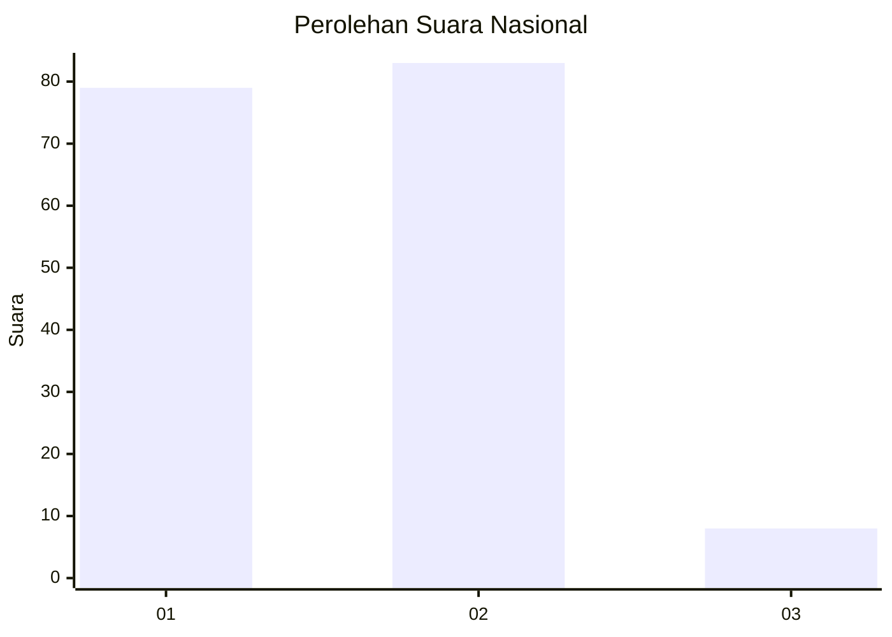
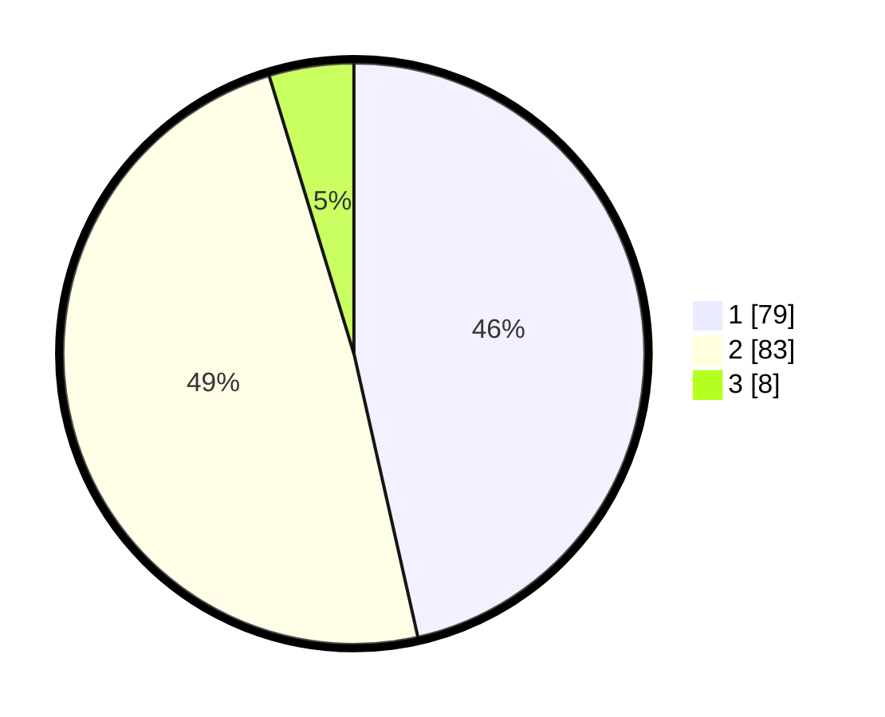

# Hasil

## Grafik

## Tabel

| No. | Nama Paslon    | Suara | Suara (raw) | Persentase |
|:--- |:-------------- | -----:| -----------:| ----------:|
| 1   | ANIES MUHAIMIN | 79    | [79][p-1]   | 46,47      |
| 2   | PRABOWO GIBRAN | 83    | [83][p-2]   | 48,82      |
| 3   | GANJAR MAHFUD  | 8     | [8][p-3]    | 4,71       |

[p-1]: https://github.com/gigit-pemilu/pemilu-2024/blob/main/pilpres/hitung-suara/sub/11-aceh/sub/10-aceh-singkil/sub/01-pulau-banyak/sub/2001-pulau-balai/sub/001-tps/sub/paslon-1.txt
[p-2]: https://github.com/gigit-pemilu/pemilu-2024/blob/main/pilpres/hitung-suara/sub/11-aceh/sub/10-aceh-singkil/sub/01-pulau-banyak/sub/2001-pulau-balai/sub/001-tps/sub/paslon-2.txt
[p-3]: https://github.com/gigit-pemilu/pemilu-2024/blob/main/pilpres/hitung-suara/sub/11-aceh/sub/10-aceh-singkil/sub/01-pulau-banyak/sub/2001-pulau-balai/sub/001-tps/sub/paslon-3.txt

## Foto C Plano

https://sirekap-obj-formc.kpu.go.id/f200/pemilu/ppwp/11/10/01/20/01/1110012001001-20240218-175147--017d1917-e95c-457b-b7ed-3042ad79d4bf.jpg

https://sirekap-obj-formc.kpu.go.id/f200/pemilu/ppwp/11/10/01/20/01/1110012001001-20240218-180302--7a169c31-bf4e-4933-add3-33b99b65ca78.jpg

https://sirekap-obj-formc.kpu.go.id/f200/pemilu/ppwp/11/10/01/20/01/1110012001001-20240218-180641--b8410287-ad11-43f6-af49-7a2a40622c42.jpg

## Metadata

| Key        | Value               |
| ---------- | ------------------- |
| Time Stamp | 2024-02-19 06:16:00 |

## DATA PEMILIH TETAP

Jumlah pemilih dalam DPT: **208**.
 * L: **104**.
 * P: **104**.

## DATA PENGGUNA HAK PILIH

Jumlah pengguna hak pilih dalam DPT: **166**.
 * L: **81**.
 * P: **85**.

Jumlah pengguna hak pilih dalam DPTb: **0**.
 * L: **0**.
 * P: **0**.

Jumlah pengguna hak pilih dalam DPK: **9**.
 * L: **4**.
 * P: **5**.

Jumlah pengguna hak pilih: **175**.
 * L: **85**.
 * P: **90**.

## JUMLAH SUARA SAH DAN TIDAK SAH

JUMLAH SELURUH SUARA SAH: **170**.

JUMLAH SUARA TIDAK SAH: **5**.

JUMLAH SELURUH SUARA SAH DAN SUARA TIDAK SAH: **175**.

