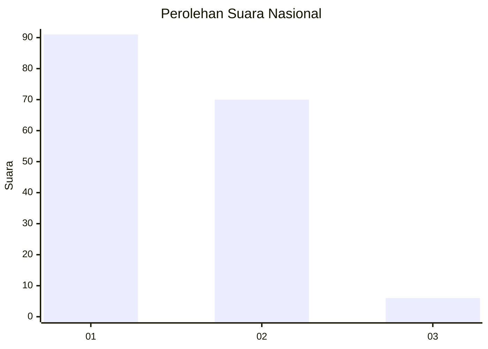
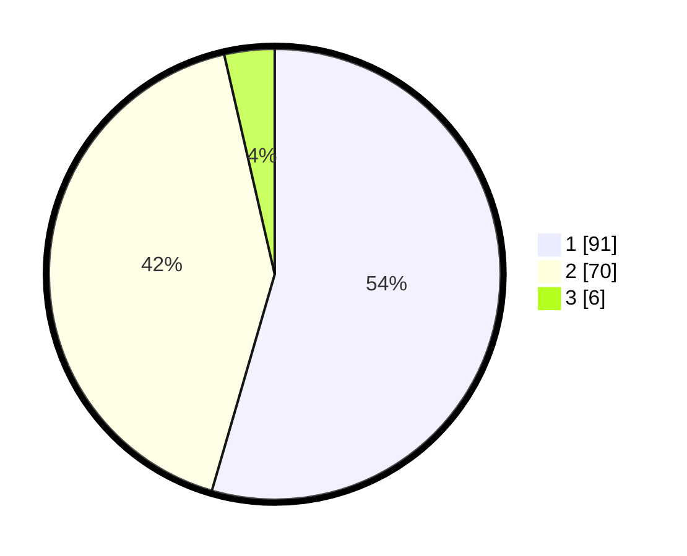

# Hasil

## Grafik

## Tabel

| No. | Nama Paslon    | Suara | Suara (raw) | Persentase |
|:--- |:-------------- | -----:| -----------:| ----------:|
| 1   | ANIES MUHAIMIN | 91    | [91][p-1]   | 54,49      |
| 2   | PRABOWO GIBRAN | 70    | [70][p-2]   | 41,92      |
| 3   | GANJAR MAHFUD  | 6     | [6][p-3]    | 3,59       |

[p-1]: https://github.com/gigit-pemilu/pemilu-2024/blob/main/pilpres/hitung-suara/sub/11-aceh/sub/10-aceh-singkil/sub/01-pulau-banyak/sub/2001-pulau-balai/sub/002-tps/sub/paslon-1.txt
[p-2]: https://github.com/gigit-pemilu/pemilu-2024/blob/main/pilpres/hitung-suara/sub/11-aceh/sub/10-aceh-singkil/sub/01-pulau-banyak/sub/2001-pulau-balai/sub/002-tps/sub/paslon-2.txt
[p-3]: https://github.com/gigit-pemilu/pemilu-2024/blob/main/pilpres/hitung-suara/sub/11-aceh/sub/10-aceh-singkil/sub/01-pulau-banyak/sub/2001-pulau-balai/sub/002-tps/sub/paslon-3.txt

## Foto C Plano

https://sirekap-obj-formc.kpu.go.id/c058/pemilu/ppwp/11/10/01/20/01/1110012001002-20240218-231333--71cc32d9-7037-4b25-8e72-5171bf7689a8.jpg

https://sirekap-obj-formc.kpu.go.id/c058/pemilu/ppwp/11/10/01/20/01/1110012001002-20240218-231848--35ce6732-da35-4f48-adf4-a0a314b7e122.jpg

https://sirekap-obj-formc.kpu.go.id/c058/pemilu/ppwp/11/10/01/20/01/1110012001002-20240218-232118--d6fbf663-bb3c-4675-aabb-27c699350a1a.jpg

## Metadata

| Key        | Value               |
| ---------- | ------------------- |
| Time Stamp | 2024-02-19 06:16:00 |

## DATA PEMILIH TETAP

Jumlah pemilih dalam DPT: **205**.
 * L: **105**.
 * P: **100**.

## DATA PENGGUNA HAK PILIH

Jumlah pengguna hak pilih dalam DPT: **171**.
 * L: **91**.
 * P: **80**.

Jumlah pengguna hak pilih dalam DPTb: **0**.
 * L: **0**.
 * P: **0**.

Jumlah pengguna hak pilih dalam DPK: **0**.
 * L: **0**.
 * P: **0**.

Jumlah pengguna hak pilih: **171**.
 * L: **91**.
 * P: **80**.

## JUMLAH SUARA SAH DAN TIDAK SAH

JUMLAH SELURUH SUARA SAH: **167**.

JUMLAH SUARA TIDAK SAH: **4**.

JUMLAH SELURUH SUARA SAH DAN SUARA TIDAK SAH: **171**.

