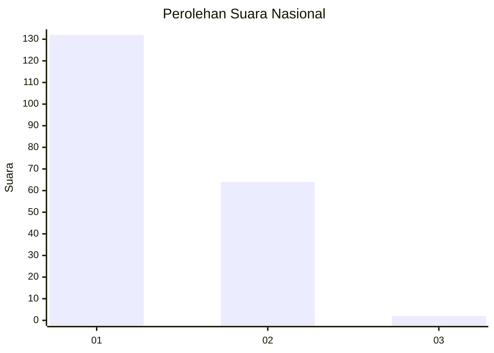
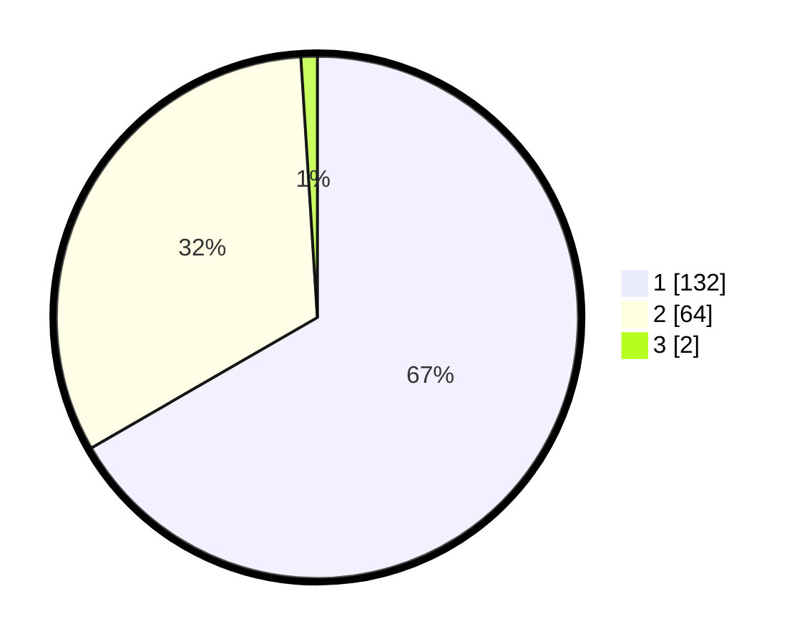

# Hasil

## Grafik

## Tabel

| No. | Nama Paslon    | Suara | Suara (raw) | Persentase |
|:--- |:-------------- | -----:| -----------:| ----------:|
| 1   | ANIES MUHAIMIN | 132   | [132][p-1]  | 66,67      |
| 2   | PRABOWO GIBRAN | 64    | [64][p-2]   | 32,32      |
| 3   | GANJAR MAHFUD  | 2     | [2][p-3]    | 1,01       |

[p-1]: https://github.com/gigit-pemilu/pemilu-2024/blob/main/pilpres/hitung-suara/sub/11-aceh/sub/10-aceh-singkil/sub/01-pulau-banyak/sub/2001-pulau-balai/sub/003-tps/sub/paslon-1.txt
[p-2]: https://github.com/gigit-pemilu/pemilu-2024/blob/main/pilpres/hitung-suara/sub/11-aceh/sub/10-aceh-singkil/sub/01-pulau-banyak/sub/2001-pulau-balai/sub/003-tps/sub/paslon-2.txt
[p-3]: https://github.com/gigit-pemilu/pemilu-2024/blob/main/pilpres/hitung-suara/sub/11-aceh/sub/10-aceh-singkil/sub/01-pulau-banyak/sub/2001-pulau-balai/sub/003-tps/sub/paslon-3.txt

## Foto C Plano

https://sirekap-obj-formc.kpu.go.id/9f71/pemilu/ppwp/11/10/01/20/01/1110012001003-20240219-015349--ba80b6d7-07eb-40b2-867f-e7814f036ecc.jpg

https://sirekap-obj-formc.kpu.go.id/9f71/pemilu/ppwp/11/10/01/20/01/1110012001003-20240219-020044--b8aec02b-3758-4d6c-881a-d92bcfec0485.jpg

https://sirekap-obj-formc.kpu.go.id/9f71/pemilu/ppwp/11/10/01/20/01/1110012001003-20240219-020435--14be4e34-3826-43e8-b916-333ef9f06b6b.jpg

## Metadata

| Key        | Value               |
| ---------- | ------------------- |
| Time Stamp | 2024-02-19 06:16:00 |

## DATA PEMILIH TETAP

Jumlah pemilih dalam DPT: **252**.
 * L: **123**.
 * P: **129**.

## DATA PENGGUNA HAK PILIH

Jumlah pengguna hak pilih dalam DPT: **212**.
 * L: **107**.
 * P: **105**.

Jumlah pengguna hak pilih dalam DPTb: **1**.
 * L: **0**.
 * P: **1**.

Jumlah pengguna hak pilih dalam DPK: **1**.
 * L: **0**.
 * P: **1**.

Jumlah pengguna hak pilih: **214**.
 * L: **107**.
 * P: **107**.

## JUMLAH SUARA SAH DAN TIDAK SAH

JUMLAH SELURUH SUARA SAH: **198**.

JUMLAH SUARA TIDAK SAH: **16**.

JUMLAH SELURUH SUARA SAH DAN SUARA TIDAK SAH: **214**.

