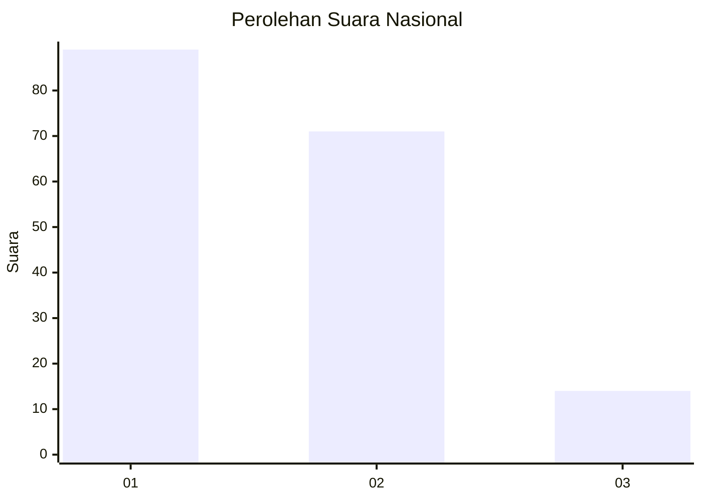
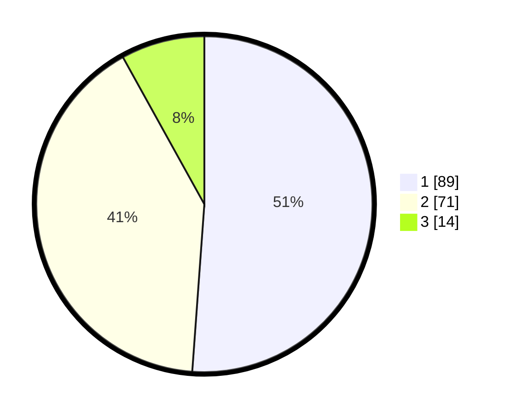

# Hasil

## Grafik

## Tabel

| No. | Nama Paslon    | Suara | Suara (raw) | Persentase |
|:--- |:-------------- | -----:| -----------:| ----------:|
| 1   | ANIES MUHAIMIN | 89    | [89][p-1]   | 51,15      |
| 2   | PRABOWO GIBRAN | 71    | [71][p-2]   | 40,80      |
| 3   | GANJAR MAHFUD  | 14    | [14][p-3]   | 8,05       |

[p-1]: https://github.com/gigit-pemilu/pemilu-2024/blob/main/pilpres/hitung-suara/sub/11-aceh/sub/10-aceh-singkil/sub/01-pulau-banyak/sub/2001-pulau-balai/sub/004-tps/sub/paslon-1.txt
[p-2]: https://github.com/gigit-pemilu/pemilu-2024/blob/main/pilpres/hitung-suara/sub/11-aceh/sub/10-aceh-singkil/sub/01-pulau-banyak/sub/2001-pulau-balai/sub/004-tps/sub/paslon-2.txt
[p-3]: https://github.com/gigit-pemilu/pemilu-2024/blob/main/pilpres/hitung-suara/sub/11-aceh/sub/10-aceh-singkil/sub/01-pulau-banyak/sub/2001-pulau-balai/sub/004-tps/sub/paslon-3.txt

## Foto C Plano

https://sirekap-obj-formc.kpu.go.id/7f53/pemilu/ppwp/11/10/01/20/01/1110012001004-20240219-041654--f7058eb5-756c-4e52-89df-96fd0d606c0e.jpg

https://sirekap-obj-formc.kpu.go.id/7f53/pemilu/ppwp/11/10/01/20/01/1110012001004-20240219-042058--90a773fe-e99f-4bf4-b9a6-6dff590e13cf.jpg

https://sirekap-obj-formc.kpu.go.id/7f53/pemilu/ppwp/11/10/01/20/01/1110012001004-20240219-042244--67e5333c-e660-43e5-b1f2-48070c10c527.jpg

## Metadata

| Key        | Value               |
| ---------- | ------------------- |
| Time Stamp | 2024-02-19 06:16:00 |

## DATA PEMILIH TETAP

Jumlah pemilih dalam DPT: **223**.
 * L: **114**.
 * P: **109**.

## DATA PENGGUNA HAK PILIH

Jumlah pengguna hak pilih dalam DPT: **186**.
 * L: **93**.
 * P: **93**.

Jumlah pengguna hak pilih dalam DPTb: **4**.
 * L: **2**.
 * P: **2**.

Jumlah pengguna hak pilih dalam DPK: **1**.
 * L: **0**.
 * P: **1**.

Jumlah pengguna hak pilih: **191**.
 * L: **95**.
 * P: **96**.

## JUMLAH SUARA SAH DAN TIDAK SAH

JUMLAH SELURUH SUARA SAH: **174**.

JUMLAH SUARA TIDAK SAH: **17**.

JUMLAH SELURUH SUARA SAH DAN SUARA TIDAK SAH: **191**.

